[TOC]

# 第10章 鲁棒性验证

本章描述特殊的STA，如时序借用，门控时钟以及非时序单元的时序检查；进阶的STA概念，如OCV，统计时序以及功耗和时序之间的权衡。

## 10.1 片上变化（OCV）

由于**工艺偏差**，同一种MOS晶体管在裸片上的不同位置可能有不同的特性。

局部工艺偏差（Local Process Variation，局部工艺偏差）：在1片裸片上出现的工艺偏差；

全局工艺偏差（Gloabl Process Variation，全局工艺偏差）：出现在多片晶圆上的偏差。

除了工艺参数偏差，芯片不同部分也会有不同的供电电压和温度。

同一芯片不同的2个区域有不同的PVT条件，可能原因如下：

1）电压降在裸片内的偏差影响局部的供电电压；

2）PMOS和NMOS器件的电压阈值偏差；

3）PMOS和NMOS器件的沟道长度偏差；

4）由于局部热点造成的温度偏差；

5）互连线金属刻蚀或者厚度的偏差对互连线电阻电容带来的影响。

以上描述的PVT偏差统称为**OCV**（On-Chip Variation, 片上变化），会影响芯片上不同区域的线延迟和单元延迟。

- OCV效应会导致**局部PVT偏差**，且**时钟路径和数据路径**被OCV影响的程度不同，可以在发射路径和捕获路径**设置PVT差异**，验证OCV效应对时序产生的影响。
- 方法：对指定路径设置**减免系数**，模拟OCV效应造成的偏差。

**建立时间检查中设置OCV减免值**：

以图10-1逻辑为例：

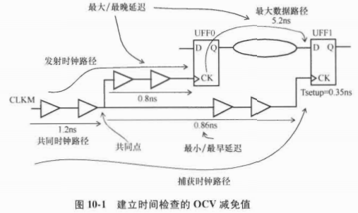

对于建立时间检查来说，最坏的情况：

- 发射时钟路径和数据路径的OCV条件会导致最大延迟；
- 捕获时钟路径的OCV条件导致最小延迟。

建立时间检查的条件（不包括任何OCV的减免值）：

`LaunchClockPath+MaxDataPath<=ClockPeriod+CaptureClockPath-Tsetup_UFF1`

最小的时钟周期=$LaunchClockPath+MaxDataPath-CaptureClockPath+Tsetup\_UFF1$

从图10-1中看：

$LaunchClockPath=1.2+0.8=2.0$

$MaxDataPath=5.2$

$CaptureClockPath=1.2+0.86=2.06$

$Tsetup\_UFF1=0.35$

最小时钟周期为：2+5.2-2.06+0.35=5.49ns

单元和绕线通过`set_timing_derate`设置减免值，命令如下：

```
set_timing_derate -early 0.8
set_timing_derate -late 1.1
```

上述命令表示：

- 减免最小/短/快路径为-20%
- 减免最大/长/慢路径为+10%
- 长路径延迟乘以-late选项指定的减免值
- 短路径延迟乘以-early选项指定的减免值

使用选项-cell_delay和-net_delay来指定单元和线延迟减免值：

```
# 只对单元延迟减免
set_timing_derate -cell_delay -early 0.9
set_timing_derate -cell_delay -late 1.0

# 只对线延迟减免
set_timing_derate -net_delay -early 1.0
set_timing_derate -net_delay -late 1.2
```

**单元检查延迟减免**：-cell_check，任何用set_output_delay指定的输出延迟要减免。

```
# 减免单元时序检查值
set_timing_derate -early 0.8 -cell_check
set_timing_derate -late 1.1 -cell_check

# 减免最快时钟路径
set_timing_derate -early 0.95 -clock
# 减免最慢数据路径
set_timing_derate -late 1.05 -data
```


对于图10-1例子，应用下面减免值：

```
set_timing_derate -early 0.9
set_timing_derate -late 1.2
set_timing_derate -late 1.1 -cell_check
```

从而得到下面的建立时间检查：

$LaunchClockPath=2.0*1.2=2.4$

$MaxDataPath=5.2*1.2=6.24$

$CaptureClockPath=2.06*0.9=1.854$

$Tsetup\_UFF1=0.35*1.1=0.385$

最小的时钟周期为：2.4+6.24-1.854+0.385=7.171ns

对于图10-1例子，有一条共同时钟路径有1.2ns延迟，对于发射时钟和捕获时钟有不同的减免，这是绝对不可能同时存在的两种状态，在分析时应该删除。

同一条路径应用不通过的减免系数带来的悲观情况被称为**共同路径悲观**。

**共同路径悲观去除**（Common Path Pessimism）在时序报告中作为单独一项列出，也被称为**时钟收敛悲观去除**（Clock Reconvergence Pessimism Removal, CRPR）。

**共同点**：时钟树共同部分最后一个单元的输出引脚。

**CPP**：时钟信号到达共同点的最小和最大到达时间的差别

$CPP=LatestArrivalTime@CommonPoint-EarliestArrivalTime@CommonPoint$

以图10-1例子：

$LatestArrivalTime@CommonPoint=1.2*1.2=1.44$

$EarliestArrivalTime@CommonPoint=1.2*0.9=1.08$

则CPP=1.44-1.08=0.36ns。

根据CPP修正，最小的时钟周期是：7.171-0.36=6.811ns

综上，**应用OCV减免值**把最小时钟周期从5.49ns增加到6.811ns。

### 10.1.1 在最差PVT情况下带有OCV分析

若建立时间检查是在最差情况PVT下进行的，在最慢路径上没必要使用减免系数，因为该路径已经是最差可能了。

但是，可以通过指定减免系数对最快路径减免，比如，将最快路径加速10%。

```
set_timing_derate -early 0.9
set_timing_derate -late 1.0
```

在最差情况慢速工艺角下建立时间检查的例子：

针对捕获时钟路径的减免设置：`set_timing_derate -early 0.8 -clock`

### 10.1.2 保持时间检查的OCV

以图10-2逻辑为例：

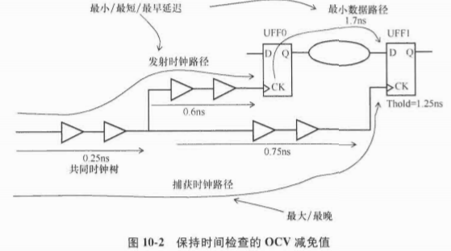

对于保持时间检查，最差的情况：

- 发射时钟路径和数据路径有造成最小延迟的OCV情况，即有最快的发射时钟；
- 捕获时钟路径有造成最大延迟的OCV情况，即最慢的捕获时钟。

保持时间检查：$LaunchClockPath+MinDataPath-CaptureClockPath-Thold\_UFF1>=0$

将图10-2中的延迟值代入，可得到：$0.85+1.7-1.00-1.25=0.3>=0$

表明无保持时间违例。

使用下面的减免约束：

```
set_timing_derate -early 0.9
set_timing_derate -late 1.2
set_timing_derate -early 0.95 -cell_check
```

得到：

LaunchClockPath=0.85*0.9=0.765ns

MinDataPath=1.7*0.9=1.53ns

CaptureClockPath=1.00*1.2=1.2ns

Thold_UFF1=1.25*0.95=1.1875ns

Common Clock Path Pessimism=0.25*(1.2-0.9)=0.075ns

保持时间检查条件变为：$0.765+1.53-1.2-1.1875+0.075=-0.0175ns$

表明当前应用OCV减免系数到最快和最慢路径时，保持时间违例。


保持时间检查在**最佳情况快速PVT工艺角**下进行，此时**没必要在最快路径上使用减免**，因为这些路径已经是可能存在的最快路径了。但是，可以在最慢路径使用减免系数，例如：

```
set_timing_derate -early 1.0
set_timing_derate -late 1.2
```

$LatestArrivalTime@CommonPoint=0.25*1.2=0.30$

$EarliestArrivalTime@CommonPoint=0.25*1.0=0.25$

则共同路径悲观CPP=0.35-0.25=0.05ns。

## 10.2 时序借用

时序借用，又被称为周期窃用，发生在锁存器上。

打开沿：时钟的1个沿让锁存器的输出和数据输入一致。

关闭沿：时钟的第2个周期关闭了锁存器，数据输入端的任何变化都不会体现在输出端。

时序借用例子：

时钟有效沿到来之前，数据在锁存器的输入端已准备好；

当时钟有效锁存器透明，数据可以比有效时钟沿晚到一些，从下一个周期借用时间。

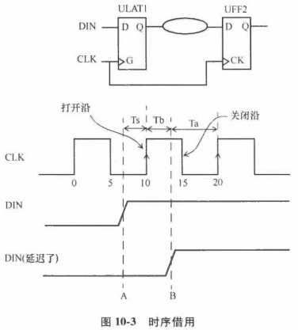

上述例子中，锁存器在CLK上升沿10ns处打开，如果DIN再次之前的时间A准备好，锁存器输入数据流向输出；

若DIN延迟了，在时间B处到达，借用时间Tb，减少了从锁存器到下一级触发器UFF2的可用时间。

**锁存器时序的第一规则**：

​	数据在锁存器的打开沿之前到达，则锁存器的行为建模和触发器相同。打开沿捕获数据，同一个时钟沿作为下一条路径的起点发射数据。

**锁存器时序的第二规则**：

​	数据信号在锁存器透明时（打开沿和关闭沿之间）到达，**锁存器的输出**被当作下一级的发射点。

锁存器时序违例窗口：

数据在关闭沿之后到达锁存器，就是时序违例。

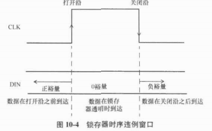

例子：锁存器到下一级触发器的半周期路径。

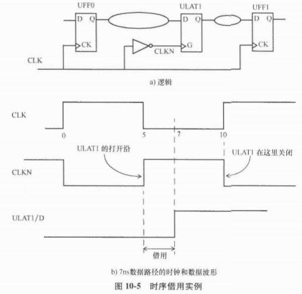

- 时钟周期为10ns
- 数据在时间0处被UFF0发射，但数据路径用时7ns
- 锁存器ULAT1在5ns处打开，所以需要从路径ULAT1到UFF1借用2ns
- ULAT1到UFF1可用的时间只有5-2=3ns

### 10.2.1 没有时序借用的例子

建立时间路径报告：从触发器UFF0到锁存器ULAT1的数据路径延迟小于5ns.

```pgp
Startpoint: UFF0 (rising edge-triggered flip-flop clocked by CLK)
Endpoint: ULAT1 (positive level-sensitive latch clocked by CLK')
Path Group: CLK
Path Type: max

Point                           Incr   Path
-----------------------------------------------------
clock CLK (rise edge)           0.00   0.00
clock source latency            0.00   0.00
clk (in)                        0.00   0.00 r
UFF0/CK (DF)                    0.00   0.00 r
UFF0/Q (DF)                     0.12   0.12 r
UBUF0/Z (BUFF)                  2.01   2.13 r
UBUF1/Z (BUFF)                  2.46   4.59 r
UBUF2/Z (BUFF)                  0.07   4.65 r
ULAT1/D (LH)                    0.00   4.65 r
data arrival time                      4.65

clock CLK' (rise edge)          5.00   5.00
clock source latency            0.00   5.00
clk (in)                        0.00   5.00 f
UINV0/ZN (INV)                  0.02   5.02 r
ULAT1/G (LH)                    0.00   5.02 r
time borrowed from endpoint     0.00   5.02
data required time                     5.02
-----------------------------------------------------
data required time                     5.02
data arrival time                     -4.65
-----------------------------------------------------
slack (MET)                            0.36

Time Borrowing Information
-----------------------------------------------------
CLK' nominal pulse width                   5.00
clock latency difference                  -0.00
library setup time                        -0.01
-----------------------------------------------------
max time borrow                           4.99
actual time borrow                        0.00
```

在此例子中，锁存器打开前数据可以及时到达锁存器ULAT1，没有必要时序借用。

### 10.2.2 有时序借用的例子

建立时间路径报告：从触发器UFF0到锁存器ULAT1的数据路径延迟大于5ns.

```pgp
Startpoint: UFF0 (rising edge-triggered flip-flop clocked by CLK)
Endpoint: ULAT1 (positive level-sensitive latch clocked by CLK')
Path Group: CLK
Path Type: max

Point                           Incr   Path
-----------------------------------------------------
clock CLK (rise edge)           0.00   0.00
clock source latency            0.00   0.00
clk (in)                        0.00   0.00 r
UFF0/CK (DF)                    0.00   0.00 r
UFF0/Q (DF)                     0.12   0.12 r
UBUF0/Z (BUFF)                  3.50   3.62 r
UBUF1/Z (BUFF)                  3.14   6.76 r
UBUF2/Z (BUFF)                  0.07   6.83 r
ULAT1/D (LH)                    0.00   6.83 r
data arrival time                      6.83

clock CLK' (rise edge)          5.00   5.00
clock source latency            0.00   5.00
clk (in)                        0.00   5.00 f
UINV0/ZN (INV)                  0.02   5.02 r
ULAT1/G (LH)                    0.00   5.02 r
time borrowed from endpoint     1.81   6.83
data required time                     6.83
-----------------------------------------------------
data required time                     6.83
data arrival time                     -6.83
-----------------------------------------------------
slack (MET)                            0.00

Time Borrowing Information
-----------------------------------------------------
CLK' nominal pulse width                   5.00
clock latency difference                  -0.00
library setup time                        -0.01
-----------------------------------------------------
max time borrow                           4.99
actual time borrow                        1.81
```

上述例子表明，从下一级路径借用了1.81ns延迟，下一级路径的时序报告如下：

```pgp
Startpoint: ULAT1 (positive level-sensitive latch clocked by CLK')
Endpoint: UFF1 (rising edge-triggered flip-flop clocked by CLK)
Path Group: CLK
Path Type: max

Point                                 Incr   Path
----------------------------------------------------------------
clock CLK' (rise edge)                5.00   5.00
clock source latency                  0.00   5.00
clk (in)                              0.00   5.00 f
UINV0/ZN (INV)                        0.02   5.02 r
ULAT1/G (LH)                          0.00   5.02 r
time given to startpoint              1.81   6.83
ULAT1/QN (LH)                         0.13   6.95 f
UFF1/D (DF)                           0.00   6.95 f
data arrival time                            6.95

clock CLK (rise edge)                 10.00  10.00
clock source latency                  0.00   10.00
clk (in)                              0.00   10.00 r
UFF1/CK (DF)                          0.00   10.00 r
library setup time                   -0.04   9.96
data required time                           9.96
----------------------------------------------------------------
data required time                           9.96
data arrival time                           -6.95
----------------------------------------------------------------
slack (MET)                                  3.01
```

### 10.2.3 有时序违例的例子

数据路径延迟很大，数据在锁存器关闭后才能到达。

```pgp
Startpoint: UFF0 (rising edge-triggered flip-flop clocked by CLK)
Endpoint: ULAT1 (positive level-sensitive latch clocked by CLK')
Path Group: CLK
Path Type: max

Point                           Incr   Path
-----------------------------------------------------
clock CLK (rise edge)           0.00   0.00
clock source latency            0.00   0.00
clk (in)                        0.00   0.00 r
UFF0/CK (DF)                    0.00   0.00 r
UFF0/Q (DF)                     0.12   0.12 r
UBUF0/Z (BUFF)                  6.65   6.77 r
UBUF1/Z (BUFF)                  4.33  11.10 r
UBUF2/Z (BUFF)                  0.07  11.17 r
ULAT1/D (LH)                    0.00  11.17 r
data arrival time                     11.17

clock CLK' (rise edge)          5.00   5.00
clock source latency            0.00   5.00
clk (in)                        0.00   5.00 f
UINV0/ZN (INV)                  0.02   5.02 r
ULAT1/G (LH)                    0.00   5.02 r
time borrowed from endpoint     4.99  10.00
data required time                    10.00
-----------------------------------------------------
data required time                    10.00
data arrival time                    -11.17
-----------------------------------------------------
slack (VIOLATED)                      -1.16

Time Borrowing Information
-----------------------------------------------------
CLK' nominal pulse width                   5.00
clock latency difference                  -0.00
library setup time                        -0.01
-----------------------------------------------------
max time borrow                           4.99
actual time borrow                        4.99
```

## 10.3 数据到数据检查

对任意2个数据引脚进行建立时间和保持时间检查。

- 第一个引脚：约束引脚，行为类似触发器的数据引脚；
- 第二个引脚：相关引脚，行为类似于触发器的时钟引脚。

与触发器建立时间检查的区别：

- 数据到数据的建立时间检查是和发射沿同沿进行的，因此也被称为**0周期检查**或**同周期检查**。

数据到数据的检查约束：`set_data_check`

```
set_data_check -from SDA -to SCTRL -setup 2.1
set_data_check -from SDA -to SCTRL -hold 1.5
```

以下图为例：

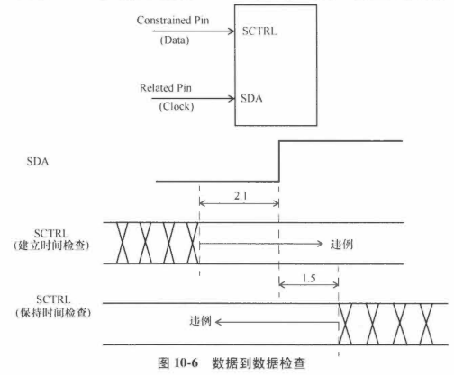

- SDA：相关引脚
- SCTRL：约束引脚
- 建立时间检查要求：SCTRL至少在SDA沿之前2.1ns到达
- 保持时间检查要求：SCTRL最早应该在SDA后1.5ns到达

例子：与门单元

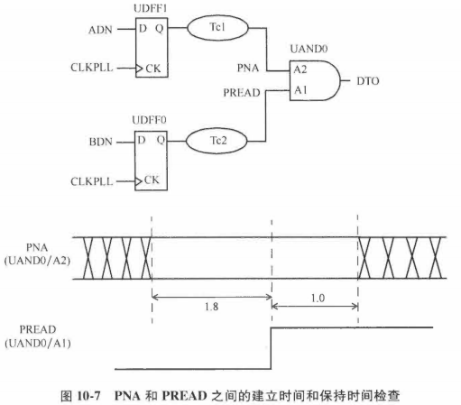

需求：保证PNA在PREAN上升沿之前1.8ns到达，且在PREAD上升沿之后1.0ns内不变。

- PNA是约束引脚，PREAD是相关引脚。

- 约束指定：

  ```
  set_data_check -from UAND0/A1 -to UAND0/A2 -setup 1.8
  set_data_check -from UAND0/A1 -to UAND0/A2 -hold 1.0
  ```

- 建立时间报告：

```pgp
Startpoint: UDFF1 (rising edge-triggered flip-flop clocked by CLKPLL)
Endpoint: UAND0 (rising edge-triggered data to data check clocked by CLKPLL)
Path Group: CLKPLL
Path Type: max

Point                           Incr   Path
----------------------------------
clock CKPLL (rise edge)         0.00   0.00 r
clock source latency            0.00   0.00 r
CKPLL (in)                      0.00   0.00 r
UDFI/CK (DF )                   0.00   0.00 r
UDFI/Q (DF )                    0.12   0.12 f
UBUF0/Z (BUFF )                 0.06   0.18 f
UAND0/A2 (AN2 )                 0.00   0.18 f
data arrival time                      0.18

clock CKPLL (rise edge)         0.00   0.00 r
clock source latency            0.00   0.00 r
CKPLL (in)                      0.00   0.00 r
UDFI/CK (DF )                   0.00   0.00 r
UDFI/Q (DF )                    0.12   0.12 f
UBUF1/Z (BUFF )                 0.05   0.17 f
UBUF2/Z (BUFF )                 0.05   0.21 f
UBUF3/Z (BUFF )                 0.05   0.26 f
UAND0/A1 (AN2 )                 0.00   0.26 f
data check setup time          -1.80  -1.54
data required time                    -1.54
----------------------------------
data required time                    -1.54
data arrival time                     -0.18 
----------------------------------
slack (VIOLATED)                      -1.72
```

报告中：

- 建立时间用“data check setup time”指定。
- PREAD需要被延迟至少1.72ns以保证PENA在PREAD之前1.8ns到达。

保持时间检查：不再是同沿。

CLKPLL时钟约束如下：

`create_clock -name CLKPLL -period 10 -waveform {0 5} [get_ports CLKPLL]`

保持时间检查报告：

```pgp
Startpoint: UDFF1 (rising edge-triggered flip-flop clocked by CLKPLL)
Endpoint: UAND0 (falling edge-triggered data to data check clocked by CLKPLL)
Path Group: CLKPLL
Path Type: min

Point                           Incr   Path
-----------------------------------------------
clock CLKPLL (rise edge)        10.00  10.00 r
clock source latency             0.00  10.00
CLKPLL (in)                      0.00  10.00 r
UDFF1/CK (DF )                   0.00  10.00 r
UDFF1/Q (DF ) <-                 0.12  10.12 r
UBUF0/Z (BUFF )                  0.05  10.17 r
UAND0/A2 (AN2 )                  0.00  10.17 r
data arrival time                      10.17

clock CLKPLL (rise edge)        0.00   0.00
clock source latency            0.00   0.00
CLKPLL (in)                     0.00   0.00 r
UDFF0/CK (DF )                  0.00   0.00 r
UDFF0/Q (DF )                   0.12   0.12 f
UBUF1/Z (BUFF )                 0.06   0.18 f
UBUF2/Z (BUFF )                 0.05   0.23 f
UBUF3/Z (BUFF )                 0.06   0.29 f
UAND0/A1 (AN2 )                 0.00   0.29 f
data check hold time            1.00   1.29
data required time               
----------------------------------
data required time                     1.29
data arrival time                    -10.17
----------------------------------
slack(MET)                             8.88
```

注意：用来为保持时间检查发射相关引脚的时钟沿，比约束引脚的发射沿早一个时钟周期。

在某些场景下，设计者会要求数据到数据的保持时间检查在同一个时钟沿进行。

此时要求：相关引脚用到的时钟沿被移回约束引脚时钟沿所在的位置，可以通过指定多周期为-1达到目的。

`set_multicycle_path -1 -hold -to UAND0/A2`

多周期指定之后的时序报告如下：

```pgp
Startpoint: UDFF1 (rising edge-triggered flip-flop clocked by CLKPLL)
Endpoint: UAND0 (falling edge-triggered data to data check clocked by CLKPLL)
Path Group: CLKPLL
Path Type: min

Point                           Incr   Path
-----------------------------------------------
clock CLKPLL (rise edge)         0.00  0.00 r
clock source latency             0.00  0.00
CLKPLL (in)                      0.00  0.00 r
UDFF1/CK (DF )                   0.00  0.00 r
UDFF1/Q (DF ) <-                 0.12  0.12 r
UBUF0/Z (BUFF )                  0.05  0.17 r
UAND0/A2 (AN2 )                  0.00  0.17 r
data arrival time                      0.17

clock CLKPLL (rise edge)        0.00   0.00
clock source latency            0.00   0.00
CLKPLL (in)                     0.00   0.00 r
UDFF0/CK (DF )                  0.00   0.00 r
UDFF0/Q (DF )                   0.12   0.12 f
UBUF1/Z (BUFF )                 0.06   0.18 f
UBUF2/Z (BUFF )                 0.05   0.23 f
UBUF3/Z (BUFF )                 0.06   0.29 f
UAND0/A1 (AN2 )                 0.00   0.29 f
data check hold time            1.00   1.29
data required time               
----------------------------------
data required time                     1.29
data arrival time                     -0.17
----------------------------------
slack(VIOLATED)                       -1.12
```

另一种让数据到数据保持时间检查在同一个周期进行的方法是指定该检查为数据到数据的建立时间检查，但方向是相反的。

`set_data_check -from UAND0/A2 to UAND0/A1 -setup 1.0` 


数据到数据检查在定义无变化数据检查时也有用。

例子：在上升沿指定建立时间检查，在下降沿指定保持时间检查

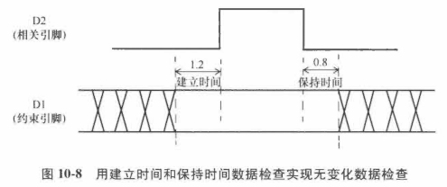

对应的约束：

```
set_data_check -rise_from D2 -to D1 -setup 1.2
set_data_check -fall_from D2 -to D1 -hold 0.8
```


## 10.4 非时序路径检查

单元或宏单元的库文件可能指定时序弧为**非时序检查**，比如2个数据引脚间的时序弧。

该检查指定在相关引脚变化前后，在约束引脚上的数据需要保持多长时间的稳定。

注意：这类检查是作为单元库约束的一部分被指定，不需要明确要求数据到数据的检查。

这类时序弧在单元库中的描述：

```
pin (WEN) {
 timing () {
 timing_type: non_seq_setup_rising;
 intrinsic_rise: 1.1;
 intrinsic_fall: 1.15;
 related_pin: "D0";
 }
 timing () {
 timing_type: non_seq_hold_rising;
 intrinsic_rise: 0.6;
 intrinsic_fall: 0.65;
 related_pin: "D0";
 }
}
```

- setup_rising：指相关引脚的上升沿
- intrinsic_rise和intrinsic_fall的值指：约束引脚的上升和下降建立时间

非时序检查类似于10.3节中的数据到数据检查，但是它们之间有2个主要区别：

- 非时序检查中，建立时间和保持时间的值是从标准单元库中得到的；数据到数据检查中，只能为数据到数据建立和保持时间检查指定唯一值。
- 非时序检查只能应用到单元的引脚上，而数据到数据的检查可以应用到设计中的任意2个引脚。

非时序检查例子如下：

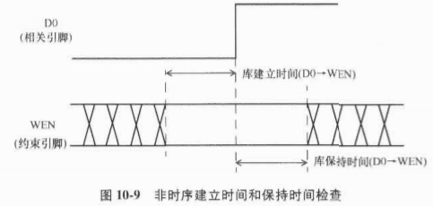

单元库包含建立弧D0->WEN，被指定为非时序弧。

## 10.5 时钟门控检查

例子：

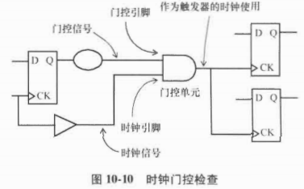

时钟门控检查的条件：

- 经过门控单元的时钟必须作为下游时钟使用

  下游时钟可以作为触发器时钟，或者可以扇出到输出端口，或者把门控单元输出作为主时钟成为生成时钟。

- 使用到门控信号。

  门控引脚的信号不应该是时钟，或者如果它是时钟，不应该被作为下游时钟。

两类时钟门控检查：

- 高电平有效时钟门控检查：当门控单元有“与”或者“与非”功能；
- 低电平有效时钟门控检查：当门控单元有“或”或者“或非”功能。

命令`set_clock_gating_check`可以为门控单元明确指定时钟门控关系，若该命令约束和门控单元的功能不一致，STA会发出警告。

### 10.5.1 高电平有效时钟门控

高电平有效时钟门控检查通常发生在1个与门或与非门单元上。

例子：使用与门

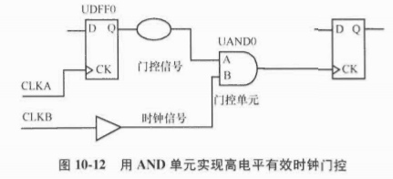

假设CLKA和CLKB有相同波形：

```
create_clock -name CLKA -period 10 -waveform {0 5} [get_ports CLKA]
create_clock -name CLKB -period 10 -waveform {0 5} [get_ports CLKB]
```

- 门控信号UAND0/A为高电平，打开门控单元，允许时钟通过。

时钟门控检查目的：验证门控引脚的转换时间不会为扇出时钟创建有效沿。

- 对于正沿触发逻辑，门控信号的上升沿发生在时钟无效周期内（电平为低）
- 对于负沿触发逻辑，门控信号的下降沿只在时钟电平为低时发生。

注意：若时钟同时驱动正沿触发器和负沿触发器，任何门控信号的转换都必须发生在时钟电平为低时。

例子：门控信号的转换发生在时钟有效沿内，需要**延迟门控信号**才能通过时钟门控检查

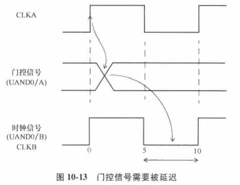

**高电平有效时钟门控建立时间检查要求：门控信号在时钟电平为高之前变化**。

建立时间路径报告：

```pgp
Startpoint: UDFF0
(rising edge-triggered flip-flop clocked by CLKA)
Endpoint: UAND0
(rising clock gating-check end-point clocked by CLKB)
Path Group: **clock_gating_default**
Path Type: max

Point                                Incr   Path
----------------------------------------------------------------
clock CLKA (rise edge)               0.00   0.00
clock source latency                 0.00   0.00
CLKA (in)                            0.00   0.00 r
UDFF0/CK (DF)                        0.00   0.00 r
UDFF0/Q (DF)                         0.13   0.13 f
UAND0/A1 (AN2)                       0.00   0.13 f
data arrival time                               0.13

clock CLKB (rise edge)               10.00  10.00
clock source latency                 0.00   10.00
CLKB (in)                            0.00   10.00 r
clock gating setup time              0.00   10.00
data required time                              10.00
----------------------------------------------------------------
data required time                              10.00
data arrival time                              -0.13
----------------------------------------------------------------
slack (MET)                                     9.87
```

上述检查确保门控信号在时钟CLKB的下一个上升沿（10ns）之前改变。

**高电平有效时钟门控保持时间检查要求：门控信号只在时钟下降沿之后改变。**

保持时间路径报告：

```pgp
Startpoint: UDFF0
(rising edge-triggered flip-flop clocked by CLKA)
Endpoint: UAND0
(rising clock gating-check end-point clocked by CLKB)
Path Group: **clock_gating_default**
Path Type: min

Point                                Incr   Path
----------------------------------------------------------------
clock CLKA (rise edge)               0.00   0.00
clock source latency                 0.00   0.00
CLKA (in)                            0.00   0.00 r
UDFF0/CK (DF)                        0.00   0.00 r
UDFF0/Q (DF)                         0.13   0.13 f
UAND0/A1 (AN2)                       0.00   0.13 f
data arrival time                               0.13

clock CLKB (rise edge)               5.00   5.00
clock source latency                 0.00   5.00
CLKB (in)                            0.00   5.00 r
clock gating setup time              0.00   5.00
data required time                          5.00
----------------------------------------------------------------
data required time                          5.00
data arrival time                          -0.13
----------------------------------------------------------------
slack (VIOLATED)                           -4.87
```

门控信号改变太快，在CLKB下降沿（5ns处）之前改变了。

若在UDFF0/Q和UAND0/A1引脚之间加5ns延迟，则建立时间和保持时间检查都会通过。

除了添加延迟，还可以通过使用不同类型的发射触发器解决保持时间不满足的问题。

例如：使用负沿触发器生成门控信号（**最常见**的门控时钟结构）。

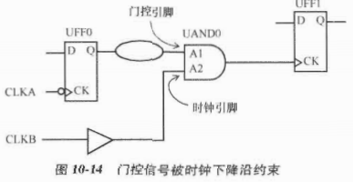

上图对应的信号波形图如下：

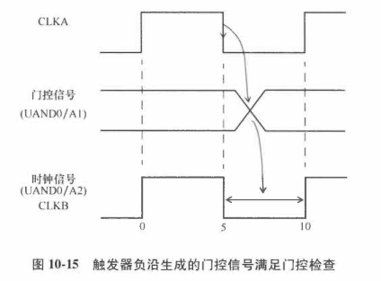

对应的建立时间报告：

```pgp
Startpoint: UDFF0
(falling edge-triggered flip-flop clocked by CLKA)
Endpoint: UAND0
(rising clock gating-check end-point clocked by CLKB)
Path Group: **clock_gating_default**
Path Type: max

Point                                Incr   Path
----------------------------------------------------------------
clock CLKA (rise edge)               5.00   5.00
clock source latency                 0.00   5.00
CLKA (in)                            0.00   5.00 r
UDFF0/CK (DF)                        0.00   5.00 r
UDFF0/Q (DF)                         0.15   5.15 f
UAND0/A1 (AN2)                       0.00   5.15 f
data arrival time                           5.15

clock CLKB (rise edge)               10.00  10.00
clock source latency                 0.00   10.00
CLKB (in)                            0.00   10.00 r
clock gating setup time              0.00   10.00
data required time                          10.00
------------------------------------------------------------
data required time                          10.00
data arrival time                           -5.15
------------------------------------------------------------
slack (MET)                                  4.85
```

对应的保持时间报告：

```pgp
Startpoint: UDFF0
(falling edge-triggered flip-flop clocked by CLKA)
Endpoint: UAND0
(rising clock gating-check end-point clocked by CLKB)
Path Group: **clock_gating_default**
Path Type: min

Point                                Incr   Path
----------------------------------------------------------------
clock CLKA (rise edge)               5.00   5.00
clock source latency                 0.00   5.00
CLKA (in)                            0.00   5.00 r
UDFF0/CK (DF)                        0.00   5.00 r
UDFF0/Q (DF)                         0.13   5.13 f
UAND0/A1 (AN2)                       0.00   5.13 f
data arrival time                           5.13

clock CLKB (rise edge)               5.00   5.00
clock source latency                 0.00   5.00
CLKB (in)                            0.00   5.00 r
clock gating setup time              0.00   5.00
data required time                          5.00
----------------------------------------------------------------
data required time                          5.00
data arrival time                          -5.13
----------------------------------------------------------------
slack (VIOLATED)                            0.13
```

### 10.5.2 低电平有效时钟门控

低电平有效时钟门控检查例子：

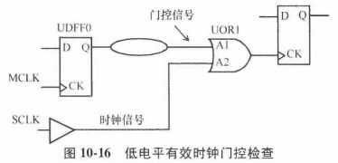

约束如下：

```
create_clock -name MCLK -period 8 -waveform {0 4} [get_ports MCLK]
create_clock -name SCLK -period 8 -waveform {0 4} [get_ports SCLK]
```

需要确保：对于正沿触发逻辑，门控信号的上升沿在时钟有效周期（时钟电平为高）到达。

门控信号为高，时钟不能穿过，所以只有在时钟电平为高时，门控信号才可以翻转，如下图所示。

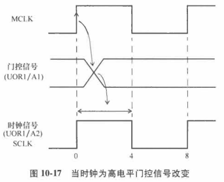

低电平有效时钟门控建立时间检查：确保门控信号在时钟沿变为无效前到达，即4ns之前

```pgp
Startpoint: UDFF0
(rising edge-triggered flip-flop clocked by MCLK)
Endpoint: UOR1
(falling clock gating-check end-point clocked by SCLK)
Path Group: **clock_gating_default**
Path Type: max

Point                                Incr   Path
--------------------------------------------------------
clock MCLK (rise edge)               0.00   0.00
clock source latency                 0.00   0.00
MCLK (in)                            0.00   0.00 r
UDFF0/CK (DF)                        0.00   0.00 r
UDFF0/Q (DF)                         0.13   0.13 f
UOR1/A1 (OR2)                        0.00   0.13 f
data arrival time                               0.13

clock SCLK (fall edge)               4.00   4.00
clock source latency                 0.00   4.00
SCLK (in)                            0.00   4.00 f
UOR1/A2 (OR2)                        0.00   4.00 f
clock gating setup time              0.00   4.00
data required time                               4.00
--------------------------------------------------------
data required time                               4.00
data arrival time                              -0.13
--------------------------------------------------------
slack (MET)                                      3.87
```

保持时间检查：确保门控信号在时钟信号上升沿后改变，本例中为0ns处

```pgp
Startpoint: UDFF0
(rising edge-triggered flip-flop clocked by MCLK)
Endpoint: UOR1
(falling clock gating-check end-point clocked by SCLK)
Path Group: **clock_gating_default**
Path Type: min

Point                                Incr   Path
--------------------------------------------------------
clock MCLK (rise edge)               0.00   0.00
clock source latency                 0.00   0.00
MCLK (in)                            0.00   0.00 r
UDFF0/CK (DF)                        0.00   0.00 r
UDFF0/Q (DF)                         0.13   0.13 f
UOR1/A1 (OR2)                        0.00   0.13 f
data arrival time                           0.13

clock SCLK (rise edge)               0.00   0.00
clock source latency                 0.00   0.00
SCLK (in)                            0.00   0.00 f
UOR1/A2 (OR2)                        0.00   0.00 f
clock gating setup time              0.00   0.00
data required time                          0.00
-------------------------------------------------------
data required time                          0.00
data arrival time                          -0.13
--------------------------------------------------------
slack (MET)                                 0.13
```

### 10.5.3 用多路复用器进行时钟门控

例子：多路复用器单元进行时钟门控

在多路复用器输入的时钟门控检查：确保多路复用器选择信号在正确时间到达，在MCLK和TCL看之间干净切换。

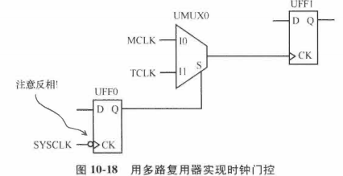

关注**MCLK**是否切换成功，假设选择信号切换时TCLK为低电平：

- 多路复用器的选择信号只在MCLK为低电平时切换；
- 类似于高电平有效时钟门控检查

波形图：

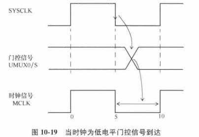

上述例子表明：选择信号必须在MCLK为低电平时到达。（假设在选择信号变化时TCLK保持为低电平）。

因为门控单元是多路复用器，时钟门控检查不会自动推理出来，在STA时下面的信息会报出来。

```
Warning: No clock-gating check is inferred for clock MCLK at pins UMUX0/S and UMUX0/I0 of cell UMUX0.

Warning: No clock-gating check is inferred for clock TCLK at pins UMUX0/S and UMUX0/I1 of cell UMUX0.

# 但是，可以通过set_clock_gating_check约束来明确强制进行时钟门控检查。

set_clock_gating_check -high [get_cells UMUX0]

# 选项-high表明这是高电平有效检查。

set_disable_clock_gating_check UMUX0/I1
# 关掉了指定引脚上的时钟门控检查
```

建立时间路径报告：

```pgp
Startpoint: UFF0
(falling edge-triggered flip-flop clocked by SYSCLK)
Endpoint: UMUX0
(rising clock gating-check end-point clocked by MCLK)
Path Group: **clock_gating_default**
Path Type: max

Point                           Incr   Path
---------------------------------------------------------
clock SYSCLK (fall edge)        5.00   5.00
clock source latency            0.00   5.00
SYSCLK (in)                     0.00   5.00 f
UFF0/CKN (DFN)                  0.00   5.00 f
UFF0/Q (DFN)                    0.15   5.15 r
UMUX0/S (MUX2)                  0.00   5.15 r
data arrival time                      5.15

clock MCLK (rise edge)         10.00  10.00
clock source latency            0.00  10.00
MCLK (in)                       0.00  10.00 r
UMUX0/I0 (MUX2)                 0.00  10.00 r
clock gating setup time         0.00  10.00
data required time                    10.00
----------------------------------------------------------
data required time                    10.00
data arrival time                     -5.15
----------------------------------------------------------
slack (MET)                            4.85
```

时钟门控保持时间报告：

```pgp
Startpoint: UFF0
(falling edge-triggered flip-flop clocked by SYSCLK)
Endpoint: UMUX0
(rising clock gating-check end-point clocked by MCLK)
Path Group: **clock_gating_default**
Path Type: min

Point                           Incr   Path
----------------------------------------------------------------
clock SYSCLK (fall edge)        5.00   5.00
clock source latency            0.00   5.00
SYSCLK (in)                     0.00   5.00 f
UFF0/CKN (DFN)                  0.00   5.00 f
UFF0/Q (DFN)                    0.13   5.13 f
UMUX0/S (MUX2)                  0.00   5.13 f
data arrival time                      5.13

clock MCLK (fall edge)          5.00   5.00
clock source latency            0.00   5.00
MCLK (in)                       0.00   5.00 f
UMUX0/I0 (MUX2)                 0.00   5.00 f
clock gating hold time          0.00   5.00
data required time                     5.00
----------------------------------------------------------------
data required time                     5.00
data arrival time                     -5.13
----------------------------------------------------------------
slack (MET)                            0.13
```

### 10.5.4 带时钟反相的时钟门控

例子：触发器的时钟是反相的，触发器的输出是门控信号。

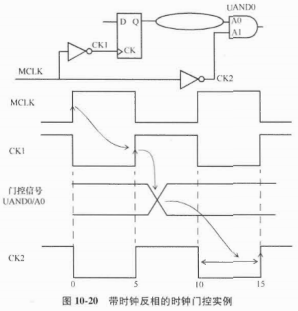

- 门控单元是与门单元
- 门控信号只有在与门单元的时钟信号为低电平时翻转

时钟门控建立时间报告：

```pgp
Startpoint: UDFF0
(rising edge-triggered flip-flop clocked by MCLK')
Endpoint: UAND0
(rising clock gating-check end-point clocked by MCLK')
Path Group: **clock_gating_default**
Path Type: max

Point                                Incr   Path
----------------------------------------------------------------
clock MCLK' (rise edge)              5.00   5.00
clock source latency                 0.00   5.00
MCLK (in)                            0.00   5.00 f
UINV0/ZN (INV )                      0.02   5.02 r
UDFF0/CK (DF )                       0.00   5.02 r
UDFF0/Q (Q )                         0.13   5.15 f
UAND0/A1 (AN2 )                      0.00   5.15 f
data arrival time                           5.15

clock MCLK' (rise edge)              15.00  15.00
clock source latency                 0.00   15.00
MCLK (in)                            0.00   15.00 f
UINV0/ZN (INV )                      0.02   15.02 r
UAND0/A2 (AN2 )                      0.00   15.02
clock gating setup time              0.00   15.02
data required time                          15.02
------------------------------------------------------------
data required time                          15.02
data arrival time                           -5.15
----------------------------------------------------------------
slack (MET)                                  9.87
```

保持时间路径报告：

```pgp
Startpoint: UDFF0
(rising edge-triggered flip-flop clocked by MCLK')
Endpoint: UAND0
(rising clock gating-check end-point clocked by MCLK')
Path Group: **clock_gating_default**
Path Type: max

Point                                Incr   Path
----------------------------------------------------------------
clock MCLK' (rise edge)              5.00   5.00
clock source latency                 0.00   5.00
MCLK (in)                            0.00   5.00 f
UINV0/ZN (INV )                      0.02   5.02 r
UDFF0/CK (DF )                       0.00   5.02 r
UDFF0/Q (Q )                         0.13   5.15 f
UAND0/A1 (AN2 )                      0.00   5.15 f
data arrival time                           5.15

clock MCLK' (rise edge)              10.00  10.00
clock source latency                 0.00   10.00
MCLK (in)                            0.00   10.00 f
UINV0/ZN (INV )                      0.02   10.02 r
UAND0/A2 (AN2 )                      0.00   10.02
clock gating setup time              0.00   10.02
data required time                          10.02
-----------------------------------------------------------
data required time                          10.02
data arrival time                           -5.15
----------------------------------------------------------------
slack (VIOLATED)                                 -4.87
```

保持时间检查：验证数据是否在MCLK‘下降沿之前改变，该沿在10ns处。

建立时间检查：验证门控信号在时钟信号的有效沿之前是否保持稳定，违例可能导致门控单元输出端出现毛刺。

保持时间检查：验证门控信号是否在时钟信号的无效沿是否保持稳定。

## 10.6 功耗管理

如第3章所述，设计的逻辑部分消耗的功耗由漏电功耗（Leakage Power）和动态功耗（Active Power）组成。

另外，模拟宏单元和IO缓冲器（特别是有动态终端的）会消耗功耗，该部分功耗和动态无关，也不是漏电。

通常，由标准单元和存储器宏单元组成的数字逻辑的功耗管理有两部分需要考虑：

- 减小设计总动态功耗。

  对于不同的工作模式，可能会有不同的极限功耗；

  对于不同的供电电源，也可能会有不同的极限。

- 在待机模式下减小设计的功耗消耗。

  待机模式下的功率消耗：漏电功耗加上待机模式下工作的逻辑的功率消耗。

  可能会有其他模式，比如休眠模式。

### 10.6.1 时钟门控

触发器由于**时钟翻转**消耗功耗，即使触发器的输出端没有翻转。

如图10-21a：

- 触发器只有在使能信号EN有效时，才接收新数据，否则保持之前的状态。

- 在EN无效的时间里，触发器的时钟翻转不会引起输出端的任何变化，但是时钟翻转依然会造成触发器内的功率消耗。

时钟门控目的：触发器输入无效时，消除触发器的时钟活动，减小功耗。

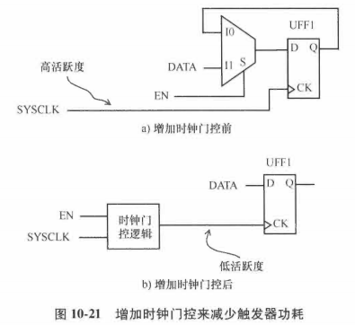

### 10.6.2 电源门控

电源门控：关闭电源供电，让不活动模块的电源关闭。

方法：电源供电串联加入**接地可关断**或**电源可关断**MOS器件

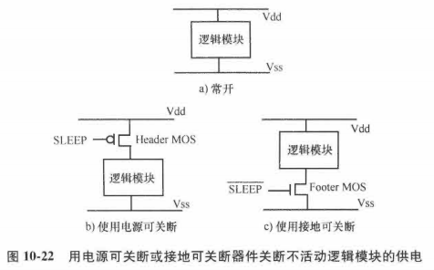

- 接地可关断——NMOS器件
- 电源可关断——PMOS器件

### 10.6.3 多种阈值单元

高阈值单元：更小的漏电，比标准阈值单元的速度慢；

标准阈值单元：速度快，但漏电高

多阈值单元的使用需要在速度和漏电之间进行权衡。

高性能模块的两种不同场景：

- 高活跃度的高性能模块

  此时，专注减少漏电功耗会导致总功耗上升。

  最初设计实现应该使用标准阈值单元来满足需要的性能，当需要的时序被满足，有正时序裕量的路径上的单元可以改为高阈值单元。

  在最终实现时，标准阈值单元只在关键路径或者时序难满足的路径使用，非关键路径上的单元可以是高阈值单元。

- 低活跃度的高性能模块

  此情况下，高性能模块有低频的翻转活动，漏电功耗占总功耗的主要地位。

### 10.6.4 阱偏置

阱偏置：给NMOS和PMOS使用P阱和N阱分别加1个小的偏置电压。

NMOS器件的衬底（或者P阱）通常接地。

PMOS器件的衬底（或者N阱）通常连接到电源轨（Vdd）。

若阱的连接有很小的负偏置，漏电功耗可以显著减小。

- NMOS器件的P阱连接到小的负电压（比如-0.5V）
- PMOS器件的N阱连接到比电源轨更高的电压（比如Vdd+0.5V）

通过添加阱偏置，单元的速度减小，但是漏电大幅减小。

## 10.7 反标

寄生参数：通过寄生参数提取工具提取，并被STA工具以SPEF格式读入。

单元和互连线的延迟通过读入SDF文件进行STA。

使用SDF的优点：单元延迟和互连线延迟不需要再计算了，直接从SDF读入，使STA专注于时序检查。

延迟反标的缺点：STA不能进行串扰计算，因为寄生参数信息丢失了。

SDF：用来给仿真工具传递延迟信息的一种机制

## 10.8 签核（Sign-Off）方法

STA在多种场景下进行，决定场景的3个主要变量：

1）寄生参数工艺角

2）工作模式

3）PVT工艺角

寄生参数可以在多个工艺角下提取，这些工艺角取决于制造过程中金属宽度和金属刻蚀的变化。其中一些工艺角：

1）典型：互联电阻和电容都是标准值

2）最大C：有最大电容的互连工艺角

3）最小C：具有最小电容的互联工艺角

4）最大RC：具有最大互连RC乘积的互连工艺角

5）最小RC：具有最小互连RC乘积的互连工艺角

最常见的PVT工艺角：

1. WCS：慢速工艺，低电压供电，高温度
2. BCF：快速工艺，高电压，低温度
3. 典型：典型工艺，标准电压，标准温度
4. WCL：低温最差慢速工艺，低电压，地温度

多模式多工艺角分析：同时在多个工作模式、PVT工艺角和寄生参数互连工艺角进行STA。

例如：一个DUA有：

- 4个工作模式：普通、休眠、移位扫描、JTAG
- 3个PVT工艺角：WCS、BCF、WCL
- 3个寄生参数互连工艺角：典型、最小C、最小RC

总共可以有36个可能的场景进行时序分析。

## 

