[TOC]

# 第7章 配置STA环境

描述如何建立静态时序分析的环境。

STA的准备工作包括设置时钟、指定IO时序特性、设定伪路径和多周期路径。

## 7.1 什么是STA环境

考虑一个典型同步设计：

待分析设计`Design Under Analysis, DUA`与其他同步设计交互。

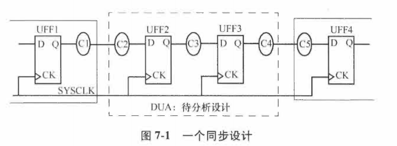

假设只有1个时钟，C1-C5是组合逻辑块，C1和C5在分析之外。

为了STA，需要给触发器指定时钟，给所有到该设计的路径和离开该设计的路径进行时序约束。	

## 7.2 指定时钟

要定义一个时钟，需要提供以下信息：

- 时钟源

- 周期

- 占空比

- 上升沿和下降沿的时间

一个基本的时钟约束规范：

```verilog
create_clock \
-name SYSCLK \
-period 20 \ #默认周期单位ns
-waveform {0 5} \
[get_ports SCLK]
```

waveform选项：第1个参数指定上升沿的发生时间，第2个指定下降沿的发生时间，可以指定任意偶数个边沿参数，默认值是：`-waveform {0 period/2}`

name选项：当约束时没有指定-name时，则时钟的名字和端口名字一样

通过约束`set_clock_transition`可以指定转换时间：

```verilog
set_clock_transition -rise 0.1 [get_clocks CLK_CONFIG]
set_clock_transition -fall 0.12 [get_clocks CLK_CONFIG]
```

> 注意：这种指定转换时间的约束只对==理想时钟==起作用，当时钟树构建完成就无视该约束了

### 7.2.1 时钟不确定性

时钟的不确定性可以用`set_clock_uncertainty`约束来指定。

```
set_clock_uncertainty -setup 0.2 [get_clocks CLK_CONFIG]
set_clock_uncertainty -hold 0.05 [get_clocks CLK_CONFIG]
```

例如：

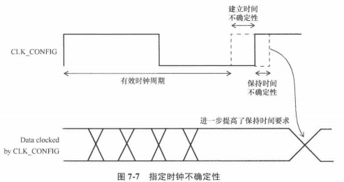

建立时间的时钟的不确定性减少了指定量的可用时钟的周期；保持时间的时钟不确定性是需要满足的额外时序余量。

**时钟间的不确定性**：

```verilog
set_clock_uncertainty -from VIRTUAL_SYS_CLK -to SYS_CLK -hold 0.05
set_clock_uncertainty -from VIRTUAL_SYS_CLK -to SYS_CLK -setup 0.3
set_clock_uncertainty -from SYS_CLK to CFG_CLK -hold 0.05
set_clock_uncertainty -from SYS_CLK to CFG_CLK -setup 0.1
```

### 7.2.2 时钟延迟

时钟延迟约束：`set_clock_latency`

```verilog
# 在MAIN_CLK上的上升沿时钟延迟是1.8ns
set_clock_latency 1.8 -rise [get_clocks MAIN_CLK]
# 在所有时钟上的下降沿时钟延迟是2.1ns：
set_clock_latency 2.1 -fall [all_clocks]
# 选项-rise,-fall指的是触发器时钟引脚上的沿
```

时钟延迟分为两种：

- 网络延迟：从时钟定义点到触发器的时钟引脚的延迟。

- 源延迟：又叫插入延迟，是从时钟的源头到时钟的定义点。可以是片上延迟，也可以是片外延迟。

  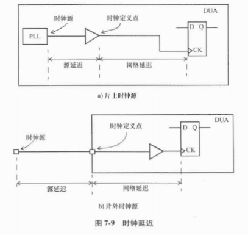

  触发器引脚上的总时钟延迟：源延迟+网络延迟。

指定**源延迟和网络延迟的约束**：

```verilog
# 为上升，下降，最大和最小指定网络延迟为0.8ns(没有-source选项)：
set_clock_latency 0.8 [get_clockSCLK_CONFIG]
# 指定源延迟：
set_clock_latency 1.9 -source [get_clockSYS_CLK]
# 指定最小源延迟：
set_clock_latency 0.851 -source -min [get_clocksCFG_CLK]
# 指定最大源延迟：
set_clock_latency 1.322 -source -max [get_clocksCFG_CLK]
```

**源延迟和网络延迟的区别**：

- 时钟树构建完成，网络延迟可以忽略（假设使用了`set_propagated_clock`命令），但是源延迟依然存在。
- 网络延迟是在时钟树综合之前对时钟树延迟的估计。

## 7.3 生成时钟

主时钟是用约束`create_clock`来定义的。

生成时钟：从主时钟派生出来的。例如，有时钟的三分频电路，应在电路的输出端定义一个生成时钟。（因为STA不知道时钟周期已经在分频逻辑的输出段改变了）

例子：主时钟CLKP的二分频生成时钟。

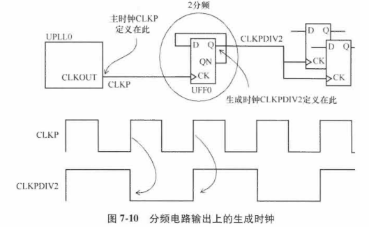

上述例子的二分频生成时钟约束：

```verilog
create_clock -name CLKP 10 [get_pins UPLL0/CLKOUT]
# 在PLL的CLKOUT引脚，创建一个主时钟CLKP，周期为10ns，占空比
# 为50%。

create_generated_clock -name CLKPDIV2 -source UPLL0/CLKOUT \
-divide_by 2 [get_pins UFF0/Q]
# 在触发器UFF0的Q引脚，创建一个生成时钟CLKPDIV2。
# 主时钟在PLL的CLKOUT引脚。生成时钟的周期是时钟CLKP的2倍，
# 也就是20ns。
```

- 可以将生成时钟按照主时钟定义，但是会创建一个新的时钟域，在STA约束时需要处理更多的时钟域；
- 将分频时钟定义为生成时钟，则不会创建新的时钟域。
- 生成时钟不需要额外的约束，因此优先把内部生成的时钟定义为一个生成时钟。

主时钟和生成时钟另一个不同点：**时钟源头**。

- 主时钟：源头在主时钟的定义点
- 生成时钟：源头在主时钟，在时钟路径报告中，时钟路径的起点永远都是主时钟的定义点。


例子：多路复用器进行时钟选择电路

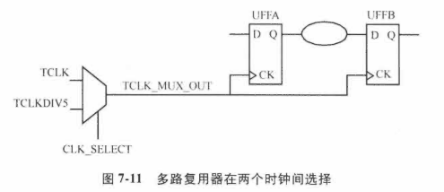

- 情况1：选择信号是常量

  输出端自动得到选择的时钟。

- 情况2：选择信号没有被约束

  进行STA时，需要设置伪路径或者指定两个时钟的互斥关系，进而避免报告不正确的路径。

  非静态的选择信号需要对多路复用器的输入进行时钟门控检查（第10章有介绍），保证多路复用器进行安全的时钟切换。

例子：时钟被一个触发器的输出端门控

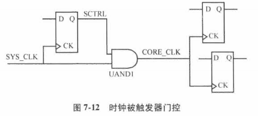

由于触发器的输出端可能不是常量，处理方法：在与门单元的输出端定义一个生成时钟。

```verilog
create_clock 0.1 [get_ports SYS_CLK]
# 创建一个主时钟，周期100ps，占空比为50%。

create_generated_clock -name CORE_CLK -divide_by 1 \
-source SYS_CLK [get_pins UAND1/Z]
# 在与门单元的输出端创建生成时钟CORE_CLK，时钟波形和主时钟一致。
```

例子：生成时钟的频率比源时钟高

```verilog
create_clock -period 10 -waveform {0 5} [get_ports PCLK]
# 创建一个主时钟PCLK，周期10ns，上升沿在0ns，下降沿在5ns。

create_generated_clock -name PCLKx2 \
-source [get_ports PCLK] \
-multiply_by 2 [get_pins UCLKMULTREG/Q]
# 依据主时钟PCLK创建1个生成时钟PCLKx2，频率是主时钟的2倍。
# 生成时钟定义在触发器UCLKMULTREG的输出端。
```

### 7.3.1 时钟门控单元输出端上的主时钟实例

例子：时钟门控，两个输入进一个与门单元。

问题：与门单元输出端是什么时钟？

- 如果与门单元的输入都是时钟，则可以在与门单元的输出定义一个**新的主时钟**（与输入时钟可能无相位关系）

  ```verilog
  create_clock -name SYS_CLK -period 4 -waveform {0 2} \
      [get_pins UFFSYS/Q]
  create_clock -name CORE_CLK -period 12 -waveform {0 4} \
      [get_pins UFFCORE/Q]
  create_clock -name MAIN_CLK -period 12 -waveform {0 2} \
      [get_pins UAND2/Z]
  ```

  

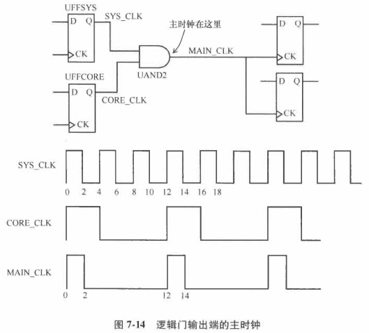

在内部引脚创建时钟的缺点：影响路径延迟的计算，需要设计者手动计算源延迟。

例子：一个二分频生成时钟和两个有相位差的时钟。

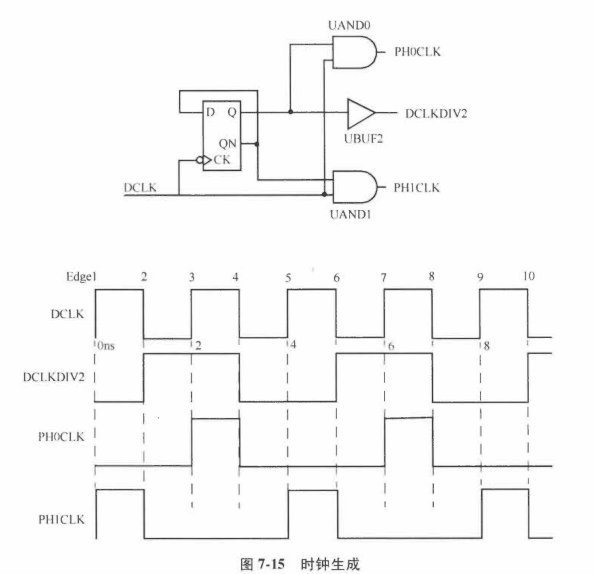

上述例子时钟的定义如下：

```verilog
create_clock 2 [get_ports DCLK]
# 时钟是DCLK，周期为2ns，上升沿在0ns，下降沿在1ns。

create_generated_clock -name DCLKDIV2 -edges {2 4 6} \
-source DCLK [get_pins UBUF2/Z]
# 生成时钟DCLKDIV2定义在缓冲器的输出端。
# 它的波形是上升沿在源时钟的沿2，下降沿在源时钟的沿4，
# 下一个上升沿在源时钟的沿6。

create_generated_clock -name PH0CLK -edges {3 4 7} \
-source DCLK [get_pins UAND0/Z]
# 生成时钟PH0CLK是用源时钟的沿3，4，7组成。

create_generated_clock -name PH1CLK -edges {1 2 5} \
-source DCLK [get_pins UAND1/Z]
# 生成时钟PH1CLK定义在与门单元的输出端，是用源时钟的沿1、2和5组成。
```

如果生成时钟的第1个沿是下降沿呢？

例子：生成时钟G3CLK

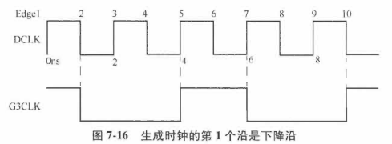

该生成时钟通过指定沿5、7、10进行定义，约束如下：

```verilog
create_generated_clock -name G3CLK -edges {5 7 10} \
-source DCLK [get_pins UAND0/Z]
```

**选项-edge_shift**：

- 可以和选项-edge配合使用，使相应的沿偏移，形成新的生成波形。

- 指定了沿列表中每个沿偏移的量（以时间为单位）。

  ```verilog
  create_clock -period 10 -waveform {0 5} [get_ports MIICLK]
  create_generated_clock -name MIICLKDIV2 -source MIICLK \
  -edge {1 3 5} [get_pins UMIICLKREG/Q]
  # 创建一个二分频时钟
  create_generated_clock -name MIIDIV2 -source MIICLK \
  -edge {1 1 5} -edge_shift {0 5 0} [get_pins UMIIDIV/Q]
  # 创建一个二分频时钟，但是占空比和源时钟的50%不同。
  ```

**沿列表中的沿排列**：必须是非降序排列，但同一沿可以用两次，进而实现时钟脉冲独立于源时钟的占空比。图7-17使用-edge_shift选项指明将源时钟的沿1移动0ns得到第一个沿，沿1移动5ns得到第2个沿，沿5移动0ns得到第3个沿。

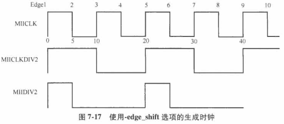

### 7.3.2 使用invert选项生成时钟

例子：使用-invert选项的生成时钟

```verilog
create_clock -period 10 [get_ports CLK]
create_generated_clock -name NCLKDIV2 -divide_by 2 -invert \
-source CLK [get_pins UINVQ/Z]
```

- -invert选项

  在所有其他生成时钟选项生效后，使生成时钟反相。

  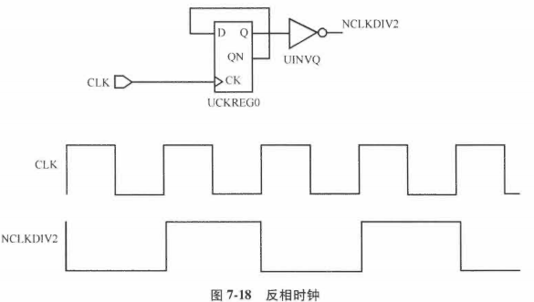

### 7.3.3 生成时钟的时钟延迟

- 生成时钟上的源延迟

  指定了从主时钟定义点到生成时钟定义点的延迟；

  - 被一个生成时钟驱动的触发器时钟引脚上的**总时钟延迟**：

    主时钟源延迟+生成时钟源延迟+生成时钟网络延迟

  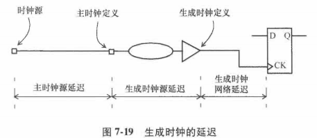

- 一个生成时钟可以把另一个生成时钟当作它的源时钟。

### 7.3.4 典型的时钟生成场景

例子：典型ASIC中的时钟分配

**晶振**：芯片外部，生成一个低频率（10-50MHz）时钟；

**芯片内部PLL**：将晶振时钟当作**参考时钟**，生成一个**高频率低抖动**的时钟（200-800MHz）。

**时钟分频逻辑**：生成ASIC需要的时钟。

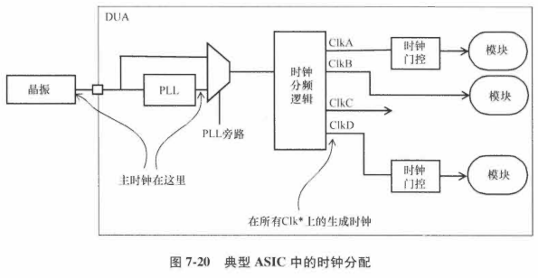

**时钟门控**：关闭设计中不活跃部分的时钟，节省功耗。

第一个主时钟：参考时钟

第二个主时钟：PLL的输出端，与参考时钟无相位关系，所以PLL输出时钟不应该是参考时钟的生成时钟。

所有**时钟分频逻辑产生的时钟**都被指定为**PLL输出端主时钟的生成时钟**。

## 7.4 约束输入路径

注意：STA不能检查没有约束的路径上的任何时序。

例子：DUA的输入路径

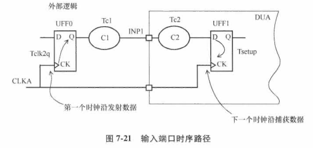

触发器UFF0在设计的外部，为设计内部的触发器UFF1提供数据。

时钟CLKA的定义指明了时钟周期。

输入延迟约束：

```verilog
set Tclk2q 	0.9
set Tc1		0.6
set_input_delay -clock CLKA -max [expr Tclk2q+Tc1] \
[get_ports INP1]
```

上述约束制定了在输入INP1的外部延迟是1.5ns，该延迟是相对于时钟CLKA的。

假设CLKA的时钟周期为2ns，引脚INP1的逻辑在设计内部传播只有500ps可用。

注意：上面的外部延迟指定的是最大值。

- 同时考虑最大和最小延迟

  ```verilog
  create_clock -period 15 -waveform {5 12} [get_ports CLKP]
  set_input_delay -clock CLKP -max 6.7 [get_ports INPA]
  set_input_delay -clock CLKP -min 3.0 [get_ports INPA]
  ```

  - 最大延迟：对应着最大时序工艺角下的最长路径
  - 最小延迟：对应着最小时序工艺角下的最短路径

  假设Tck2q的最大和最小延迟值分别是1.1ns和0.8ns，组合逻辑路径延迟Tc1的最大延迟5.6ns和最小延迟2.2ns。

  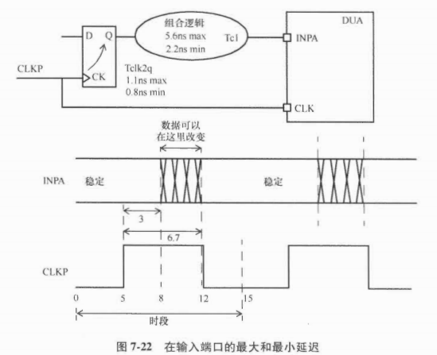

  从CLKP到INPA的最大延迟：1.1ns+5.6ns=6.7ns，最小延迟为3ns。

  考虑外部输入延迟时，设计内部的可用建立时间最小为（15-6.7）=8.3ns。即在一个时钟周期内，捕获数据的可用时间为8.3ns。

- 未指定-max和-min选项

  ```verilog
  set_input_delay -clock clk_core 0.5 [get_ports bist_mode]
  set_input_delay -clock clk_core 0.5 [get_ports sad_state]
  ```

  500ps的时间会应用到最大和最小延迟上。

  **外部输入延迟**是对应时钟clk_core的**上升沿指定**的。

  （如果是对应时钟**下降沿指定**的，必须使用**-clock_fall**选项）

## 7.5 约束输出路径

例子1：

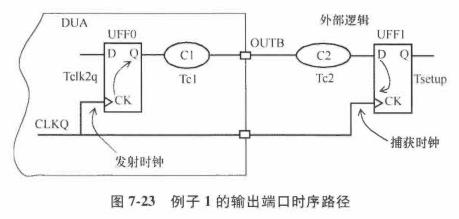

CLKQ：定义了从触发器UFF0到UFF1的总可用时间。

外部逻辑的总延迟：Tc2+Tsetup

输出延迟约束：制定了最大外部延迟为5ns

```verilog
set Tc2		3.9
set Tsetup	1.1
set_output_delay -clock CLKQ -max [expr Tc2+Tsetup] \
[get_ports OUTB]
```

例子2：有最大和最小延迟

最大延迟：7.4ns

最小延迟：-0.2ns（最小Tc2-Thold）

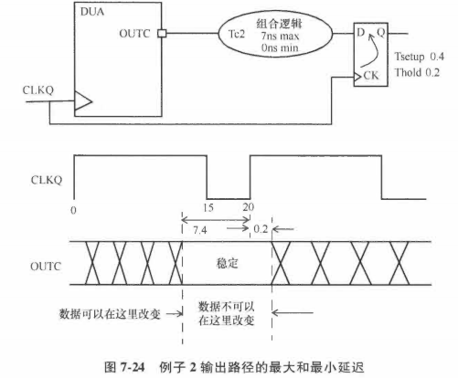

对应的约束：

```verilog
create_clock -period 20 -waveform {0 15} [get_ports CLKQ]
set_output_delay -clock CLKQ -min -0.2 [get_ports OUTC]
set_output_delay -clock CLKQ -max 7.4 [get_ports OUTC]
```

例子3：两个输入，1个输出

约束：

```verilog
create_clock -period 100 -waveform {5 55} [get_ports MCLK]
set_input_delay 25 -max -clock MCLK [get_ports DATAIN]
set_input_delay 5 -min -clock MCLK [get_ports DATAIN]
set_output_delay 20 -max -clock MCLK [get_ports DATAOUT]
set_output_delay -5 -min -clock MCLK [get_ports DATAOUT]
```


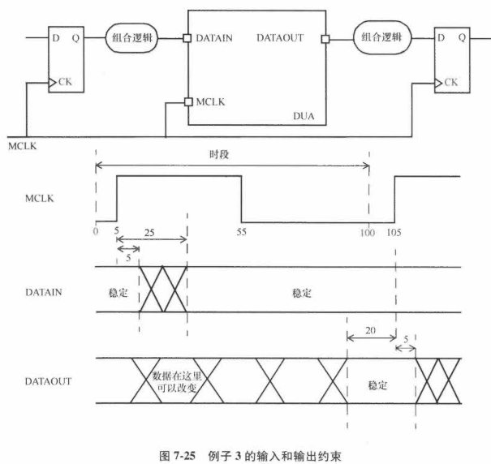

## 7.6 时序路径组

STA时，路径是一句有效的起点和有效的终点记录的。

- 有效的起点：包括输入端口，同步器件的时钟引脚，比如触发器和存储器。
- 有效的终点：输出端口，同步器件的数据输入引脚。

一条有效的时序路径可以是：

1. 输入端口到输出端口；
2. 从输入端口到触发器或存储器的输入；
3. 从触发器或存储器的时钟引脚到触发器或存储器的输入；
4. 从触发器的时钟引脚到输出；
5. 从存储器的时钟引脚到输出端口。

图7-26中的有效路径包括：

1. 输入端口A到UFFA/D；
2. 输入端口A到输出端口Z；
3. UFFA/CK到UFFB/D；
4. UFFB/CK到输出端口Z。

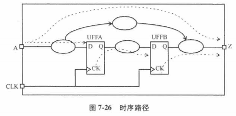

图2-27的路径组是：

1. CLKA组：输入端口A到UFFA/D；
2. CLKB组：UFFA/CK到UFFB/D；
3. 默认组：输入端口A到输出端口Z，UFFB/CK到输出端口Z。

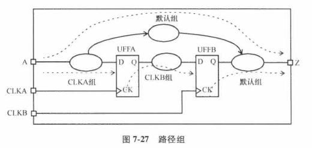

静态时序分析和报告通常是在每个路径组分别进行的。

## 7.7 外部属性建模

命令create_clock、set_input_delay和set_output_delay：足够约束芯片内的所有路径并进行时序分析，但还是不够得到**模块IO引脚的精确时序**。

对于输入，需要在输入指定转换率，可用以下命令：

- set_drive
- set_driving_cell
- set_input_transition

对于输出，需要指定输出看到的电容性负载，可用以下命令：

- set_load

### 7.7.1 驱动能力建模

set_drive和set_driving_cell：用于对外部源的驱动能力建模。

若无约束，所有的输入假设拥有无限的驱动能力，意味着输入引脚的转换时间为0。

- 命令set_drive

  在DUA的输入引脚指定了驱动电阻的值，电阻值越小，驱动能力越强。

  ```verilog
  set_drive 100 UCLK #在输入UCLK指定驱动电阻为100
  # 上升驱动和下降驱动不同
  set_drive -rise 3 [all_inputs]
  set_drive -fall 2 [all_inputs]
  ```

  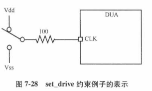

- 命令set_driving_cell

  提供了描述端口驱动能力的更保守和精确的方法。

  被用于指定一个单元来驱动输入端口。

  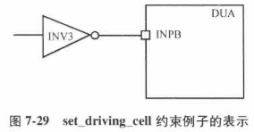

  ```verilog
  set_driving_cell -lib_cell INV3 -library slow [get_ports INPB]
  # 输入INPB是由库文件slow中的INV3单元驱动的。
  
  set_driving_cell -lib_cell INV2 -library tech13g [get_ports all_inputs]
  # 指定库文件tech13g中的INV2单元驱动所有输入。
  
  set_driving_cell -lib_cell BUFFD4 -library tech90gwc [get_ports {testmode[3]}]
  # 输入testmode[3]是由库文件tech90gwc中的单元BUFFD4驱动的。
  ```

  和驱动约束一样，输入端口的驱动单元被用于计算在第1个单元上的转换时间，和计算存在任何RC互连参数的情况下，从输入端口到第1个单元的延迟。

- 命令set_input_transition

  ```verilog
  set_input_transition 0.85 [get_ports INPC]
  # 在端口INPC中指定输入转换时间为850ps
  set_input_transition 0.6 [all_inputs]
  # 在所有输入端口指定转换时间为600ps
  set_input_transition 0.25 [get_ports SD_DIN*]
  # 指定所有名字匹配SD_DIN*的端口转换时间为250ps
  # 可以用选项-min和-max来分别指定最小和最大值
  ```

### 7.7.2 电容负载建模

- set_load

  在输出端口设置了电容性负载。

  默认，在输出端口的电容性负载为0。

  可以指定明确的电容值，或者是一个单元的输入引脚电容。

  ```verilog
  set_load 5 [get_ports OUTX] # 在输出端口OUTX指定5pF的负载
  set_load 25 [all_outputs] # 在所有输出端指定25pF的负载电容
  set_load -pin_load 0.007 [get_ports {shift_write[31]}]
  # 在指定的输出端口指定7fF的引脚电容负载
  # 可以用-wire_load选项指定端口连接的线的负载
  # 如果没有使用-pin_load和-wire_load选项，默认是-pin_load。
  ```

  也可以用于指定1条设计内部线的负载

  ```verilog
  set_load 0.25 [get_nets UCNT5/NET6]
  # 设定线电容为0.25p
  ```

## 7.8 设计规则检查

STA中常用的两个设计规则：**最大转换时间和最大电容**。

- set_max_transition
- set_max_capacitance

任何违反这些设计规则的违例都会以裕量Slack的形式被报告。

```verilog
set_max_transition 0.6 IOBANK
# 在IOBANK设定极限为600ps。

set_max_capacitance 0.5 [current_design]
# 在当前设计中设定所有线的最大电容为0.5pf。
```

例子：一条线上的电容

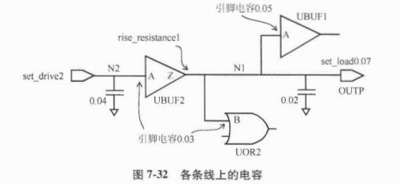

```
Total cap on net N1 =
    pin cap of UBUF1:pin/A +
    pin cap of UOR2:pin/B +
    load cap specified on output port OUTP +
    wire/routing cap
    =0.05+0.03+0.07+0.02
    =0.17pF

Total cap on net N2 =
    pin cap of UBUF2/A +
    wire/routing cap from input to buffer
    =0.04+0.03
    =0.07pF
```

转换时间计算：（假设使用线延迟模型）

```
Transition time on pin UBUF2/A = 
    drive of 2 * total cap on net N2 
    = 2 * 0.07 = 0.14ns = 140ps

Transition time on output port OUTP = 
    drive resistance of UBUF2/Z * total cap of net N1 
    = 1 * 0.17 = 0.17ns = 170ps
```


## 7.9虚拟时钟

虚拟时钟：一个存在的时钟，但和设计的任何引脚或端口都不相关。

- 在STA中作为参考时钟，指定相对于时钟的输入输出延迟。

例子：

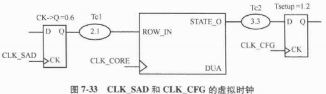

- 为时钟CLK_SAD和CLK_CFG定义虚拟时钟

  ```verilog
  create_clock -name VIRTUAL_CLK_SAD -period 10 -waveform {2 8}
  create_clock -name VIRTUAL_CLK_CFG -period 8 \
      -waveform {0 4}
  create_clock -period 10 [get_ports CLK_CORE]
  ```

  定义好虚拟时钟后，可以相对于这些虚拟时钟指定IO约束。

  ```
  set_input_delay -clock VIRTUAL_CLK_SAD -max 2.7 \
  	[get_ports ROW_IN]
  set_output_delay -clock VIRTUAL_CLK_CFG -max 4.5 \
  	[get_ports STATE_O]
  ```

  输入路径的时序关系：

  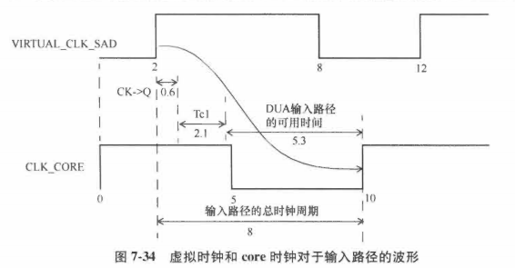

  输出路径的时序关系：

  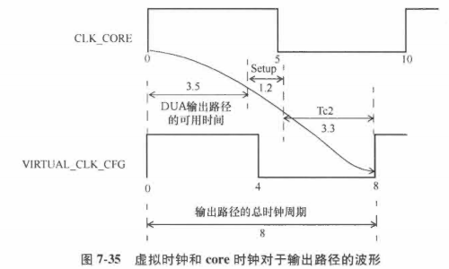

虚拟时钟：只是一种约束输入和输出的方法，设计者也可以用其他方法来约束IO。

## 7.10 完善时序分析

用于约束**分析空间**的4个常用命令：

- set_case_analysis：在单元输入引脚或者输入端口指定常量；
- set_disable_timing：中断单元的时序弧；
- set_false_path：指定路径不是真实的，不需要在STA中检查
- set_multicycle_path：指定路径可以有大于1个时钟周期。

注意：后两种在第8章会详细分析讨论。

### 7.10.1 指定无效信号

在设计中，在芯片的指定模式下，某些信号是常量。这些常量信号用set_case_analysis来指定。

```
set_case_analysis 0 TEST
set_case_analysis 0 [get_ports {testmode[3]}]
set_case_analysis 0 [get_ports {testmode[2]}]
set_case_analysis 0 [get_ports {testmode[1]}]
set_case_analysis 0 [get_ports {testmode[0]}]
```

如果设计有多个功能模式，且只需要分析其中一种，可以用情况分析来指定：

```
set_case_analysis 1 func_mode[0]
set_case_analysis 0 func_mode[1]
set_case_analysis 1 func_mode[2]
```

当设计可以在多种时钟下运行，可以通过多路复用器来控制选择合适的时钟。

```
set_case_analysis 1 UCORE/UMUX0/CLK_SEL[0]
set_case_analysis 1 UCORE/UMUX1/CLK_SEL[1]
set_case_analysis 0 UCORE/UMUX2/CLK_SEL[2]
```

第一个set_case_analysis让MIICLK选择了PLLdiv16；

第二个set_case_analysis让MAINCLK选择了PLLdiv2；

第三个set_case_analysis让ADCCLK选择了SCANCLK。

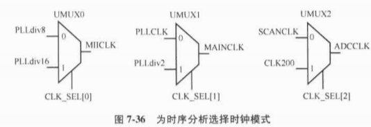

### 7.10.2 中断单元内部的时序弧

每个单元都有从输入到输出的时序弧。

在某些情况下，可能穿过单元的特定路径不存在。

例如：多路复用器选择端的路径

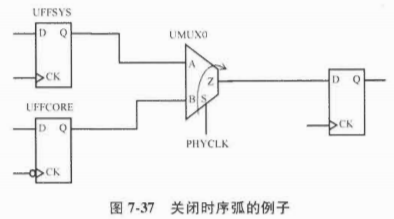

关闭时序弧：

`set_disable_timing -from S -to Z [get_cells UMUX0]`

但谨慎使用set_disable_timing，他会删除所有经过指定引脚的时序路径。

## 7.11 点对点约束

点对点约束命令：set_min_delay和set_max_delay

```
set_max_delay 5.0 -to UFF0/D
# 所有到触发器D引脚的路径延迟的极限是5ns。

set_max_delay 0.6 -from UFF2/Q -to UFF3/D
# 所有这2个触发器之间的路径延迟的极限是600ps。

set_max_delay 0.45 -from UMUX0/Z -through UAND1/A -to UOR0/Z
# 为指定路径设置最大延迟。

set_min_delay 0.15 -from {UAND0/A UXOR1/B} -to {UMUX2/SEL}
```

注意：使用非标准的内部引脚作为起点和终点，会强制让这些点成为起始和终结点，也会把该点上的路径分割。

可以指定类似的从一个时钟到另一个时钟的点到点约束。

```
set_max_delay 1.2 -from [get_clocks SYS_CLK] \
-to [get_clocks CFG_CLK]
# 两个时钟域之间的所有路径的最大延迟为1200ps。

set_min_delay 0.4 -from [get_clocks SYS_CLK] \
-to [get_clocks CFG_CLK]
# 两个时钟域之间的所有路径的最小延迟为400ps。
```


## 7.12 路径分割

时序分割：把时序路径切割为被时序约束的较小路径。

命令set_input_delay通常在单元的输出引脚定义1个起点；

命令set_output_delay通常在单元的输入引脚定义1个新的终点。

例子：

一旦定义时钟SYSCLK，被时序约束的路径：从UFF0/CK到UFF1/D。

若只对UAND2/Z到UAND6/A的路径分析，可以用下面命令：

```
set STARTPOINT [get_pins UAND2/Z]
set ENDPOINT [get_pins UAND6/A]
set_input_delay 0 $STARTPOINT
set_output_delay 0 $ENDPOINT
```

使用上述命令约束，会将原有的时序路径分割为3个部分，每个部分分别被时序约束。

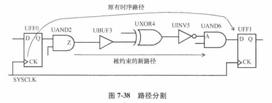

命令set_disable_timing，set_max_delay和set_min_delay也会造成时序路径被分割。
