[toc]

# 第8章 时序验证

介绍STA中的时序检查部分，目的：穷尽验证DUA的时序。

通常，时序检查需要在多种情况下进行，包括最差情况慢速条件和最佳情况快速条件。

## 8.1 建立时间检查

建立时间检查：验证时钟和触发器数据引脚间的时序关系，以保证满足建立时间要求。

建立时间检查目的：保证在时钟到达触发器之前，数据在触发器的输入端已经稳定可用。

典型触发器的建立时间要求：

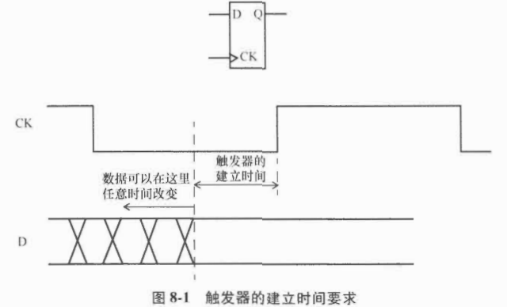

发射触发器：发射数据；

捕获触发器：捕获数据；

建立时间检查：验证从发射触发器到捕获触发器的最长路径。

注意：到两个触发器的时钟可以不同，可以相同。

例子：发射触发器和捕获触发器有相同的时钟。[^图2]

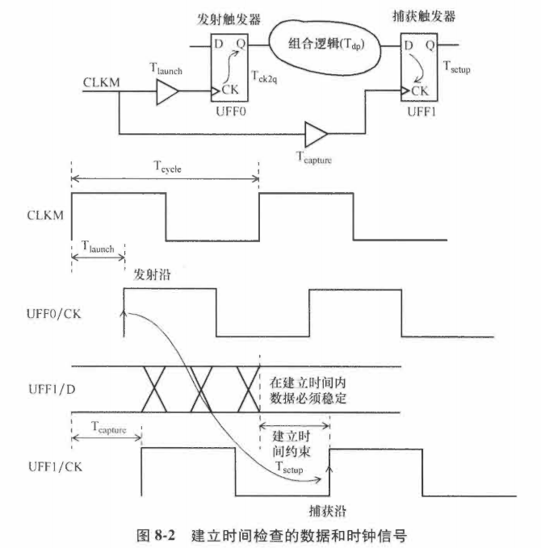

上述例子，建立时间检查公式：

$T_{launch}+T_{ck2q}+T_{dp}<T_{capture}+T_{cycle}-T_{setup}$

- Tlaunch：发射触发器UFF0的时钟树延迟；
- Tdp：组合逻辑数据路径的延迟；
- Tcycle：时钟周期
- Tcapture：捕获触发器的时钟树延迟

总的来说，数据到达捕获触发器D引脚的总时间必须小于时钟到达捕获触发器时间+1个时钟周期延迟-建立时间。

### 8.1.1 触发器到触发器的路径

一个建立时间检查的路径报告：

```pgp
Startpoint: UFF0 (rising edge-triggered flip-flop clocked by CLKM)
Endpoint: UFF1 (rising edge-triggered flip-flop clocked by CLKM)
Path Group: CLKM
Path Type: max

Point                               Incr        Path
----------------------------------------------------
clock CLKM (rise edge)              0.00        0.00
clock network delay (ideal)         0.00        0.00
UFF0/CK (DFF)                       0.00        0.00 r
UFF0/Q (DFF) <-                    0.16        0.16 r
UNOR0/ZN (NR2)                      0.04        0.20 r
UBUF4/Z (BUFF)                      0.05        0.26 r
UFF1/D (DFF)                        0.00        0.26 r
data arrival time                               0.26

clock CLKM (rise edge)             10.00       10.00
clock network delay (ideal)         0.00       10.00
clock uncertainty                  -0.30        9.70
UFF1/CK (DFF)                       0.00        9.70 r
library setup time                 -0.04        9.66
data required time                              9.66
----------------------------------------------------
data required time                              9.66
data arrival time                              -0.26
----------------------------------------------------
slack (MET)                                    9.41
```

- 发射触发器（`Startpoint`指定）的实例名：UFF0，且是时钟CLKM的上升沿触发。
- 捕获触发器（Endpoint指定）：UFF1，也是被时钟CLKM的上升沿触发。
- 路径组：表明路径属于路径组CLKM。
- 路径类型：表明该报告显示的延迟都是最大路径延迟，也说明是建立时间检查。
- 增加Incr列：指定端口或引脚代表的单元或者线的增长延迟。
- 路径Path列：表明累计的实际到达延迟和数据需要到达延迟。

上述例子使用的时钟约束：

```
create_clock -name CLKM -period 10 -waveform {0 5} \
    [get_ports CLKM]
set_clock_uncertainty -setup 0.3 [all_clocks]
set_clock_transition -rise 0.2 [all_clocks]
set_clock_transition -fall 0.15 [all_clocks]
```

- 1个时钟周期的时间：10ns

- 时钟的不确定性：0.3ns，包含了时钟源抖动造成的周期变化以及任何需要分析的时序余量。

- 触发器的建立时间：0.04ns

- 数据需要到达的时间：10-0.3-0.04=9.66ns

- 数据的实际到达时间：0.26ns，所以时序裕量有9.41ns

- clock network delay：被标记为ideal，表明时钟树被当作理想状态，即时钟路径上的任何缓冲器被假设为0延迟。一旦时钟树构建完成，时钟网络会被标记为propagated(传播状态)。

  下面的时序报告展示了发射时钟上的时钟网络延迟为0.11ns，捕获时钟上的时钟网络延迟为0.12ns.

  ```pgp
  Startpoint: UFF0 (rising edge-triggered flip-flop clocked by CLKM)
  Endpoint: UFF1 (rising edge-triggered flip-flop clocked by CLKM)
  Path Group: CLKM
  Path Type: max
  
  Point                               Incr        Path
  ----------------------------------------------------
  clock CLKM (rise edge)              0.00        0.00
  clock network delay (propagated)    0.11        0.11
  UFF0/CK (DFF)                       0.00        0.11 r
  UFF0/Q (DFF) <-                     0.14        0.26 r
  UNOR0/ZN (NR2)                      0.04        0.30 r
  UBUF4/Z (BUFF)                      0.05        0.35 r
  UFF1/D (DFF)                        0.00        0.35 r
  data arrival time                               0.35
  
  clock CLKM (rise edge)             10.00       10.00
  clock network delay (propagated)    0.12       10.12
  clock uncertainty                  -0.30        9.82
  UFF1/CK (DFF)                       0.00        9.82 r
  library setup time                 -0.04        9.78
  data required time                              9.78
  ----------------------------------------------------
  data required time                              9.78
  data arrival time                              -0.35
  ----------------------------------------------------
  slack (MET)                                    9.43
  ```

  时序路径报告可以选择包括展开的时钟路径，也就是完整明确地显示时钟树。


时钟源延迟（也叫插入延迟）：从时钟源头传播到DUA中时钟定义点所需时间。

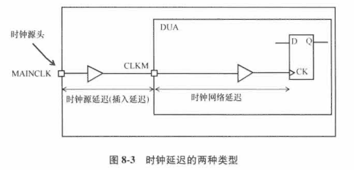

时钟源延迟可以用set_clock_latency明确指定：

```
set_clock_latency -source -rise 0.7 [get_clocks CLKM]
set_clock_latency -source -fall 0.65 [get_clocks CLKM]
```

注意：如果没有-source选项，则set_clock_latency指定的是**时钟网络延迟**，即**从DUA的时钟定义点到触发器的时钟引脚之间的延迟**。

- 时钟网络延迟：在时钟树构建完成前，用于给时钟路径延迟建模使用，在时钟树构建完之后，被标记为propagated，且约束变得无效了。

### 8.1.2 输入到触发器的路径

例子：从输入端口到触发器的路径报告。

```pgp
Startpoint: INA (input port clocked by VIRTUAL_CLKM)
Endpoint: UFF2 (rising edge-triggered flip-flop clocked by CLKM)
Path Group: CLKM
Path Type: max

Point                                Incr   Path
----------------------------------------------------
clock VIRTUAL_CLKM (rise edge)       0.00   0.00
clock network delay (ideal)          0.00   0.00
input external delay                 2.55   2.55 f
INA (in)                                  
UINV1/ZN (INV)                       0.02   2.58 r
UAND0/Z (AN2)                        0.06   2.63 r
UINV2/ZN (INV)                       0.02   2.65 f
UFF2/D (DFF)                         0.00   2.65 f
data arrival time                           2.65

clock CLKM (rise edge)               10.00  10.00
clock source latency                 0.00   10.00
CLKM (in)                            0.00   10.00 r
UCKBUF0/C (CKB)                      0.06   10.06 r
UCKBUF2/C (CKB)                      0.07   10.12 r
UCKBUF3/C (CKB)                      0.06   10.18 r
UFF2/CK (DFF)                        0.00   10.18 r
clock uncertainty                   -0.30   9.88
library setup time                  -0.03   9.85
data required time                          9.85
----------------------------------------------------
data required time                          9.85
data arrival time                          -2.65
----------------------------------------------------
slack (MET)                                 7.20
```

输入路径原理图和时钟波形：[^图4]

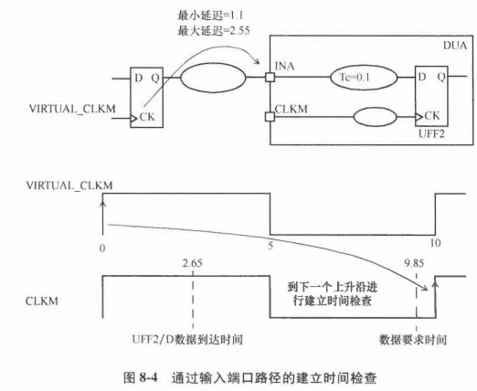

- 输入端口被时钟VIRTUAL_CLKM约束，是一个虚拟时钟

- input external delay：输入外部延迟，通过下面SDC命令指定

  ```
  create_clock -name VIRTUAL_CLKM -period 10 -waveform {0 5}
  set_input_delay -clock VIRTUAL_CLKM -max 2.55 [get_ports INA]
  # 指定了输入INA相对于虚拟时钟的延迟
  ```

- 计算连接到端口INA的第一个单元的延迟

  方法：指定输入端口INA的驱动单元，确定端口INA上的驱动能力和转换率，转换率用于计算单元的延迟。

  `set_driving_cell -lib_cell BUFF -library lib0131wc [get_ports INA]`

- 时序分析报告显示，建立时间裕量为7.2ns

**具有真实时钟的输入路径**

- 在端口CIN的输入约束是相对于输入端口CLKP上的时钟指定的，约束如下：

  `set_input_delay -clock CLKP -max 4.3 [get_ports CIN]`

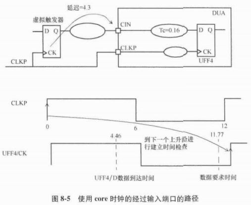

### 8.1.3 触发器到输出的路径

和8.1.2的输入端口约束类似，输出端口也可以相对于虚拟时钟约束，或者相对于设计内部时钟，或者相对于输入时钟端口，或者相对于输出时钟端口。

例子：输出引脚ROUTE相对于虚拟时钟的约束：

```
set_output_delay -clock VIRTUAL_CLKP -max 5.1 [get_ports ROUT]
set_load 0.02 [get_ports ROUT]
```

为了确定正确连接到输出端口的最后一个单元的延迟，应该指定端口的负载。[^图6]

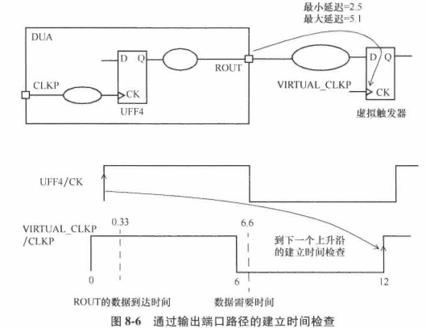

```pgp
Startpoint: UFF4 (rising edge-triggered flip-flop clocked by CLKP)
Endpoint: ROUT (output port clocked by VIRTUAL_CLKP)
Path Group: VIRTUAL_CLKP
Path Type: max

Point                           Incr   Path
----------------------------------------------------
clock CLKP (rise edge)          0.00   0.00
clock source latency            0.00   0.00
CLKP (in)                       0.00   0.00
UCKBUF4/C (CKB)                 0.06   0.06
UCKBUF5/C (CKB)                 0.06   0.12 r
UFF4/CK (DFF)                   0.00   0.12 r
UFF4/Q (DFF)                    0.13   0.25 r
UBUF3/Z (BUFF)                  0.09   0.33 r
ROUT (out)                      0.00   0.33 r
data arrival time                      0.33

clock VIRTUAL_CLKP (rise edge)  12.00  12.00
clock network delay (ideal)     0.00   12.00
clock uncertainty              -0.30   11.70
output external delay          -5.10   6.60
data required time                     6.60
----------------------------------------------------
data required time                     6.60
data arrival time                     -0.33
----------------------------------------------------
slack (MET)                            6.27
```


### 8.1.4 输入到输出的路径

例子：从输入到输出的组合逻辑路径[^图7]

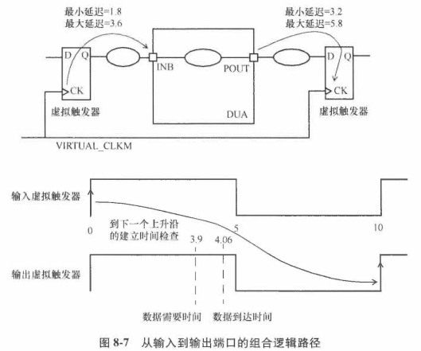

输入和输出延迟约束：

```
set_input_delay -clock VIRTUAL_CLKM -max 3.6 [get_ports INB]
set_output_delay -clock VIRTUAL_CLKM -max 5.8 [get_ports POUT]
```

对应的时序路径报告：

```pgp
Startpoint: INB (input port clocked by VIRTUAL_CLKM)
Endpoint: POUT (output port clocked by VIRTUAL_CLKM)
Path Group: VIRTUAL_CLKM
Path Type: max

Point                           Incr   Path
-------------------------------------------------
clock VIRTUAL_CLKM (rise edge)  0.00   0.00
clock network delay (ideal)     0.00   0.00
input external delay            3.60   3.60 f
INB (in)                        0.00   3.60 f
UBUFO/Z (BUFF)                  0.05   3.65 f
UBUF1/Z (BUFF)                  0.06   3.72 f
UINV3/ZN (INV)                  0.34   4.06 r
POUT (out)                      0.00   4.06 r
data arrival time                      4.06

clock VIRTUAL_CLKM (rise edge)  10.00  10.00
clock network delay (ideal)     0.00   10.00
clock uncertainty              -0.30   9.70
output external delay          -5.80   3.90
data required time                      
-------------------------------------------------
data required time                     3.90
data arrival time                      
-------------------------------------------------
slack (VIOLATED)                      -0.16
```

> 注意：任何**内部时钟延迟**，都不会影响该路径报告的结果。

### 8.1.5 频率直方图

频率直方图：建立时间裕量和路径数量，类似于图8-8。

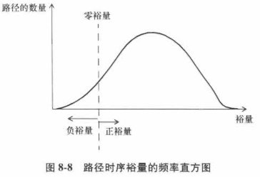

对于没有被优化过的设计，零裕量线更靠近右边，反之更靠近左边。

文本格式的直方图，由静态时序分析工具产生。

```
{-INF  375  0}
{375   380  237}
{380   385  425}
{385   390  1557}
{390   395  1668}
{395   400  1559}
{400   405  1244}
{405   410  1079}
{410   415  941}
{415   420  431}
{420   425  404}
{425   430  1}
{430   +INF 0}
```

前两个索引：表明裕量的范围

第3个索引：表面在这个裕量范围内的路径数量。

## 8.2 保持时间检查

保持时间约束要求：被锁存的数据在时钟有效沿到达之后应该保持一定时间的稳定。

一个典型触发器的保持时间需求：

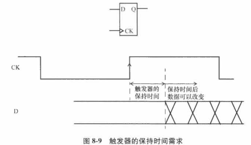

保持时间检查：在发射触发器和捕获触发器之间进行，且捕获触发器的保持时间需求必须被满足。

> 注意：到2个触发器的时钟可以相同，可以不同。

- 保持时间检查独立于时钟周期。
- 保持时间检查在捕获触发器时钟的每个有效沿进行。

例子：发射触发器和捕获触发器有相同的时钟

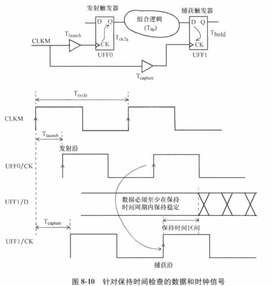

- 时钟上升沿发射的数据经过时间$T_{launch}+T_{ck2q}+T_{dp}$到达捕获触发器UFF1的D引脚。

- 时钟同样的沿经过时间$T_{capture}$到达捕获触发器的时钟引脚

- 保持时间检查：捕获触发器上的**数据到达时间和时钟到达时间的差值必须大于捕获触发器的需求保持时间**，保证触发器的上一个数据不会被覆盖且可靠地被触发器捕获。

- 保持时间检查公式：

  $T_{launch}+T_{ck2q}+T_{dp}>T_{capture}+T_{hold}$

- 保持时间约束

  给到达捕获触发器**数据引脚**的路径加上**下限或者最小值约束**；

- 保持时间检查都是在快速时序工艺角进行。

- 保持时间检查需要确保：

  1）下1个发射沿的数据绝不能被当前建立时间捕获沿捕获；

  2）当前建立时间发射沿的数据绝不能被之前的捕获沿捕获。

  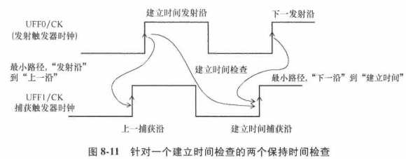

  - 下一发射沿不能过快传播数据，导致建立时间捕获沿没有时间可靠的捕获数据；
  - 建立时间发射沿不能过快传播数据，导致上一捕获沿没有机会 捕获数据。

- 保持时间检查的重要性：**建立时间违例**会导致设计的工作频率降低，**保持时间违例**会彻底杀死设计。

### 8.2.1 触发器到触发器的路径

例子：基于图8-2的例子描述触发器到触发器的保持时间路径。

[^图2 ]: 图8-2

```pgp
Startpoint: UFF0 (rising edge-triggered flip-flop clocked by CLKM)
Endpoint: UFF1 (rising edge-triggered flip-flop clocked by CLKM)
Path Group: CLKM
Path Type: min

Point                           Incr   Path
-------------------------------------------------
clock CLKM (rise edge)          0.00   0.00
clock source latency            0.00   0.00
CLKM (in)                       0.00   0.00 r
UCKBUFO/C (CKB)                 0.06   0.06 r
UCKBUF1/C (CKB)                 0.06   0.11 r
UFF0/CK (DFF)                   0.00   0.11 r
UFF0/Q (DFF) <-                 0.14   0.26 f
UNORO/ZN (NR2)                  0.02   0.28 f
UBUF4/Z (BUFF)                  0.06   0.33 f
UFF1/D (DFF)                    0.00   0.33 f
data arrival time                      0.33

clock CLKM (rise edge)          0.00   0.00
clock source latency            0.00   0.00
CLKM (in)                       0.00   0.00 r
UCKBUFO/C (CKB)                 0.06   0.06 r
UCKBUF2/C (CKB)                 0.07   0.12 r
UFF1/CK (DFF)                   0.00   0.12 r
clock uncertainty               0.05   0.17
library hold time               0.01   0.19
data required time                     0.19
data arrival time                     -0.33
-------------------------------------------------
slack(MET)                                0.14
```

- 路径类型：min意味着使用最短路径的单元延迟值，也对应着保持时间检查。
- 库保持时间：指定了触发器UFF1的保持时间。
- 时序报告显示：新数据最早允许到达UFF1的时间是0.19ns，而新数据的实际到达时间为0.33ns，所以保持裕量为0.14ns。

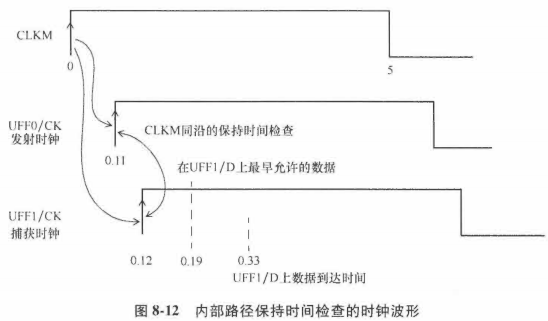

图8-12表明了时钟信号到达发射和捕获触发器的时间，以及数据到达捕获触发器允许最早时间和实际到达时间。

因为数据到达时间比数据要求时间要晚，满足保持时间要求。

**保持时间裕量计算**

建立时间和保持时间时序报告的计算方式不同。

- 建立时间报告：裕量=需要时间-到达时间
- 保持时间报告：裕量=到达时间-需要时间

### 8.2.2 输入到触发器的路径

输入端口的保持时间检查：使用虚拟时钟在输入端口指定最小延迟

[^图4 ]: 图8-4

`set_input_delay -clock VIRTUAL_CLKM -min 1.1 [get_ports INA]`

下面是时序报告：

```pgp
Startpoint: INA (input port clocked by VIRTUAL_CLKM)
Endpoint: UFF2 (rising edge-triggered flip-flop clocked by CLKM)
Path Group: CLKM
Path Type: min

Point                           Incr   Path
-------------------------------------------------
clock VIRTUAL_CLKM (rise edge)  0.00   0.00
clock network delay (ideal)     0.00   0.00
input external delay            1.10   1.10 f
INA (in) <-                     0.00   1.10 f
UINV1/ZN (INV )                 0.02   1.13 r
UAND0/Z (AN2 )                  0.06   1.18 r
UINV2/ZN (INV )                 0.02   1.20 f
UFF2/D (DFF )                   0.00   1.20 f
data arrival time                      1.20

clock CLKM (rise edge)          0.00   0.00
clock source latency            0.00   0.00
CLKM (in)                       0.00   0.00 r
UCKBUFO/C (CKB )                0.06   0.06 r
UCKBUF1/C (CKB )                0.07   0.12 r
UCKBUF2/C (CKB )                0.06   0.18 r
UFF2/CK (DFF )                  0.00   0.18 r
clock uncertainty               0.05   0.23
library hold time               0.01   0.25
data required time                     0.25
-------------------------------------------------
data required time                     0.25
data arrival time                     -1.20
-------------------------------------------------
slack(MET)                                0.95
```

数据被UFF2捕获且没有违反它的保持时间所需要的到达时间是0.25ns，意味数据需要在0.25ns之后到达；

数据实际到达时间为1.2ns，所以保持时间裕量为0.95ns.

### 8.2.3 触发器到输出的路径

输出保持时间检查例子：

[^图6]: 图8-6

输出端口约束：

`set_output_delay -clock VIRTUAL_CLKP -min 2.5 [get_ports ROUT]`

输出延迟：相对于1个虚拟时钟指定的，保持时间报告如下。

```pgp
Startpoint: UFF4 (rising edge-triggered flip-flop clocked by CLKP)
Endpoint: ROUT (output port clocked by VIRTUAL_CLKP)
Path Group: VIRTUAL_CLKP
Path Type: min

Point                           Incr
-------------------------------------------------
clock CLKP (rise edge)          0.00   0.00
clock source latency            0.00   0.00
CLKP (in)                       0.00   0.00 r
UCKBUF4/C (CKB )                0.06   0.06 r
UCKBUF5/C (CKB )                0.06   0.12 r
UFF4/CK (DFF )                  0.00   0.12 r
UFF4/Q (DFF )                   0.13   0.25 f
UBUF3/Z (BUFF )                 0.08   0.33 f
ROUT (out)                      0.00   0.33 f
data arrival time                      0.33

clock VIRTUAL_CLKP (rise edge)  0.00   0.00
clock network delay (ideal)     0.00   0.00
clock uncertainty               0.05   0.05
output external delay          -2.50  -2.45
data required time                    -2.45 
-------------------------------------------------
data required time                    -2.45
data arrival time                     -0.33
-------------------------------------------------
slack(MET)                             2.78
```

**具有真实时钟的触发器到输出的路径**

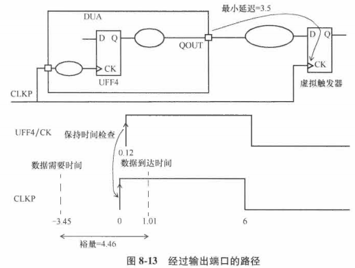

```
set_output_delay -clock CLKP -min 3.5 [get_ports QOUT]
set_load 0.55 [get_ports QOUT]
```

保持时间检查报告：

```pgp
Startpoint: UFF4 (rising edge-triggered flip-flop clocked by CLKP)
Endpoint: ROUT (output port clocked by CLKP)
Path Group: CLKP
Path Type: min

Point                           Incr
-------------------------------------------------
clock CLKP (rise edge)          0.00   0.00
clock source latency            0.00   0.00
CLKP (in)                       0.00   0.00 r
UCKBUF4/C (CKB )                0.06   0.06 r
UCKBUF5/C (CKB )                0.06   0.12 r
UFF4/CK (DFF )                  0.00   0.12 r
UFF4/Q (DFF )                   0.14   0.26 f
UBUF3/Z (BUFF )                 0.75   1.01 f
ROUT (out)                      0.00   1.01 f
data arrival time                      1.01

clock VIRTUAL_CLKP (rise edge)  0.00   0.00
clock network delay (ideal)     0.00   0.00
clock uncertainty               0.05   0.05
output external delay          -3.50  -3.45
data required time                    -3.45 
-------------------------------------------------
data required time                    -3.45
data arrival time                     -1.01
-------------------------------------------------
slack(MET)                             4.46
```

上面报告表明对于保持时间，触发器到输出端口有4.46ns的正裕量。

### 8.2.4 输入到输出的路径

例子：输入端口到输出端口的保持时间检查

[^图7]: 图8-7

端口上的约束如下：

```
set_load -pin_load 0.15 [get_ports POUT]
set_output_delay -clock VIRTUAL_CLKM -min 3.2 [get_ports POUT]
set_input_delay -clock VIRTUAL_CLKM -min 1.8 [get_ports INB]
set_input_transition 0.8 [get_ports INB]
```

时序报告：

```pgp
Startpoint: INB (input port clocked by VIRTUAL_CLKM)
Endpoint: POUT (output port clocked by VIRTUAL_CLKM)
Path Group: VIRTUAL_CLKM
Path Type: min

Point                           Incr   Path
----------------------------------------------------------------
clock VIRTUAL_CLKM (rise edge)  0.00   0.00
clock network delay (ideal)     0.00   0.00
input external delay            1.80   1.80 r
INB (in) <-                     0.00   1.80 r
UBUF0/Z (BUFF )                 0.04   1.84 r
UBUF1/Z (BUFF )                 0.06   1.90 r
UINV3/ZN (INV )                 0.22   2.12 f
POUT (out)                      0.00   2.12 f
data arrival time                      2.12

clock VIRTUAL_CLKM (rise edge)  0.00   0.00
clock network delay (ideal)     0.00   0.00
clock uncertainty               0.05   0.05
output external delay          -3.20  -3.15
data required time                    -3.15
----------------------------------------------------------------
data required time                    -3.15
data arrival time                     -2.12
----------------------------------------------------------------
slack (MET)                            5.27
```

输出端口上的约束是相对于虚拟时钟指定的

## 8.3 多周期路径

在某些情况下，2个触发器之间的组合逻辑数据路径可能需要超过1个时钟周期，才能传播通过整个逻辑。

在这种情况下，组合逻辑路径被声明为**多周期路径**。

例子：数据路径需要3个时钟周期

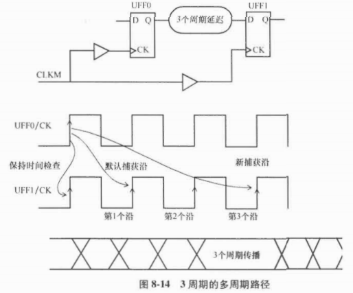

**多周期建立时间约束**：

```
create_clock -name CLKM -period 10 [get_ports CLKM]
set_multicycle_path 3 -setup \
	-from [get_pins UFF0/Q] \
	-to [get_pins UFF1/D]
```

该约束设计每3个周期使用从UFF1/Q发出的数据，而不是每个周期。

多周期约束的建立时间路径时序报告：

```
Startpoint: UFF0 (rising edge-triggered flip-flop clocked by CLKM)
Endpoint: UFF1 (rising edge-triggered flip-flop clocked by CLKM)
Path Group: CLKM
Path Type: max

Point                                Incr      Path
----------------------------------------------------------------
clock CLKM (rise edge)               0.00      0.00
clock network delay (propagated)     0.11      0.11
UFF0/CK (DFF)                        0.00      0.11 r
UFF0/Q (DFF)                         0.14      0.26 f
UNOR0/ZN (NR2)                       0.04      0.30 r
UBUF4/Z (BUFF)                       0.05      0.35 r
UFF1/D (DFF)                         0.00      0.35 r
data arrival time                              0.35

clock CLKM (rise edge)               30.00     30.00
clock network delay (propagated)     0.12      30.12
clock uncertainty                   -0.30      29.82
UFF1/CK (DFF)                                  29.82 r
library setup time                  -0.04      29.78
data required time                             29.78
----------------------------------------------------------------
data required time                             29.78
data arrival time                              -0.35
----------------------------------------------------------------
slack (MET)                                    29.43
```

**多周期路径的保持时间检查**

**默认的保持时间检查**：在建立时间捕获沿之前的1个有效沿上进行，而我们此时需要将默认的保持时间检查沿提前2个周期，所以保持多周期指定为2。期望的行为如图8-15所示。

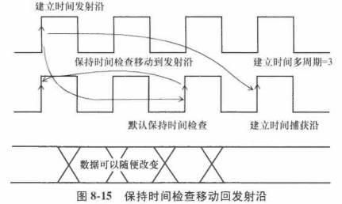

经过多周期保持时间约束，数据路径的最小延迟可以小于1个时钟周期。

```
set_multicycle_path 2 -hold -from [get_pins UFF0/Q] \
	-to [get_pins UFF1/D]
```

在多周期保持时间中**指定的周期数字**，指定了**需要从默认的保持时间检查沿（建立时间捕获沿之前的1个有效沿）往回移动多少个时钟周期**。

保持时间路径报告如下：

```pgp
Startpoint: UFF0 (rising edge-triggered flip-flop clocked by CLKP)
Endpoint: UFF1 (rising edge-triggered flip-flop clocked by CLKP)
Path Group: CLKP
Path Type: min

Point                           Incr   Path
----------------------------------------------------------------
clock CLKP (rise edge)          0.00   0.00
clock source latency            0.00   0.00
CLKP (in)                       0.00   0.00 r
UCKBUF4/C (CKB)                 0.07   0.07 r
UFF0/CK (DFF)                   0.00   0.07 r
UFF0/Q (DFF)                    0.15   0.22 f
UXOR1/Z (XOR2)                  0.07   0.29 f
UFF1/D (DFF)                    0.00   0.29 f
data arrival time                      0.29

clock CLKP (rise edge)          0.00   0.00
clock source latency            0.00   0.00
CLKP (in)                       0.00   0.00 r
UCKBUF4/C (CKB)                 0.07   0.07 r
UCKBUF5/C (CKB)                 0.06   0.13 r
UFF1/CK (DFF)                   0.00   0.13 r
clock uncertainty               0.05   0.18
library hold time               0.01   0.19
data required time                     0.19
----------------------------------------------------------------
data required time                     0.19
data arrival time                     -0.29
----------------------------------------------------------------
slack (MET)                            0.11
```

在多数设计中，多周期建立时间指定为N个周期，但对应的多周期保持时间N-1没有被指定，会发生什么？

此时，保持时间检查在建立时间捕获沿之前的1个周期的沿上进行，如图8-16。

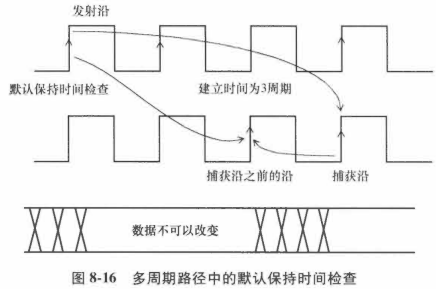

- 数据只能在建立时间捕获沿之前的1个周期内改变，所以数据路径必须有最小2个时钟周期的最小延迟

```pgp
Startpoint: UFF0 (rising edge-triggered flip-flop clocked by CLKM)
Endpoint: UFF1 (rising edge-triggered flip-flop clocked by CLKM)
Path Group: CLKM
Path Type: min

Point                           Incr   Path
----------------------------------------------
clock CLKM (rise edge)          0.00   0.00
clock source latency            0.00   0.00
CLKM (in)                       0.00   0.00 r
UCKBUFO/C (CKB )                0.06   0.06 r
UCKBUF1/C (CKB )                0.06   0.11 r
UFF0/CK (DFF )                  0.00   0.11 r
UFF0/Q (DFF ) <-                0.14   0.26 r
UNOR0/ZN (NR2 )                 0.02   0.28 f
UBUF4/Z (BUFF )                 0.06   0.33 f
UFF1/D (DFF )                   0.00   0.33 f
data arrival time                      0.33

clock CLKM (rise edge)          20.00  20.00
clock source latency            0.00   20.00
CLKM (in)                       0.00   20.00 r
UCKBUF0/C (CKB )                0.06   20.06 r
UCKBUF2/C (CKB )                0.07   20.12 r
UFF1/CK (DFF )                  0.00   20.12 r
clock uncertainty               0.05   20.17
library hold time               0.01   20.19
data required time                       
-----------------------------------------------
data required time                     20.19
data arrival time                      -0.33
-----------------------------------------------
slack (VIOLATED)                       -19.85
```

上述路径报告中，保持时间是在捕获沿之前的1个时钟沿检查的，导致了很大的保持时间违例。

实际，保持时间检查在组合逻辑上要求最小延迟为至少2个时钟周期。


#### **跨时钟域**

情况1：在2个具有相同周期的不同时钟间的多周期路径

情况2：不同周期时钟

本节考虑情况1。

**例子1**

```
create_clock -name CLKM -period 10 -waveform {0 5} [get_ports CLKM]
create_clock -name CLKP -period 10 -waveform {0 5} [get_ports CLKP]
```

**建立时间多周期乘数**：给定路径的时钟周期。

默认建立时间捕获沿一直都是1个周期，建立时间多周期值2让捕获沿距离发射沿2个周期。

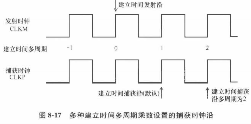

**保持时间多周期乘数**：保持时间检查会在建立时间捕获沿之前几个时钟周期进行，不考虑发射沿的位置。

保持时间约束：

```
set_multicycle_path 2 \
    -from [get_pins UFF0/CK] -to [get_pins UFF3/D]
# 因为没有指定 -hold 选项，默认的选项为 -setup。
# 这意味着建立时间乘数为2，保持时间乘数为0。
```

**对应多周期约束的建立时间路径报告**：

```pgp
Startpoint: UFF0 (rising edge-triggered flip-flop clocked by CLKM)
Endpoint: UFF3 (rising edge-triggered flip-flop clocked by CLKP)
Path Group: CLKP
Path Type: max

Point                           Incr   Path
----------------------------------------------
clock CLKM (rise edge)          0.00   0.00
clock source latency            0.00   0.00
CLKM (in)                       0.00   0.00 r
UCKBUF0/C (CKB)                 0.06   0.06 r
UCKBUF1/C (CKB)                 0.06   0.11 r
UFF0/CK (DFF)                   0.00   0.11 r
UFF0/Q (DFF)                    0.14   0.26 f
UINV0/ZN (INV)                  0.03   0.28 r
UFF3/D (DFF)                    0.00   0.28 r
data arrival time                      0.28

clock CLKP (rise edge)          20.00  20.00
clock source latency            0.00   20.00
CLKP (in)                       0.00   20.00 r
UCKBUF4/C (CKB)                 0.06   20.06 r
UFF3/CK (DFF)                   0.00   20.06 r
clock uncertainty              -0.30   19.76
library setup time             -0.04   19.71
data required time                     19.71
----------------------------------------------
data required time                     19.71
data arrival time                      -0.28
----------------------------------------------
slack (MET)                            19.43
```

注意：路径报告中指定的路径组一直是捕获触发器的时钟，即CLKP。

**对应多周期约束的保持时间路径报告**：保持时间乘数默认为0，所以保持时间检查在10ns处，即建立时间捕获沿之前的1个时钟周期。

```pgp
Startpoint: UFF0 (rising edge-triggered flip-flop clocked by CLKM)
Endpoint: UFF3 (rising edge-triggered flip-flop clocked by CLKP)
Path Group: CLKP
Path Type: min

Point                           Incr   Path
------------------------------------------------
clock CLKM (rise edge)          0.00   0.00
clock source latency            0.00   0.00
CLKM (in)                       0.00   0.00 r
UCKBUF0/C (CKB)                 0.06   0.06 r
UCKBUF1/C (CKB)                 0.06   0.11 r
UFF0/CK (DFF)                   0.00   0.11 r
UFF0/Q (DFF)                    0.14   0.26 r
UINV0/ZN (INV)                  0.02   0.28 f
UFF3/D (DFF)                    0.00   0.28 f
data arrival time                      0.28

clock CLKP (rise edge)          10.00  10.00
clock source latency            0.00   10.00
CLKP (in)                       0.00   10.00 r
UCKBUF4/C (CKB)                 0.06   10.06 r
UFF3/CK (DFF)                   0.00   10.06 r
clock uncertainty               0.05   10.11
library hold time               0.02   10.12
data required time                     10.12
------------------------------------------------
data required time                     10.12
data arrival time                      -0.28
------------------------------------------------
slack (VIOLATED)                       -9.85
```

上述报告显示的保持时间违例可以通过指定多周期保持时间为1来删除。

```
set_multicycle_path 2 \
	-from [get_pins UFF0/CK] -to [get_pins UFF3/D] -setup
set_multicycle_path 1 \
	-from [get_pins UFF0/CK] -to [get_pins UFF3/D] -hold
# 选项-setup和-hold是明确指定的
```

保持时间多周期乘数为1后，时序报告：

```pgp
Startpoint: UFF0 (rising edge-triggered flip-flop clocked by CLKM)
Endpoint: UFF3 (rising edge-triggered flip-flop clocked by CLKP)
Path Group: CLKP
Path Type: min

Point                           Incr   Path
------------------------------------------------
clock CLKM (rise edge)          0.00   0.00
clock source latency            0.00   0.00
CLKM (in)                       0.00   0.00 r
UCKBUF0/C (CKB)                 0.06   0.06 r
UCKBUF1/C (CKB)                 0.06   0.11 r
UFF0/CK (DFF)                   0.00   0.11 r
UFF0/Q (DFF)  <-                0.14   0.26 r
UINV0/ZN (INV)                  0.02   0.28 f
UFF3/D (DFF)                    0.00   0.28 f
data arrival time                      0.28

clock CLKP (rise edge)          0.00   0.00
clock source latency            0.00   0.00
CLKP (in)                       0.00   0.00 r
UCKBUF4/C (CKB)                 0.06   0.06 r
UFF3/CK (DFF)                   0.00   0.06 r
clock uncertainty               0.05   0.11
library hold time               0.02   0.12
data required time                     0.12
------------------------------------------------
data required time                     0.12
data arrival time                      -0.28
------------------------------------------------
slack (MET)                       	   0.16
```

注意：本节的例子中，建立时间和保持时间检查报告都是同一时序工艺角。

但是，建立时间检查通常是在最差情况慢速工艺角最难满足，而保持时间检查通常在最佳情况快速工艺角最难满足。

## 8.4 伪路径

在设计真正的功能运行时，可能有些时序路径不是真实的，可能不存在，这些路径可以通过设置**伪路径**。

STA时，会忽略伪路径。

伪路径包括：

- 从1个时钟域到另一个时钟路径
- 从1个触发器的时钟引脚到另一个触发器的输入
- 经过1个单元的引脚
- 经过多个单元的引脚
- 以上路径的组合

指定伪路径的优势：减小分析空间，减少分析时间。

伪路径约束例子：

```verilog
set_false_path -from [get_clocks SCAN_CLK] \
-to [get_clocks CORE_CLK] 
# 任何从SCAN_CLK域到CORE_CLK域的路径都是伪路径。

set_false_path -through [get_pins UMUX0/S] 
# 任何穿过这个引脚的路径都是伪路径。

set_false_path -through [get_pins SAD_CORE/RSTN] 
# 伪路径约束可以指定为“到”，“经过”，或者“从”模块引脚。

set_false_path -to [get_ports TEST_REG*] 
# 所有路径终点为端口TEST_REG*的都是伪路径。

set_false_path -through UINV/Z -through UAND0/Z 
# 任何以这个顺序穿过这两个引脚的路径都是伪路径。
```

设置2个时钟域之间的伪路径，使用：

`set_false_path -from [get_clocks clockA] -to [get_clocks clockB]`

不要使用：

`set_false_path -from [get_pins {regA_*}/CP] -to [get_pins {regB_*}/D]`

因为第2种格式会慢很多。

另一个建议：减少`-through`的使用，它会增加没有必要的运行时间复杂度。

从优化的角度，当使用多周期路径时，不要使用伪路径。

## 8.5 半周期路径

触发器有正沿触发的，也有负沿触发的，则很可能存在半周期路径。

**半周期路径**：可能是从上升沿触发器到下降沿触发器，可能是从下降沿到上升沿。

例子：数据在触发器UFF5时钟的下降沿发射，在触发器UFF3时钟的上升沿捕获。

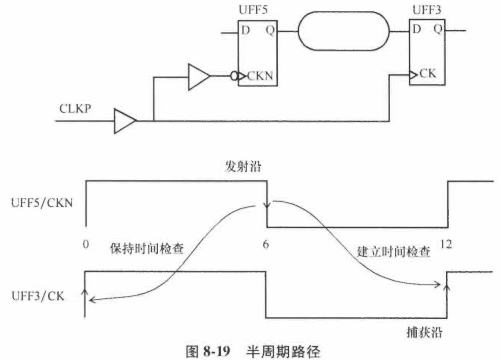

建立时间检查报告：

```pgp
Startpoint: UFF5 (falling edge-triggered flip-flop clocked by CLKP)
Endpoint: UFF3 (rising edge-triggered flip-flop clocked by CLKP)
Path Group: CLKP
Path Type: max

Point                           Incr   Path
----------------------------------------------------------------
clock CLKP (fall edge)          6.00   6.00
clock source latency            0.00   6.00
CLKP (in)                       0.00   6.00 f
UCKBUF4/C (CKB)                 0.06   6.06 f
UCKBUF6/C (CKB)                 0.06   6.12 f
UFF5/CKN (DFN)                  0.00   6.12 f
UFF5/Q (DFN)                    0.16   6.28 r
UNAND0/ZN (ND2)                 0.03   6.31 f
UFF3/D (DFF)                    0.00   6.31 f
data arrival time                      6.31

clock CLKP (rise edge)          12.00  12.00
clock source latency            0.00   12.00
CLKP (in)                       0.00   12.00 r
UCKBUF4/C (CKB)                 0.07   12.07 r
UFF3/CK (DFF)                   0.00   12.07 r
clock uncertainty              -0.30   11.77
library setup time             -0.03   11.74
data required time                     11.74
----------------------------------------------------------------
data required time                     11.74
data arrival time                      -6.31
----------------------------------------------------------------
slack (MET)                             5.43
```

上述例子，数据只有半周期6ns传播到捕获时钟。

当数据路径对建立时间检查只有半个周期，但对保持时间检查会有额外的半周期，保持时间路径如下：

```pgp
Startpoint: UFF5 (falling edge-triggered flip-flop clocked by CLKP)
Endpoint: UFF3 (rising edge-triggered flip-flop clocked by CLKP)
Path Group: CLKP
Path Type: min

Point                           Incr   Path
----------------------------------------------------
clock CLKP (fall edge)          6.00   6.00
clock source latency            0.00   6.00
CLKP (in)                       0.00   6.00 f
UCKBUF4/C (CKB)                 0.06   6.06 f
UCKBUF6/C (CKB)                 0.06   6.12 f
UFF5/CKN (DFN)                  0.00   6.12 f
UFF5/Q (DFN)                    0.16   6.28 r
UNAND0/ZN (ND2)                 0.03   6.31 f
UFF3/D (DFF)                    0.00   6.31 f
data arrival time                      6.31

clock CLKP (rise edge)          0.00   0.00
clock source latency            0.00   0.00
CLKP (in)                       0.00   0.00 r
UCKBUF4/C (CKB)                 0.07   0.07 r
UFF3/CK (DFF)                   0.00   0.07 r
clock uncertainty               0.05   0.12
library hold time               0.02   0.13
data required time                     0.13
----------------------------------------------------
data required time                     0.13
data arrival time                     -6.31
----------------------------------------------------
slack (MET)                            6.18
```

保持时间检查总发生在捕获沿的前1个周期。因为捕获沿出现在12ns，之前的捕获沿是在0ns，所以保持时间检查发生在0ns，为保持时间检查有效地增加了半个周期。

## 8.6 移除时间检查

**移除时间检查**：确保有效时钟沿和异步控制信号释放之间有足够的时间。

- 异步控制信号：在有效时钟沿之后被释放。

- 例子

  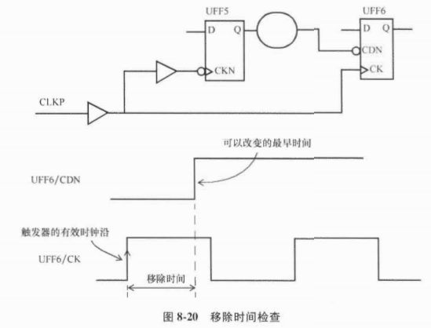

- 最小路径检查

  类似于保持时间检查，移除时间检查是1个最小路径检查

```pgp
Startpoint: UFF5 (falling edge-triggered flip-flop clocked by CLKP)
Endpoint: UFF6 (removal check against rising-edge clock CLKP)
Path Group: async_default
Path Type: min

Point                           Incr   Path
----------------------------------------------------
clock CLKP (fall edge)          6.00   6.00
clock source latency            0.00   6.00
CLKP (in)                       0.00   6.00 f
UCKBUF4/C (CKB)                 0.06   6.06 f
UCKBUF6/C (CKB)                 0.07   6.13 f
UFF5/CKN (DFN)                  0.00   6.13 f
UFF5/Q (DFN)                    0.15   6.28 f
UINV8/ZN (INV)                  0.03   6.31 r
UFF6/CDN (DFCN)                 0.00   6.31 r
data arrival time                      6.31

clock CLKP (rise edge)          0.00   0.00
clock source latency            0.00   0.00
CLKP (in)                       0.00   0.00 r
UCKBUF4/C (CKB)                 0.07   0.07 r
UCKBUF6/C (CKB)                 0.07   0.14 r
UCKBUF7/C (CKB)                 0.05   0.19 r
UFF6/CK (DFCN)                  0.00   0.19 r
clock uncertainty               0.05   0.24
library removal time            0.19   0.43
data required time                     0.43
----------------------------------------------------
data required time                     0.43
data arrival time                      -6.31
----------------------------------------------------
slack (MET)                            5.88
```

该触发器的移除时间显示为“library removal time”且值为0.19ns。

所有的异步时间检查都被归类为路径组“async default”。

## 8.7 恢复时间检查

**恢复时间检查**：确保在异步信号变为无效和下1个有效时钟沿之后的最小时间。

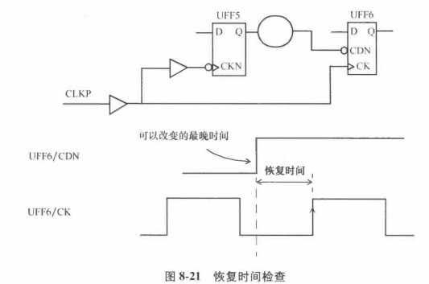

- 最大路径检查

  类似于建立时间检查

时序报告如下：

```
Startpoint: UFF5 (falling edge-triggered flip-flop clocked by CLKP)
Endpoint: UFF6 (recovery check against rising-edge clock CLKP)
Path Group: **async_default**
Path Type: max

Point                           Incr   Path
----------------------------------------------
clock CLKP (fall edge)          6.00   6.00
clock source latency            0.00   6.00
CLKP (in)                       0.00   6.00 f
UCKBUFC4/C (CKB)                0.06   6.06 f
UCKBUF6/C (CKB)                 0.07   6.13 f
UFF5/C/KKN (DFN)                0.00   6.13 f
UFF5/Q (DFN)                    0.15   6.28 f
UINV8/ZN (INV)                  0.03   6.31 r
UFF6/CDN (DFCN)                 0.00   6.31 r
data arrival time                      6.31

clock CLKP (rise edge)          12.00  12.00
clock source latency            0.00   12.00
CLKP (in)                       12.00  12.00 r
UCKBUFC4/C (CKB)                0.07   12.07 r
UCKBUF6/C (CKB)                 0.07   12.14 r
UCKBUF7/C (CKB)                 0.05   12.19 r
UFF6/CK (DFCN)                  0.00   12.19 r
clock uncertainty              -0.30   11.89
library recovery time           0.09   11.98
data required time                      
-------------------------------------------------
data required time                     11.98
data arrival time                      -6.31
-------------------------------------------------
slack(MET)                             5.67
```

Endpoint行：指明恢复时间检查

触发器UFF6的移除时间显示为“library recovery time”且值为0.09ns.

恢复时间检查也属于路径组“async default”。

## 8.8 跨时钟域的时序

### 8.8.1 慢速时钟域到快速时钟域

例子：

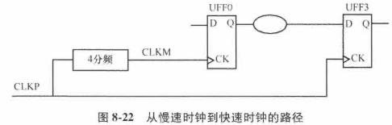

时钟定义：

```
create_clock -name CLKM -period 20 -waveform {0 10} [get_ports CLKM]
create_clock -name CLKP -period 5 -waveform {0 2.5} [get_ports CLKP]
```

当发射触发器和捕获触发器的时钟频率不同，STA首先需要确定共同基础周期。

上述例子中，更快的时钟周期被扩展，得到共同周期20ns。

默认情况下，使用约束最紧的建立时间沿关系，在本例中就是紧挨着的下1个捕获沿。

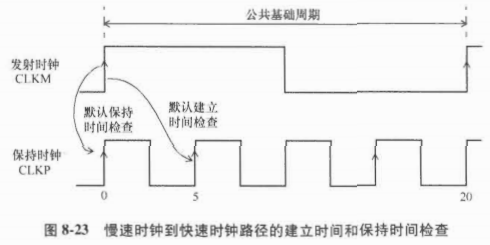

建立时间路径报告如下：

```pgp
Startpoint: UFF0 (rising edge-triggered flip-flop clocked by CLKM)
Endpoint: UFF3 (rising edge-triggered flip-flop clocked by CLKP)
Path Group: CLKP
Path Type: max

Point                           Incr   Path
-------------------------------------------------
clock CLKM (rise edge)          0.00   0.00
clock source latency            0.00   0.00
CLKM (in)                       0.00   0.00 r
UCKBUF0/C (CKB)                 0.06   0.06 r
UCKBUF1/C (CKB)                 0.06   0.11 r
UFF0/CK (DFF)                   0.00   0.11 r
UFF0/Q (DFF)                    0.14   0.26 f
UNAND0/ZN (ND2)                 0.03   0.29 r
UFF3/D (DFF)                    0.00   0.29 r
data arrival time                      0.29

clock CLKP (rise edge)          5.00   5.00
clock source latency            0.00   5.00
CLKP (in)                       0.00   5.00 r
UCKBUF4/C (CKB)                 0.07   5.07 r
UFF3/CK (DFF)                   0.00   5.07 r
clock uncertainty              -0.30   4.77
library setup time             -0.04   4.72
data required time                     4.72
-------------------------------------------------
data required time                     4.72
data arrival time                      -0.29
-------------------------------------------------
slack (MET)                            4.44
```

注意：发射时钟是在时间0ns，而捕获时钟是在时间5ns.

**保持时间检查**是和建立时间检查相关的，**保证被时钟沿发射的数据不会干扰前一个数据的捕获**。

保持时间检查时序报告：

```pgp
Startpoint: UFF0 (rising edge-triggered flip-flop clocked by CLKM)
Endpoint: UFF3 (rising edge-triggered flip-flop clocked by CLKP)
Path Group: CLKP
Path Type: min

Point                           Incr   Path
----------------------------------------------
clock CLKM (rise edge)          0.00   0.00
clock source latency            0.00   0.00
CLKM (in)                       0.00   0.00 r
UCKBUF0/C (CKB)                 0.06   0.06 r
UFF0/CK (DFF)                   0.00   0.06 r
UFF0/Q (DFF)                    0.14   0.20 r
UNAND0/ZN (ND2)                 0.03   0.23 f
UFF3/D (DFF)                    0.00   0.23 f
data arrival time                      0.23

clock CLKP (rise edge)          0.00   0.00
clock source latency            0.00   0.00
CLKP (in)                       0.00   0.00 r
UCKBUF4/C (CKB)                 0.07   0.07 r
UFF3/CK (DFF)                   0.00   0.07 r
clock uncertainty               0.05   0.12
library hold time               0.02   0.13
data required time                     0.13
----------------------------------------------
data required time                     0.13
data arrival time                      -0.23
----------------------------------------------
slack (MET)                            0.10
```

上面的例子中，可以看到发射数据**在捕获时钟的每个第4周期上**可用。

假设在**CLKP的每个第4个捕获沿**捕获数据，这样就允许触发器之间的组合逻辑有4个CLKP的周期去传播，即20ns，用**多周期约束**完成这种设置：

```
set_multicycle_path 4 -setup \
	-from [get_clocks CLKM] -to [get_clocks CLKP] -end 
```

- 选项-end：指定多周期4是指终点或捕获时钟的。

该多周期约束把建立时间和保持时间检查改变为图8-24所示。

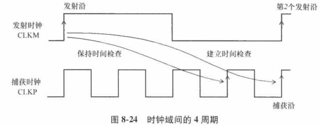

对应的建立时间报告如下：

```pgp
Startpoint: UFF0 (rising edge-triggered flip-flop clocked by CLKM)
Endpoint: UFF3 (rising edge-triggered flip-flop clocked by CLKP)
Path Group: CLKP
Path Type: max

Point                           Incr   Path
-------------------------------------------------
clock CLKM (rise edge)          0.00   0.00
clock source latency            0.00   0.00
CLKM (in)                       0.00   0.00 r
UCKBUF0/C (CKB)                 0.06   0.06 r
UCKBUF1/C (CKB)                 0.06   0.11 r
UFF0/CK (DFF)                   0.00   0.11 r
UFF0/Q (DFF)                    0.14   0.26 f
UNAND0/ZN (ND2)                 0.03   0.29 r
UFF3/D (DFF)                    0.00   0.29 r
data arrival time                      0.29

clock CLKP (rise edge)         20.00  20.00
clock source latency            0.00  20.00
CLKP (in)                       0.00  20.00 r
UCKBUF4/C (CKB)                 0.07  20.07 r
UFF3/CK (DFF)                   0.00  20.07 r
clock uncertainty              -0.30  19.77
library setup time             -0.04  19.72
data required time                    19.72
-------------------------------------------------
data required time                    19.72
data arrival time                     -0.29
-------------------------------------------------
slack (MET)                           19.44
```

图8-24表明了保持时间检查时在建立时间捕获沿之前的1个时钟沿（默认），即保持时间捕获沿是在15ns。

保持时间时序报告如下：

```pgp
Startpoint: UFF0 (rising edge-triggered flip-flop clocked by CLKM)
Endpoint: UFF3 (rising edge-triggered flip-flop clocked by CLKP)
Path Group: CLKP
Path Type: min

Point                           Incr   Path
----------------------------------------------
clock CLKM (rise edge)          0.00   0.00
clock source latency            0.00   0.00
CLKM (in)                       0.00   0.00 r
UCKBUF0/C (CKB)                 0.06   0.06 r
UCKBUF1/C (CKB)                 0.06   0.11 r
UFF0/CK (DFF)                   0.00   0.11 r
UFF0/Q (DFF)                    0.14   0.26 r
UNAND0/ZN (ND2)                 0.03   0.29 f
UFF3/D (DFF)                    0.00   0.29 f
data arrival time                      0.29

clock CLKP (rise edge)         15.00  15.00
clock source latency            0.00  15.00
CLKP (in)                       0.00  15.00 r
UCKBUF4/C (CKB)                 0.07  15.07 r
UFF3/CK (DFF)                   0.00  15.07 r
clock uncertainty               0.05  15.12
library hold time               0.02  15.13
data required time                    15.13
----------------------------------------------
data required time                    15.13
data arrival time                     -0.29
----------------------------------------------
slack (VIOLATED)                      -14.84
```

在大部分设计中，这不是预期的保持时间检查，保持时间检查应该移回发射沿所在的位置。

通过设置保持时间**多周期约束为3**来实现：

```verilog
set_multicycle_path 3 -hold \
	-from [get_clocks CLKM] -to [get_clocks CLKP] -end
```

- **多周期约束3**：让保持时间检查沿移回3个周期，即0ns。

- **选项-end**：表明捕获时钟周期移动数量，**多周期建立时间的默认选项**。
- **选项-start**：指定发射时钟周期移动数量，**多周期保持时间的默认选项**。

多周期保持时间约束之后，保持时间检查如图8-25所示。

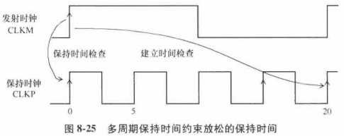

具有多周期保持时间约束的时序报告如下：

```pgp
Startpoint: UFF0 (rising edge-triggered flip-flop clocked by CLKM)
Endpoint: UFF3 (rising edge-triggered flip-flop clocked by CLKP)
Path Group: CLKP
Path Type: min

Point                           Incr   Path
----------------------------------------------
clock CLKM (rise edge)          0.00   0.00
clock source latency            0.00   0.00
CLKM (in)                       0.00   0.00 r
UCKBUF0/C (CKB)                 0.06   0.06 r
UCKBUF1/C (CKB)                 0.06   0.11 r
UFF0/CK (DFF)                   0.00   0.11 r
UFF0/Q (DFF)                    0.14   0.26 r
UNAND0/ZN (ND2)                 0.03   0.29 f
UFF3/D (DFF)                    0.00   0.29 f
data arrival time                      0.29

clock CLKP (rise edge)          0.00   0.00
clock source latency            0.00   0.00
CLKP (in)                       0.00   0.00 r
UCKBUF4/C (CKB)                 0.07   0.07 r
UFF3/CK (DFF)                   0.00   0.07 r
clock uncertainty               0.05   0.12
library hold time               0.02   0.13
data required time                     0.13
----------------------------------------------
data required time                     0.13
data arrival time                     -0.29
----------------------------------------------
slack (VIOLATED)                       0.16
```

- 总结

  指定建立时间多周期为N个周期，很可能需要指定保持时间多周期为N-1个周期。

  在慢速时钟域到快速时钟域路径上，指定多频率多周期约束，并使用-end选项，且建立时间和保持时间是基于快速时间的时钟周期来调整的。

### 8.8.2 快速时钟域到慢速时钟域

例子：从快速时钟域到慢速时钟域

时钟约束：

```
create_clock -name CLKM -period 20 -waveform {0 10} [get_ports CLKM]
create_clock -name CLKP -period 5 -waveform {0 2.5} [get_ports CLKP]
```

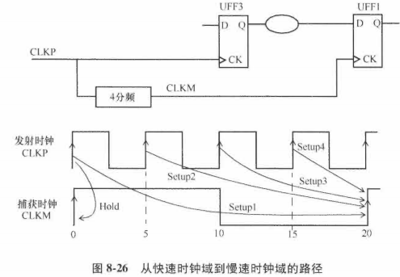

可能存在4种建立时序检查：见图8-26。其中约束最紧的是Setup4检查。

约束最紧的路径报告如下：发射沿在15ns，捕获时钟沿在20ns

```pgp
Startpoint: UFF3 (rising edge-triggered flip-flop clocked by CLKP)
Endpoint: UFF1 (rising edge-triggered flip-flop clocked by CLKM)
Path Group: CLKM
Path Type: max

Point                           Incr   Path
------------------------------------------------------
clock CLKP (rise edge)          15.00  15.00
clock source latency            0.00   15.00
CLKP (in)                       0.07   15.07 r
UFBKBUFC/C (CKB )               0.07   15.07 r
UFF3/CK (DFF )                  0.15   15.22 f
UNOR0/ZN (NR2 )                 0.05   15.27 r
UBUF4/Z (BUFF )                 0.05   15.32 r
UFF1/D (DFF )                   0.00   15.32 r
data arrival time                      15.32

clock CLKM (rise edge)          20.00  20.00
clock source latency            0.00   20.00
CLKM (in)                       0.00   20.00 r
UCKBUFO/C (CKB )                0.06   20.06 r
UCKBUF2/C (CKB )                0.07   20.12 r
UFF1/CK (DFF )                  0.00   20.12 r
clock uncertainty              -0.30   19.82
library setup time             -0.04   19.78
data required time                     19.78
----------------------------------
data required time                     19.78
data arrival time                     -15.32
----------------------------------
slaMET)                                4.46
```

类似于建立时间检查，可能存在4种保持时间检查，图8-26显示了约束最紧的保持时间检查，它保证了在0ns的捕获沿不会捕获在0ns发射的数据。

保持时间检查的时序报告：

```pgp
Startpoint: UFF3 (rising edge-triggered flip-flop clocked by CLKP)
Endpoint: UFF1 (rising edge-triggered flip-flop clocked by CLKM)
Path Group: CLKM
Path Type: min

Point                           Incr   Path
----------------------------------------------------------------
clock CLKP (rise edge)          0.00   0.00
clock source latency            0.00   0.00
CLKP (in)                       0.00   0.00 r
UCKBUF4/C (CKB)                 0.07   0.07 r
UFF3/CK (DFF)                   0.00   0.07 r
UFF3/Q (DFF)                    0.16   0.22 r
UNOR0/ZN (NR2)                  0.02   0.25 f
UBUF4/Z (BUFF)                  0.06   0.30 f
UFF1/D (DFF)                    0.00   0.30 f
data arrival time                      0.30

clock CLKM (rise edge)          0.00   0.00
clock source latency            0.00   0.00
CLKM (in)                       0.00   0.00 r
UCKBUF0/C (CKB)                 0.06   0.06 r
UCKBUF2/C (CKB)                 0.07   0.12 r
UFF1/CK (DFF)                   0.00   0.12 r
clock uncertainty               0.05   0.17
library hold time               0.01   0.19
data required time                     0.19
----------------------------------------------------------------
data required time                     0.19
data arrival time                     -0.30
----------------------------------------------------------------
slack (MET)                            0.12
```

设计者可以指定从快速时钟到慢速时钟的数据路径为多周期路径。

如果建立时间检查放松，为数据路径提供2个快速时钟的周期，约束如下：

```
set_multicycle_path 2 -setup \
	-from [get_clocks CLKP] -to [get_clocks CLKM] -start

set_multicycle_path 1 -hold \
	-from [get_clocks CLKP] -to [get_clocks CLKM] -start
# 选项-start是和发射时钟相关，默认是为了多周期保持时间检查
```

- 选项-start：指定了周期数的单位是发射时钟CLKP的周期
- 建立时间周期数2：把发射沿移动到默认发射沿的前1个沿，即15ns移动到10ns。
- 保持时间多周期：保证之前数据的捕获可以稳定的发生在0ns，因为发射沿也是在0ns.

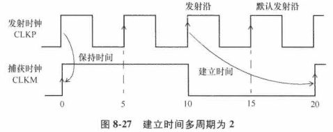

建立时间路径报告：发射时钟沿在10ns，捕获时钟沿在20ns

```pgp
Startpoint: UFF3 (rising edge-triggered flip-flop clocked by CLKP)
Endpoint: UFF1 (rising edge-triggered flip-flop clocked by CLKM)
Path Group: CLKM
Path Type: max

Point                           Incr   Path
----------------------------------
clock CLKP (rise edge)          10.00  10.00
clock source latency            0.00   10.00
CLKP (in)                       0.00   10.00 r
UCKBUF4/C (CKB )                0.07   10.07 r
UFF3/CK (DFF )                  0.00   10.07 r
UFF3/Q (DFF ) <-                0.15   10.22 f
UNOR0/ZN (NR2 )                 0.05   10.27 r
UBUF4/Z (BUFF )                 0.05   10.32 r
UFF1/D (DFF )                   0.00   10.32 r
data arrival time                      10.32

clock CLKM (rise edge)          20.00  20.00
clock source latency            0.00   20.00
CLKM (in)                       0.00   20.00 r
UCKBUF0/C (CKB )                0.06   20.06 r
UCKBUF2/C (CKB )                0.07   20.12 r
UFF1/CK (DFF )                  0.00   20.12 r
clock uncertainty              -0.30   19.82
library setup time             -0.04   19.78
data required time                     19.78
----------------------------------
data required time                     19.78
data arrival time                     -10.32 
----------------------------------
slack(MET)                             9.46
```

保持时间路径报告：保持时间检查在0ns，捕获时钟和发射时钟在0ns都是上升沿。

```pgp
Startpoint: UFF3 (rising edge-triggered flip-flop clocked by CLKP)
Endpoint: UFF1 (rising edge-triggered flip-flop clocked by CLKM)
Path Group: CLKM
Path Type: min

Point                           Incr   Path
------------------------------------------------
clock CLKP (rise edge)          0.00   0.00
clock source latency            0.00   0.00
CLKP (in)                       0.00   0.00 r
UCKBUF4/C (CKB)                 0.07   0.07 r
UFF3/CK (DFF)                   0.00   0.07 r
UFF3/Q (DFF)                    0.16   0.22 r
UNOR0/ZN (NR2)                  0.02   0.25 f
UBUF4/Z (BUFF)                  0.06   0.30 f
UFF1/D (DFF)                    0.00   0.30 f
data arrival time                      0.30

clock CLKM (rise edge)          0.00   0.00
clock source latency            0.00   0.00
CLKM (in)                       0.00   0.00 r
UCKBUF0/C (CKB)                 0.06   0.06 r
UCKBUF2/C (CKB)                 0.07   0.12 r
UFF1/CK (DFF)                   0.00   0.12 r
clock uncertainty               0.05   0.17
library hold time               0.01   0.19
data required time                     0.19
------------------------------------------------
data required time                     0.19
data arrival time                     -0.30
------------------------------------------------
slack (MET)                            0.12
```


## 8.9 实例

发射时钟和捕获时钟有不同的关系

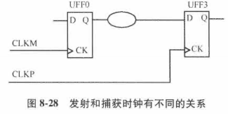

### 8.9.1 半周期——例1

2个时钟有相同的周期但相位相反。

时钟约束如下：

```
create_clock -name CLKM \
	-period 20 -waveform {0 10} [get_ports CLKM]
create_clock -name CLKP \
	-period 20 -waveform {10 20} [get_ports CLKP]
```

波形如下：

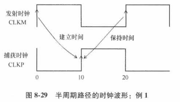

建立时间检查是从0ns处的发射沿，到10ns处的下1个捕获沿。

保持时间检查：有半个周期的余量，验证在20ns发射的数据是否在10ns被捕获沿捕获。

建立时间路径报告：

```pgp
Startpoint: UFF0 (rising edge-triggered flip-flop clocked by CLKM)
Endpoint: UFF3 (rising edge-triggered flip-flop clocked by CLKP)
Path Group: CLKP
Path Type: max

Point                           Incr   Path
------------------------------------------------
clock CLKM (rise edge)          0.00   0.00
clock source latency            0.00   0.00
CLKM (in)                       0.00   0.00 r
UCKBUF0/C (CKB)                 0.06   0.06 r
UCKBUF1/C (CKB)                 0.06   0.11 r
UFF0/CK (DFF)                   0.00   0.11 r
UFF0/Q (DFF) <--                0.14   0.26 f
UNAND0/ZN (ND2)                 0.03   0.29 r
UFF3/D (DFF)                    0.00   0.29 r
data arrival time                      0.29

clock CLKP (rise edge)          10.00  10.00
clock source latency            0.00   10.00
CLKP (in)                       0.00   10.00 r
UCKBUF4/C (CKB)                 0.07   10.07 r
UFF3/CK (DFF)                   0.00   10.07 r
clock uncertainty              -0.30   9.77
library setup time             -0.04   9.72
data required time                     9.72
------------------------------------------------
data required time                     9.72
data arrival time                     -0.29
------------------------------------------------
slack (MET)                            9.44
```

保持时间路径报告：

```pgp
Startpoint: UFF0 (rising edge-triggered flip-flop clocked by CLKM)
Endpoint: UFF3 (rising edge-triggered flip-flop clocked by CLKP)
Path Group: CLKP
Path Type: min

Point                           Incr   Path
------------------------------------------------
clock CLKM (rise edge)         20.00  20.00
clock source latency            0.00  20.00
CLKM (in)                       0.00  20.00 r
UCKBUF0/C (CKB)                 0.06  20.06 r
UCKBUF1/C (CKB)                 0.06  20.11 r
UFF0/CK (DFF)                   0.00  20.11 r
UFF0/Q (DFF) <--                0.14  20.26 f
UNAND0/ZN (ND2)                 0.03  20.29 r
UFF3/D (DFF)                    0.00  20.29 r
data arrival time                     20.29

clock CLKP (rise edge)          10.00  10.00
clock source latency             0.00  10.00
CLKP (in)                        0.00  10.00 r
UCKBUF4/C (CKB)                  0.07  10.07 r
UFF3/CK (DFF)                    0.00  10.07 r
clock uncertainty                0.05  10.12
library setup time               0.02  10.13
data required time                     10.13
------------------------------------------------
data required time                     10.13
data arrival time                     -20.29
------------------------------------------------
slack (MET)                            10.16
```

### 8.9.2 半周期——例2

和例1相似，但是发射时钟和捕获时钟的相位相反。

2个时钟有相同的周期但相位相反。

时钟约束如下：

```
create_clock -name CLKM \
	-period 10 -waveform {5 10} [get_ports CLKM]
create_clock -name CLKP \
	-period 10 -waveform {0 5} [get_ports CLKP]
```

波形如下：

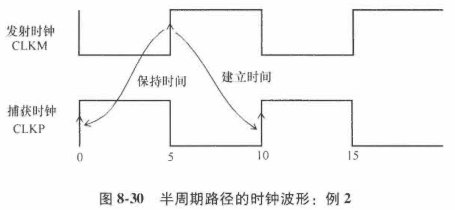

建立时间检查是从5ns处的发射沿，到10ns处的下1个捕获沿。

保持时间检查：从5ns处的时钟发射沿到0ns处的捕获时钟沿。

建立时间路径报告：

```pgp
Startpoint: UFF0 (rising edge-triggered flip-flop clocked by CLKM)
Endpoint: UFF3 (rising edge-triggered flip-flop clocked by CLKP)
Path Group: CLKP
Path Type: max

Point                           Incr   Path
------------------------------------------------
clock CLKM (rise edge)          5.00   5.00
clock source latency            0.00   5.00
CLKM (in)                       0.00   5.00 r
UCKBUF0/C (CKB)                 0.06   5.06 r
UCKBUF1/C (CKB)                 0.06   5.11 r
UFF0/CK (DFF)                   0.00   5.11 r
UFF0/Q (DFF) <-                 0.14   5.26 f
UNAND0/ZN (ND2)                 0.03   5.29 r
UFF3/D (DFF)                    0.00   5.29 r
data arrival time                      5.29

clock CLKP (rise edge)          10.00  10.00
clock source latency            0.00   10.00
CLKP (in)                       0.00   10.00 r
UCKBUF4/C (CKB)                 0.07   10.07 r
UFF3/CK (DFF)                   0.00   10.07 r
clock uncertainty              -0.30   9.77
library setup time             -0.04   9.72
data required time                     9.72
------------------------------------------------
data required time                     9.72
data arrival time                     -5.29
------------------------------------------------
slack (MET)                            4.44
```

保持时间路径报告：

```pgp
Startpoint: UFF0 (rising edge-triggered flip-flop clocked by CLKM)
Endpoint: UFF3 (rising edge-triggered flip-flop clocked by CLKP)
Path Group: CLKP
Path Type: min

Point                           Incr   Path
------------------------------------------------
clock CLKM (rise edge)          5.00   5.00
clock source latency            0.00   5.00
CLKM (in)                       0.00   5.00 r
UCKBUF0/C (CKB)                 0.06   5.06 r
UCKBUF1/C (CKB)                 0.06   5.11 r
UFF0/CK (DFF)                   0.00   5.11 r
UFF0/Q (DFF) <--                0.14   5.26 f
UNAND0/ZN (ND2)                 0.03   5.29 r
UFF3/D (DFF)                    0.00   5.29 r
data arrival time                      5.29

clock CLKP (rise edge)           0.00  0.00
clock source latency             0.00  0.00
CLKP (in)                        0.00  0.00 r
UCKBUF4/C (CKB)                  0.07  0.07 r
UFF3/CK (DFF)                    0.00  0.07 r
clock uncertainty                0.05  0.12
library setup time               0.02  0.13
data required time                     0.13
------------------------------------------------
data required time                     0.13
data arrival time                     -5.29
------------------------------------------------
slack (MET)                            5.16
```

### 8.9.3 快速时钟域到慢速时钟域

本例：捕获时钟是发射时钟的2分频时钟，时钟约束如下：

```
create_clock -name CLKM -period 10 -waveform {0 5} [get_ports CLKM]
create_clock -name CLKP -period 20 -waveform {0 10} [get_ports CLKP]
```

波形：

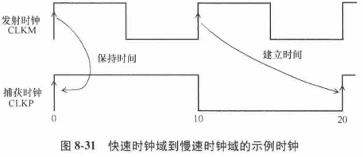

建立时间检查：从10ns处的发射沿到20ns处的捕获沿，时序报告如下：

```pgp
Startpoint: UFF0 (rising edge-triggered flip-flop clocked by CLKM)
Endpoint: UFF3 (rising edge-triggered flip-flop clocked by CLKP)
Path Group: CLKP
Path Type: max

Point                           Incr   Path
------------------------------------------------
clock CLKM (rise edge)          10.00  10.00
clock source latency            0.00   10.00
CLKM (in)                       0.00   10.00 r
UCKBUF0/C (CKB)                 0.06   10.06 r
UFF0/CK (DFF)                   0.00   10.11 r
UFF0/Q (DFF)                    0.14   10.26 f
UNAND0/ZN (ND2)                 0.03   10.29 r
UFF3/D (DFF)                    0.00   10.29 r
data arrival time                      10.29

clock CLKP (rise edge)          20.00  20.00
clock source latency            0.00   20.00
CLKP (in)                       0.00   20.00 r
UCKBUF4/C (CKB)                 0.07   20.07 r
UFF3/CK (DFF)                   0.00   20.07 r
clock uncertainty              -0.30   19.77
library setup time             -0.04   19.72
data required time                     19.72
------------------------------------------------
data required time                     19.72
data arrival time                     -10.29
------------------------------------------------
slack (MET)                             9.44
```

保持时间检查：从0ns处的发射沿到0ns处的捕获沿，时序报告如下：

```pgp
Startpoint: UFF0 (rising edge-triggered flip-flop clocked by CLKM)
Endpoint: UFF3 (rising edge-triggered flip-flop clocked by CLKP)
Path Group: CLKP
Path Type: min

Startpoint: UFF0 (rising edge-triggered flip-flop clocked by CLKM)
Endpoint: UFF3 (rising edge-triggered flip-flop clocked by CLKP)
Path Group: CLKP
Path Type: min

Point                           Incr   Path
----------------------------------
clock CLKM (rise edge)          0.00   0.00
clock source latency            0.00   0.00
CLKM (in)                       0.00   0.00 r
UCKBUFO/C (CKB )                0.06   0.06 r
UCKBUF1/C (CKB )                0.06   0.11 r
UFF0/CK (DFF )                  0.00   0.11 r
UFF0/Q (DFF )                   0.14   0.26 f
UNAND0/ZN (ND2 )                0.03   0.29 f
UFF3/D (DFF )                   0.00   0.29 f
data arrival time                      0.29

clock CLKP (rise edge)          0.00   0.00
clock source latency            0.00   0.00
CLKP (in)                       0.00   0.00 r
UCKBUFC4/C (CKB )               0.07   0.07 r
UFF3/CK (DFF )                  0.00   0.07 r
clock uncertainty               0.05   0.12
library hold time               0.02   0.13
data required time                     0.13 
----------------------------------
data required time                     0.13
data arrival time                     -0.29
----------------------------------
slack(MET)                             0.16
```

### 8.9.4 慢速时钟域到快速时钟域

本例：捕获时钟是发射时钟频率的2倍。

波形：

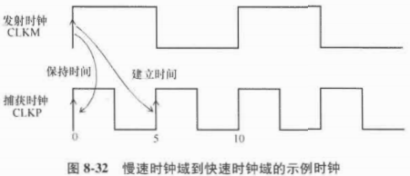

建立时间检查：从0ns处的发射沿到5ns处的下一个捕获沿，时序报告如下：

```pgp
Startpoint: UFF0 (rising edge-triggered flip-flop clocked by CLKM)
Endpoint: UFF3 (rising edge-triggered flip-flop clocked by CLKP)
Path Group: CLKP
Path Type: max

Point                           Incr   Path
------------------------------------------------
clock CLKM (rise edge)          0.00   0.00
clock source latency            0.00   0.00
CLKM (in)                       0.00   0.00 r
UCKBUF0/C (CKB)                 0.06   0.06 r
UFF0/CK (DFF)                   0.00   0.11 r
UFF0/Q (DFF)                    0.14   0.26 f
UNAND0/ZN (ND2)                 0.03   0.29 r
UFF3/D (DFF)                    0.00   0.29 r
data arrival time                      0.29

clock CLKP (rise edge)          5.00   5.00
clock source latency            0.00   5.00
CLKP (in)                       0.00   5.00 r
UCKBUF4/C (CKB)                 0.07   5.07 r
UFF3/CK (DFF)                   0.00   5.07 r
clock uncertainty              -0.30   4.77
library setup time             -0.04   4.72
data required time                     4.72
------------------------------------------------
data required time                     4.72
data arrival time                     -0.29
------------------------------------------------
slack (MET)                            4.44
```

保持时间检查：发射和捕获沿都是在0ns处，时序报告与8.9.3的保持时间的报告类似。

## 8.10 多倍时钟

### 8.10.1 整数倍

如果数据路径在2个时钟域之间，则2个时钟就是**相关的**。

STA会计算所有相关时钟的共同基础周期。

例子：4个相关时钟

```
create_clock -name CLKM -period 20 -waveform {0 10} [get_ports CLKM]
create_clock -name CLKQ -period 10 -waveform {0 5}
create_clock -name CLKP -period 5 -waveform {0 2.5} [get_ports CLKP]
```

分析CLKP和CLKM时钟域间的路径时，共同的基础周期是20ns。

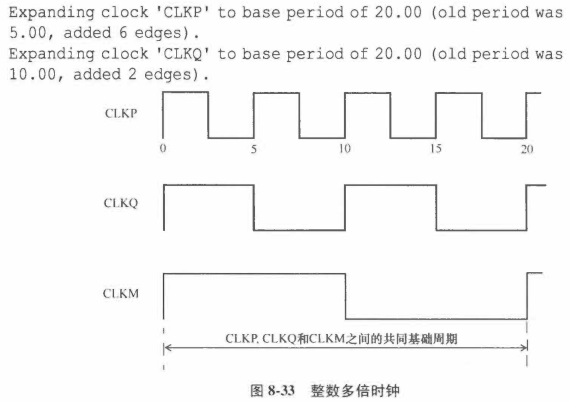

快速时钟到慢速时钟路径的建立时间报告：CLKP->CLKM

```pgp
Startpoint: UFF3 (rising edge-triggered flip-flop clocked by CLKP)
Endpoint: UFF1 (rising edge-triggered flip-flop clocked by CLKM)
Path Group: CLKM
Path Type: max

Point                           Incr   Path
----------------------------------------------------------------
clock CLKP (rise edge)          15.00  15.00
clock source latency            0.00   15.00
CLKP (in)                       0.00   15.00 r
UCKBUF4/C (CKB)                 0.07   15.07 r
UFF3/CK (DFF)                   0.00   15.07 r
UFF3/Q (DFF)                    0.15   15.22 f
UNOR0/ZN (NR2)                  0.05   15.27 r
UBUF4/Z (BUFF)                  0.05   15.32 r
UFF1/D (DFF)                    0.00   15.32 r
data arrival time                      15.32

clock CLKM (rise edge)          20.00  20.00
clock source latency            0.00   20.00
CLKM (in)                       0.00   20.00 r
UCKBUF0/C (CKB)                 0.06   20.06 r
UCKBUF2/C (CKB)                 0.07   20.12 r
UFF1/CK (DFF)                   0.00   20.12 r
clock uncertainty              -0.30   19.82
library setup time             -0.04   19.78
data required time                     19.78
----------------------------------------------------------------
data required time                     19.78
data arrival time                     -15.32
----------------------------------------------------------------
slack (MET)                             4.46
```

相应的保持路径报告：

```pgp
Startpoint: UFF3 (rising edge-triggered flip-flop clocked by CLKP)
Endpoint: UFF1 (rising edge-triggered flip-flop clocked by CLKM)
Path Group: CLKM
Path Type: min

Point                           Incr   Path
----------------------------------------------------------------
clock CLKP (rise edge)          0.00   0.00
clock source latency            0.00   0.00
CLKP (in)                       0.00   0.00 r
UCKBUF4/C (CKB)                 0.07   0.07 r
UFF3/CK (DFF)                   0.00   0.07 r
UFF3/Q (DFF)                    0.16   0.22 f
UNOR0/ZN (NR2)                  0.02   0.25 r
UBUF4/Z (BUFF)                  0.06   0.30 r
UFF1/D (DFF)                    0.00   0.30 r
data arrival time                      0.30

clock CLKM (rise edge)          0.00   0.00
clock source latency            0.00   0.00
CLKM (in)                       0.00   0.00 r
UCKBUF0/C (CKB)                 0.06   0.06 r
UCKBUF2/C (CKB)                 0.07   0.12 r
UFF1/CK (DFF)                   0.00   0.12 r
clock uncertainty               0.05   0.17
library setup time              0.01   0.19
data required time                     0.19
----------------------------------------------------------------
data required time                     0.19
data arrival time                     -0.30
----------------------------------------------------------------
slack (MET)                            0.12
```

### 8.10.2 非整数倍

2个时钟域间有1条数据路径，而时钟域的频率不是彼此的整数倍。

例子：发射时钟是共同时钟的8分频，捕获时钟是共同时钟的5分频，如下图所示。

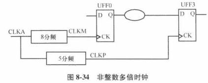

时序约束：

```
create_clock -name CLKM -period 8 -waveform {0 4} [get_ports CLKM]
create_clock -name CLKQ -period 10 -waveform {0 5}
create_clock -name CLKP -period 5 -waveform {0 2.5} [get_ports CLKP]
```

波形图如下：

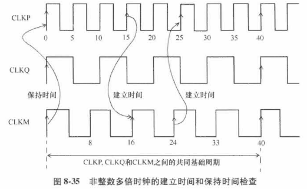

时序分析会先计算相关时钟的共同周期，然后将时钟扩展到共同基础周期。

**思考：从CLKM时钟域到CLKP时钟域的1条数据路径**。

- 时序分析所需的共同基础周期是40ns。

- 建立时间发生在时钟发射沿和时钟捕获沿间的最小时间内。

  本例中指的是时钟CLKM在**24ns处发射**和时钟CLKP在**25ns处捕获**。

  建立时间时序报告：

```pgp
Startpoint: UFF0 (rising edge-triggered flip-flop clocked by CLKM)
Endpoint: UFF3 (rising edge-triggered flip-flop clocked by CLKP)
Path Group: CLKP
Path Type: max

Point                           Incr   Path
----------------------------------------------------------------
clock CLKM (rise edge)          24.00  24.00
clock source latency            0.00   24.00
CLKM (in)                       0.00   24.00 r
UCKBUF0/C (CKB)                 0.06   24.06 r
UCKBUF1/C (CKB)                 0.06   24.11 r
UFF0/CK (DFF)                   0.00   24.11 r
UFF0/Q (DFF)                    0.14   24.26 f
UNAND0/ZN (ND2)                 0.03   24.29 r
UFF3/D (DFF)                    0.00   24.29 r
data arrival time                      24.29

clock CLKP (rise edge)          25.00  25.00
clock source latency             0.00  25.00
CLKP (in)                        0.00  25.00 r
UCKBUF4/C (CKB)                  0.07  25.07 r
UFF3/CK (DFF)                    0.00  25.07 r
clock uncertainty               -0.30  24.77
library setup time              -0.04  24.72
data required time                     24.72
----------------------------------------------------------------
data required time                     24.72
data arrival time                     -24.29
----------------------------------------------------------------
slack (MET)                             0.44
```

约束最紧的保持时间路径：从CLKM在0ns处发射到CLKP在0ns处捕获。

保持时间路径：

```pgp
Startpoint: UFF0 (rising edge-triggered flip-flop clocked by CLKM)
Endpoint: UFF3 (rising edge-triggered flip-flop clocked by CLKP)
Path Group: CLKP
Path Type: min

Point                           Incr   Path
----------------------------------------------------------------
clock CLKM (rise edge)          0.00   0.00
clock source latency            0.00   0.00
CLKM (in)                       0.00   0.00 r
UCKBUF0/C (CKB)                 0.06   0.06 r
UCKBUF1/C (CKB)                 0.06   0.11 r
UFF0/CK (DFF)                   0.00   0.11 r
UFF0/Q (DFF) <-                 0.14   0.26 f
UNAND0/ZN (ND2)                 0.03   0.29 f
UFF3/D (DFF)                    0.00   0.29 f
data arrival time                      0.29

clock CLKP (rise edge)          0.00   0.00
clock source latency            0.00   0.00
CLKP (in)                       0.00   0.00 r
UCKBUF4/C (CKB)                 0.07   0.07 r
UFF3/CK (DFF)                   0.00   0.07 r
clock uncertainty               0.05   0.12
library hold time               0.02   0.13
data required time                     0.13
----------------------------------------------------------------
data required time                     0.13
data arrival time                     -0.29
----------------------------------------------------------------
slack (MET)                            0.16
```

**从CLKP时钟域到CLKM时钟域的路径**

约束最紧的建立时间路径：从时钟CLKP在**15ns处发射**，到时钟CLKM在**16ns的捕获**沿。

约束最紧的保持时间路径：在0ns处的发射沿和捕获沿

### 8.10.3 相移

2个时钟相对于彼此有90°相移，约束如下：

```
create_clock -period 2.0 -waveform {0 1.0} [get_ports CKM]
create_clock -period 2.0 -waveform {0.5 1.5} [get_ports CKM90]
```

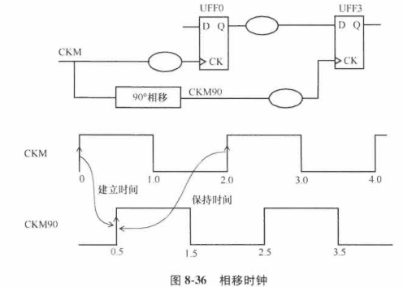

建立时间路径报告：

```pgp
Startpoint: UFF0 (rising edge-triggered flip-flop clocked by CKM)
Endpoint: UFF3 (rising edge-triggered flip-flop clocked by CKM90)
Path Group: CKM90
Path Type: max

Point                                Incr   Path
----------------------------------------------------------------
clock CKM (rise edge)                0.00   0.00
clock source latency                 0.00   0.00
CKM (in)                             0.00   0.00 r
UCKBUF0/C (CKB)                      0.06   0.06 r
UCKBUF1/C (CKB)                      0.06   0.11 r
UFF0/CK (DFF)                        0.00   0.11 r
UFF0/Q (DFF) <-                      0.14   0.26 f
UNAND0/ZN (ND2)                      0.03   0.29 r
UFF3/D (DFF)                         0.00   0.29 r
data arrival time                           0.29

clock CKM90 (rise edge)              0.50   0.50
clock source latency                 0.00   0.50
CKM90 (in)                           0.00   0.50 r
UCKBUF4/C (CKB)                      0.07   0.57 r
UFF3/CK (DFF)                        0.00   0.57 r
clock uncertainty                   -0.30   0.27
library setup time                  -0.04   0.22
data required time                          0.22
----------------------------------------------------------------
data required time                          0.22
data arrival time                          -0.29
----------------------------------------------------------------
slack (VIOLATED)                           -0.06
```

保持时间检查：

- 时钟CKM90的第1个上升沿在0.5ns处，是捕获沿。

- 保持时间检查在建立时间捕获沿的1个周期之前。

- 对于2ns处的发射沿，建立时间捕获沿在2.5ns。
- 所以，保持时间检查是在之前的捕获沿0.5ns处。

```pgp
Startpoint: UFF0 (rising edge-triggered flip-flop clocked by CKM)
Endpoint: UFF3 (rising edge-triggered flip-flop clocked by CKM90)
Path Group: CKM90
Path Type: min

Point                           Incr   Path
----------------------------------------------------------------
clock CLKM (rise edge)          2.00   2.00
clock source latency            0.00   2.00
CLKM (in)                       0.00   2.00 r
UCKBUF0/C (CKB)                 0.06   2.06 r
UCKBUF1/C (CKB)                 0.06   2.11 r
UFF0/CK (DFF)                   0.00   2.11 r
UFF0/Q (DFF) <-                 0.14   2.26 f
UNAND0/ZN (ND2)                 0.03   2.29 f
UFF3/D (DFF)                    0.00   2.29 f
data arrival time                      2.29

clock CLKP (rise edge)          0.50   0.50
clock source latency            0.00   0.50
CLKP (in)                       0.00   0.50 r
UCKBUF4/C (CKB)                 0.07   0.57 r
UFF3/CK (DFF)                   0.00   0.57 r
clock uncertainty               0.05   0.62
library hold time               0.02   0.63
data required time                     0.63
----------------------------------------------------------------
data required time                     0.13
data arrival time                     -2.29
----------------------------------------------------------------
slack (MET)                            1.16
```

