[TOC]

# 第9章 接口分析

介绍各种类型的输入和输出路径时序分析过程，以及几种常用接口。

## 9.1 IO 接口

介绍DUA的输入和输出端口的约束是如何定义的

### 9.1.1 输入接口

两种常见的可选择的指定输入时序的方法：

- 以AC约束的形式指定DUA的输入端的波形；
- 指定到输入端的外部逻辑的路径延迟。

1. **在输入端口的波形约束**

   **输入AC约束**如图9-1所示。

   该约束包括输入CIN在时钟CLKP上升沿之前在4.3ns稳定，而该值要在时钟上升沿后保持稳定到2ns.

   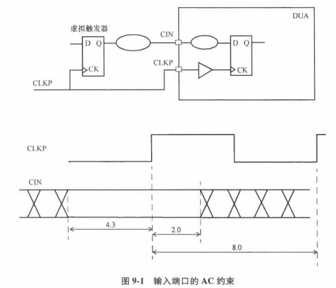

   - 最大输入延迟

     从虚拟触发器时钟到CIN的延迟最大为：8-4.3=3.7ns，确保输入CIN的数据在上升沿之前4.3ns到达

   - 最小输入延迟

     AC约束指定了输入CIN在时钟上升沿后稳定2ns，因此从虚拟触发器到输入CIN的延迟必须至少是2ns.

   - 输入约束

     ```
     create_clock -name CLKP -period 8 [get_ports CLKP]
     set_input_delay -min 2.0 -clock CLKP [get_ports CIN]
     set_input_delay -max 3.7 -clock CLKP [get_ports CIN]
     ```

   该输入条件下设计的建立时间报告：

   ```pgp
   Startpoint: CIN (input port clocked by CLKP)
   Endpoint: UFF4 (rising edge-triggered flip-flop clocked by CLKP)
   Path Group: CLKP
   Path Type: max
   
   Point                                Incr   Path
   ------------------------------------------------------
   clock CLKP (rise edge)               0.00   0.00
   clock network delay (propagated)     0.00   0.00
   input external delay                 3.70   3.70 f
   CIN (in)                             0.00   3.70 f
   UBUF5/Z (BUFF )                      0.05   3.75 f
   UXOR1/Z (XOR2 )                      0.10   3.85 r
   UFF4/D (DF )                         0.00   3.85 r
   data arrival time                           3.85
   
   clock CLKP (rise edge)               8.00   8.00
   clock source latency                 0.00   8.00
   CLKP (in)                            0.00   8.00 r
   UCKBUF4/C (CKB )                     0.07   8.07 r
   UCKBUF5/C (CKB )                     0.06   8.13 r
   UFF4/CP (DF )                        0.00   8.13 r
   library setup time                  -0.05   8.08
   data required time                          8.08
   ------------------------------------------------------
   data required time                          8.08
   data arrival time                          -3.85
   ------------------------------------------------------
   slack (MET)                                 4.23
   ```

   保持时间报告：

   ```pgp
   Startpoint: CIN (input port clocked by CLKP)
   Endpoint: UFF4 (rising edge-triggered flip-flop clocked by CLKP)
   Path Group: CLKP
   Path Type: min
   
   Point                                Incr   Path
   ------------------------------------------------------
   clock CLKP (rise edge)               0.00   0.00
   clock network delay (propagated)     0.00   0.00
   input external delay                 2.00   2.00 r
   CIN (in)                             0.00   2.00 r
   UBUF5/Z (BUFF)                       0.05   2.05 r
   UXOR1/Z (XOR2)                       0.07   2.12 r
   UFF4/D (DF)                          0.00   2.12 r
   data arrival time                           2.12
   
   clock CLKP (rise edge)               0.00   0.00
   clock source latency                 0.00   0.00
   CLKP (in)                            0.00   0.00
   UCKBUF4/C (CKB)                      0.07   0.07 r
   UCKBUF5/C (CKB)                      0.06   0.13 r
   UFF4/CK (DF)                         0.00   0.13 r
   clock uncertainty                    0.05   0.18
   library hold time                    0.00   0.17
   data required time                          0.17
   ------------------------------------------------------
   data required time                          0.17
   data arrival time                          -2.12
   ------------------------------------------------------
   slack (MET)                                 1.95
   ```

   

2. **在输入端口的路径延迟约束**

   外部逻辑的路径延迟明确指定。

   外部逻辑路径到输入的任何延迟相加，然后用命令set_input_delay指定路径延迟。

   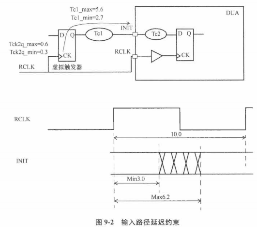

   ```
   create_clock -name RCLK -period 10 [get_ports RCLK]
   set_input_delay -max 6.2 -clock RCLK [get_ports INIT]
   set_input_delay -min 3.0 -clock RCLK [get_ports INIT]
   ```

### 9.1.2 输出接口

与输入接口类似，指定输出时序要求常见2种方式：

- 以AC约束的形式指定DUA的输出端的所需波形；
- 指定外部逻辑的路径延迟。

1. **输出波形约束**

   输出AC约束：

   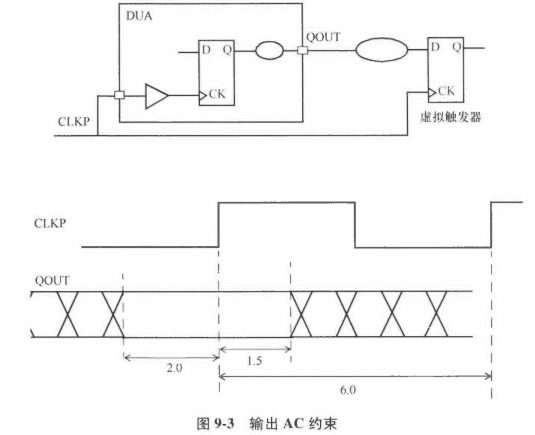

   输出QOUT应该在CLKP上升沿之前2ns保持稳定，并在上升沿之后稳定1.5ns.

   约束：

   ```
   create_clock -name CLKP -period 6 \
   	-waveform {0 3} [get_ports CLKP]
   # 虚拟触发器的建立时间
   set_output_delay -clock CLKP -max 2.0 [get_ports QOUT]
   # 虚拟触发器的保持时间
   set_output_delay -clock CLKP -min -1.5 [get_ports QOUT]
   ```

   

2. **输出外部路径延迟**

   外部逻辑的路径延迟明确指定。

   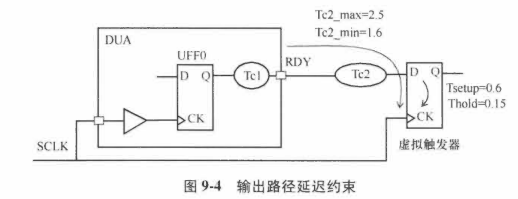

   ```
   create_clock -name SCLK -period 5 [get_ports SCLK]
   # 外部逻辑的建立时间(Tc2_max=2.5, Tsetup=0.6):
   set_output_delay -max 3.1 -clock SCLK [get_ports RDY]
   # 外部逻辑的保持时间(Tc2_min=1.6, Thold=0.15):
   set_output_delay -min 1.45 -clock SCLK [get_ports RDY]
   ```

### 9.1.3 时序窗口内的输出变化

在**源同步接口**中，对时钟和数据的时序关系有要求，例如：输出数据被要求只在时钟上升沿附近的指定时序窗口内变化。

例子：

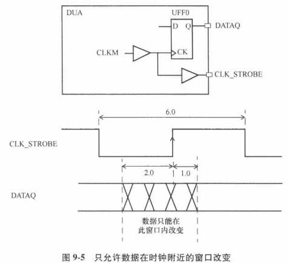

上述例子，以CLKM为主时钟，创建了生成时钟CLK_STROBE。指定对应接口的时序约束如下：

```
create_clock -name CLKM -period 6 [get_ports CLKM]
create_generated_clock -name CLK_STROBE -source CLKM \
    -divide_by 1 [get_ports CLK_STROBE]
```

这种窗口需求需要通过组合约束来指定，包括建立时间和保持时间检查，以及多周期路径约束。

建立时间检查：

- 检查出现在单一的上升沿

- 为建立时间检查指定做周期值为0

  `set_multicycle_path 0 -setup -to [get_ports DATAQ]`

保持时间检查：

- 检查也必须在同沿上

- 为保持时间检查指定多周期值为-1

  `set_multicycle_path -1 -hold -to [get_ports DATAQ]`

相对于时钟CLK_STROBE指定输出的时序约束：

```
set_output_delay -max -1.0 -clock CLK_STROBE [get_ports DATAQ]
set_output_delay -min 2.0 -clock CLK_STROBE [get_ports DATAQ]
```


另一个源同步接口的例子：输出时钟是主时钟的2分频时钟

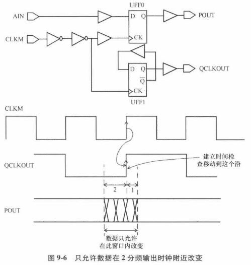

对应的约束：

```
create_clock -name CLKM -period 6 [get_ports CLKM]
create_generated_clock -name QCLKOUT -source CLKM \
    -divide_by 2 [get_ports QCLKOUT]
set_multicycle_path 0 -setup -to [get_ports POUT]
set_multicycle_path -1 -hold -to [get_ports POUT]
set_output_delay -max -1.0 -clock QCLKOUT [get_ports POUT]
set_output_delay -min +2.0 -clock QCLKOUT [get_ports POUT]
```


## 9.2 SRAM接口

组成**SRAM接口的信号**包括命令，地址和控制输出总线，双向数据总线以及时钟。

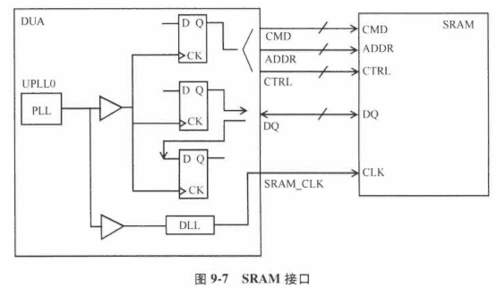

- 写周期

  DUA写入SRAM信号，数据和地址从DUA到SRAM并被SRAM在有效时钟沿锁存。

- 读周期

  地址信号：从DUA到SRAM

  数据信号：从SRAM到DUA

- 信号方向

  地址和控制信号都是单向的；

  数据信号是双向的

- DLL（Delay Locked Loop，延迟锁相环）

  允许时钟被延迟，以及应对各种信号经过接口的延迟变化（由PVT偏差和其他外部变化引起的）

**SRAM接口的AC特性**：

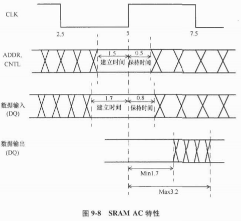

- 数据输入和输出：SRAM看到的方向

- SRAM和DUA之间的IO接口约束

  ```
  # 第1步，在输出端口UPLL0定义主时钟：
  create_clock -name PLL_CLK -period 5 [get_pins UPLL0/CLKOUT]
  # 接下来，在DUA的时钟输出引脚定义1个生成时钟：
  create_generated_clock -name SRAM_CLK \
  	-source [get_pins UPLL0/CLKOUT] -divide_by 1 \
  	[get_ports SRAM_CLK]
  # 约束地址和控制：
  set_output_delay -max 1.5 -clock SRAM_CLK \
  	[get_ports ADDR[0]] 
  set_output_delay -min -0.5 -clock SRAM_CLK \
  	[get_ports ADDR[0]] 
  ...
  # 约束DUA输出的数据：
  set_output_delay -max 1.7 -clock SRAM_CLK [get_ports DQ[0]]
  set_output_delay -min -0.8 -clock SRAM_CLK [get_ports DQ[0]] 
  # 约束进入DUA的数据:
  set_input_delay -max 3.2 -clock SRAM_CLK [get_ports DQ[0]] 
  set_input_delay -min 1.7 -clock SRAM_CLK [get_ports DQ[0]] 
  ....
  ```

- 地址信号时序检查

  建立时间检查：确保地址信号在SRAM_CLK沿之前1.5ns到达存储器

  保持时间检查，确保地址信号在SRAM_CLK沿之后0.5ns内保持稳定

## 9.3 DDR SDRAM接口

和SRAM接口一样，DDR SDRAM接口是SRAM接口的扩展。

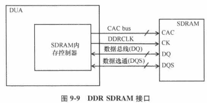

- 控制总线

  由命令，地址和控制引脚（CAC）组成。

- 双向数据总线DQ

- 双向数据选通脉冲DQS

  在**读模式**下，DQS和DQ是**源同步**的，从SDRAM中读出时序对齐；

  在**写模式**下，DQS**相位偏移90°**。
  
  1个DQS信号对应1组DQ信号（4bit或8bit），这样对应的目的是为了偏移平衡。
  
  例如：1个DQS对应1Byte，平衡1组9个信号（8个DQ和1个DQS），比平衡72bit数据总线和时钟容易。

典型DDR SDRAM接口CAC总线的AC特性：

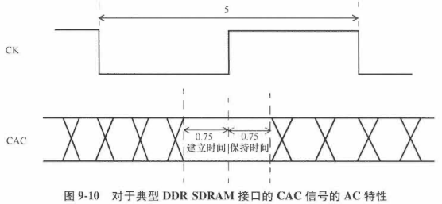

CAC总线的建立时间和保持时间需求对应的接口约束：

```
# DDRCLK为典型的DUA内部PLL时钟的生成时钟
create_generated_clock -name DDRCLK \
	-source [get_pins UPLL0/CLKOUT] \
	-divide_by 1 [get_ports DDRCLK]
# 为CAC的每1bit设置输出约束
set_output_delay -max 0.75 -clock DDRCLK [get_ports CAC]
set_output_delay -min -0.75 -clock DDRCLK [get_ports CAC]
```

某些情况下，地址总线可能比时钟驱动大很多的负载，特别是和不能插入缓冲器的存储模块交互。

在这种情况下，地址总线到存储器的延迟比时钟信号大很多，导致AC约束和图9-10不同。

### 9.3.1 读周期

在1个读周期内，存储器的**数据输出和DQS**是**沿对齐**的。

- 存储器在DQS的每个沿发出数据DQ，DQ转换时间和DQS的下降沿和上升沿是沿对齐的。
- DQ和DQS在DUA内部的存储控制器中可能不是对齐的（由于IO缓冲器之间的延迟差异或者PCB互连走线差异等因素）

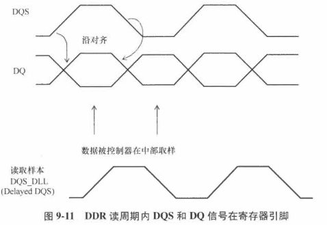

基础读取原理：

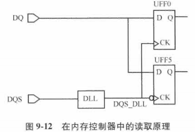

- 正向沿触发器在DQS_DLL的上升沿捕捉到数据DQ；
- 负向沿触发器在DQS_DLL的下降沿捕捉到数据DQ。
- DQ路径上没有标注DLL，但很多设计中的数据路径也包含DLL。

为了约束控制器上的读取接口，在DQS定义一个时钟，在数据上相对于该时钟指定输入延迟：

```
create_clock -period 5 -name DQS [get_ports DQS]
```

该时钟假设存储器读取接口工作在200MHz（数据速率400Mbps），对应DQ信号每2.5ns取样1次。

数据在2个沿被捕获，对每个沿明确指定输入约束：

```
# 时钟上升沿
set_input_delay 0.4 - max -clock DQS [get_ports DQ]
set_input_delay -0.4 -min -clock DQS [get_ports DQ]

# 时钟下降沿
set_input_delay 0.35 - max -clock DQS -clock_fall [get_ports DQ]
set_input_delay -0.35 -min -clock DQS -clock_fall [get_ports DQ]

# 发射和捕获是同沿
set_multicycle_path 0 -setup -to UFF0/D
set_multicycle_path 0 -setup -to UFF5/D
```

输入延迟：代表在DUA引脚上，DQ和DQS沿之间的延迟差异。

2个触发器的建立时间和保持时间路径报告：

- 假设捕获触发器的建立时间需求是0.05ns，保持时间需求是0.03ns.
- DLL 延迟假设是1.25ns

建立时间路径报告：

```pgp
Startpoint: DQ (input port clocked by DQS)
Endpoint: UFF0 (rising edge-triggered flip-flop clocked by DQS)
Path Group: DQS
Path Type: max

Point                                Incr   Path
----------------------------------------------------------------
clock DQS (rise edge)                0.00   0.00
clock network delay (propagated)     0.00   0.00
input external delay                 0.40   0.40 f
DQ (in)                              0.00   0.40 f
UFF0/D (DF)                          0.00   0.40 f
data arrival time                           0.40

clock DQS (rise edge)                0.00   0.00
clock source latency     			 0.00   0.00
DQS (in)							 0.00   0.00
UUDL0/Z (DLL)                        1.25   1.25
UDF0/CP (DF)                         0.00   1.25 r
library setup time                  -0.05   1.20
data required time                          1.20
----------------------------------------------------------------
data required time                          1.20
data arrival time                          -0.40
----------------------------------------------------------------
slack (MET)                                 0.80

Startpoint: DQ (input port clocked by DQS)
Endpoint: UFF5 (falling edge-triggered flip-flop clocked by DQS)
Path Group: DQS
Path Type: max

Point                                Incr   Path
----------------------------------------------------------------
clock DQS (fall edge)                2.50   2.50
clock network delay (propagated)     0.00   2.50
input external delay                 0.35   2.85 f
DQ (in)                              0.00   2.85 f
UFF5/D (DFN)                         0.00   2.85 f
data arrival time                           2.85

clock DQS (fall edge)                2.50   2.50
clock source latency     			 0.00   2.50
DQS (in)							 0.00   2.50
UUDL0/Z (DLL)                        1.25   3.76
UDF5/CPN (DFN)                       0.00   3.76 r
library setup time                  -0.05   3.71
data required time                          3.71
----------------------------------------------------------------
data required time                          3.71
data arrival time                          -2.85
----------------------------------------------------------------
slack (MET)                                 0.86
```

保持时间报告：

```pgp
Startpoint: DQ (input port clocked by DQS)
Endpoint: UFF0 (rising edge-triggered flip-flop clocked by DQS)
Path Group: DQS
Path Type: min

Point                                Incr   Path
----------------------------------------------------------------
clock DQS (rise edge)                5.00   5.00
clock network delay (propagated)     0.00   5.00
input external delay                -0.40   4.60 f
DQ (in)                              0.00   4.60 f
UFF0/D (DF)                          0.00   4.60 f
data arrival time                           4.60

clock DQS (fall edge)                2.50   2.50
clock source latency                 0.00   2.50
DQS (in)                             0.00   2.50 f
UDL0/Z (DLL)                         1.25   3.75 f
UFF0/CP (DF)                         0.00   3.75 f
library hold time                    0.03   3.78
data required time                          3.78
----------------------------------------------------------------
data required time                          3.78
data arrival time                          -4.60
----------------------------------------------------------------
slack (MET)                                 0.82

Startpoint: DQ (input port clocked by DQS)
Endpoint: UFF5 (falling edge-triggered flip-flop clocked by DQS)
Path Group: DQS
Path Type: min

Point                                Incr   Path
----------------------------------------------------------------
clock DQS (fall edge)                2.50   2.50
clock network delay (propagated)     0.00   2.50
input external delay                -0.35   2.15 f
DQ (in)                              0.00   2.15 f
UFF5/D (DFN)                         0.00   2.15 f
data arrival time                           2.15

clock DQS (rise edge)                0.00   0.00
clock source latency                 0.00   0.00
DQS (in)                             0.00   0.00 f
UDL0/Z (DLL)                         1.25   1.25 f
UFF5/CPN (DFN)                       0.00   1.25 f
library hold time                    0.03   1.28
data required time                          1.28
----------------------------------------------------------------
data required time                          1.28
data arrival time                          -2.15
----------------------------------------------------------------
slack (MET)                                 0.87
```

### 9.3.2 写周期

在1个写周期内，DQS沿和DUA内的存储控制器发出的DQ信号相差1/4周期，所以DQS脉冲可以用来在存储器中捕捉数据。

存储器引脚需要的波形如下图：

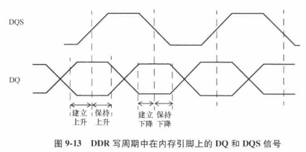

- 输入到存储器的引脚**DQS信号必须与DQ信号窗口的中心对齐**。

- DUA通常在写周期提供**额外的DLL控制**，以达到需要的DQS和DQ信号相差1/4周期。

如何约束输出达到DQS和DQ信号的相位差要求，取决于时钟在控制器内是如何生成的。考虑两种情况：

- 情况1：内部2倍频时钟

  内部时钟是DDR时钟的两倍频率，输出逻辑如图9-14所示。

  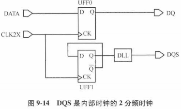

  - 使用DLL来偏移时钟DQS
  - 不适用DLL而用负沿触发器来得到90°偏移

  对于图9-14，输出可以被约束为：

  ```
  # 166MHz(333Mbps)DDR;2x时钟在333MHz
  create_clock -period 3 [get_ports CLK2X]
  
  # 在触发器的输出端定义1个1x生成时钟
  create_generated_clock -name pre_DQS -source CLK2X \
  	divide_by 2 [get_pins UFF1/Q]
  # DQS假设有1.5ns的DLL延迟
  create_generated_clock -name DQS -source UFF1/Q \
  	-edge {1 2 3} -edge_shift {1.5 1.5 1.5} [get_ports DQS]
  ```

  DQ输出端的时序必须对应于生成时钟DQS进行约束。

  假设在DDR SDRAM上，DQ和DQS之间的建立时间需求：DQ的上升沿和下降沿分别是0.25ns和0.4ns；

  对于DQ的上升沿和下降沿，保持时间需求是0.15ns和0.2ns.

  时序约束如下：

  ```
  set_output_delay -clock DQS -max 0.25 -rise [get_ports DQ]
  # 默认上面是上升时钟
  
  set_output_delay -clock DQS -max 0.4 -fall [get_ports DQ]
  # 如果DQS下降沿的建立时间需求不同，可以通过-clock_fall选项指定
  
  set_output_delay -clock DQS -min -0.15 -rise DQ
  set_output_delay -clock DQS -min -0.2 -fall DQ
  ```

  波形图如下：

  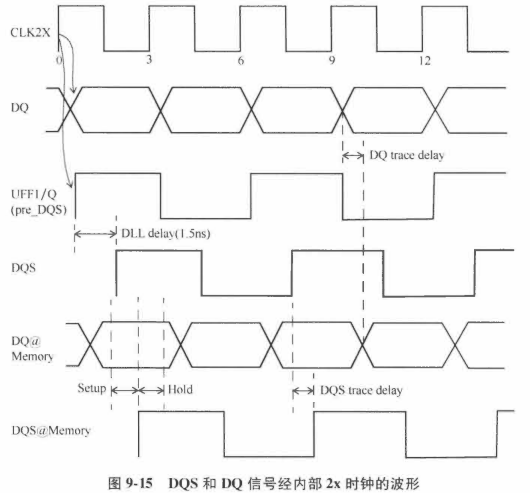

  建立时间检查：从发射DQ的CLK2X在0ns的上升沿，到DQS在1.5ns的上升沿。

  ```pgp
  Startpoint: UFF0 (rising edge-triggered flip-flop clocked by CLK2X)
  Endpoint: DQ (output port clocked by DQS)
  Path Group: DQS
  Path Type: max
  
  Point                                 Incr   Path
  ------------------------------------------------------------
  clock CLK2X (rise edge)               0.00   0.00
  clock source latency                  0.00   0.00
  CLK2X (in)                            0.00   0.00 r
  UFF0/CP (DFD1)                        0.00   0.00 r
  UFF0/Q (DFD1)                         0.12   0.12 f
  DQ (out)                              0.00   0.12 f
  data arrival time                            0.12
  
  clock DQS (rise edge)                 1.50   1.50
  clock CLK2X (source latency)          0.00   1.50
  CLK2X (in)                            0.00   1.50 r
  UFF1/Q (DFD1) (gclock source)         0.12   1.62 r
  UDLL0/Z (DLL)                         0.00   1.62 r
  DQS (out)                             0.00   1.62 r
  output external delay                -0.40   1.22
  data required time                           1.22
  -------------------------------------------------------------
  data required time                           1.22
  data arrival time                           -0.12
  -------------------------------------------------------------
  slack (MET)                                  1.10
  ```

  > 注意：1/4周期延迟出现DQS时钟沿在同一行，而不是在DLL的实例UDLL0那一行
  >
  > 这是因为DLL延迟被建模为DQS生成时钟定义的一部分，而不是DLL的时序弧的部分。

  保持时间检查：从发射DQ的时钟CLK2X在3ns处的上升沿，到之前DQS在1.5ns的上升沿。

  ```pgp
  Startpoint: UFF0 (rising edge-triggered flip-flop clocked by CLK2X)
  Endpoint: DQ (output port clocked by DQS)
  Path Group: DQS
  Path Type: min
  
  Point                                 Incr   Path
  ------------------------------------------------------------
  clock CLK2X (rise edge)               3.00   3.00
  clock source latency                  0.00   3.00
  CLK2X (in)                            0.00   3.00 r
  UFF0/CP (DFD1)                        0.00   3.00 r
  UFF0/Q (DFD1)                         0.12   3.12 f
  DQ (out)                              0.00   3.12 f
  data arrival time                            3.12
  
  clock DQS (rise edge)                 1.50   1.50
  clock CLK2X (source latency)          0.00   1.50
  CLK2X (in)                            0.00   1.50 r
  UFF1/Q (DFD1) (gclock source)         0.12   1.62 r
  UDLL0/Z (DLL)                         0.00   1.62 r
  DQS (out)                             0.00   1.62 r
  output external delay                 0.20   1.82
  data required time                           1.82
  -------------------------------------------------------------
  data required time                           1.82
  data arrival time                           -3.12
  -------------------------------------------------------------
  slack (MET)                                  1.30
  ```

- 情况2：内部1倍频时钟

  如果内部时钟是倍频时钟，典型输出电路类似于：

  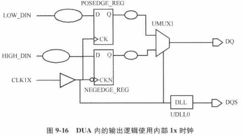

  使用2个触发器生成DQ数据：

  - 第1个触发器NEGEDGE_REG被时钟CLK1X的负沿触发
  - 第2个触发器POSEDGE_REG被时钟CLK1X的正沿触发
  - 使用CLK1X作为多路复用器UMUX1的选择信号
    - CLK1X为高电平，触发器NEGEDGE_REG的输出被送到DQ；
    - CLK1X为低电平，触发器POSEDGE_REG的输出被送到DQ；

  相关波形如下：

  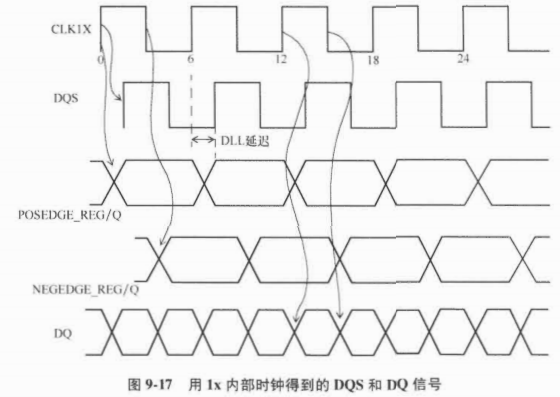

  约束如下：

  ```
  # 定义1X时钟
  create_clock -name CLK1X -period 6 [get_ports CLK1X]
  
  # 在DQS定义1个生成时钟 假设UDLL0有1.5ns的1/4周期延迟
  create_generated_clock -name DQS -source CLK1X \
  	-edge {1 2 3} -edge_shift {1.5 1.5 1.5} [get_ports DQS]
  
  # 在DQ和DQS的时钟上升沿和下降沿之间，定义建立时间检查为0.25ns和0.3ns
  set_output_delay -max 0.25 -clock DQS [get_ports DQ]
  set_output_delay -max 0.25 -clock DQS -clock_fall \
  	[get_ports DQ]
  # 保持时间检查	
  set_output_delay -min -0.2 -clock DQS [get_ports DQ]
  set_output_delay -min -0.27 -clock DQS -clock_fall \
  	[get_ports DQ]
  ```

  建立时间检查：

  - 在多路复用器的输入（发射NEGEDGE_REG数据），从CLK1X的上升沿到DQS的上升沿

  ```pgp
  Startpoint: CLK1X (clock source 'CLK1X')
  Endpoint: DQ (output port clocked by DQS)
  Path Group: DQS
  Path Type: max
  
  Point                                Incr   Path
  ------------------------------------------------------------
  clock CLK1X (rise edge)              0.00   0.00
  clock source latency                 0.00   0.00
  CLK1X (in)                           0.00   0.00
  UMUX1/S (MUX2D1) <-                  0.00   0.00
  UMUX1/Z (MUX2D1)                     0.07   0.07 r
  DQ (out)                             0.00   0.07 r
  data arrival time                           0.07
  
  clock DQS (rise edge)                1.50   1.50
  clock CLK2X (source latency)         0.00   1.50
  CLK1X (in)                           0.00   1.50 r
  UBUF0/Z (BUFFD1)                     0.03   1.53 r
  UDLL0/Z (DLL)                        0.00   1.53 r
  DQS (out)                            0.00   1.53 r
  output external delay               -0.25   1.28
  data required time                          1.28
  ------------------------------------------------------------
  data required time                          1.28
  data arrival time                          -0.07
  ------------------------------------------------------------
  slack (MET)                                 1.21
  ```

  - 在多路复用器的输入（发射POSEDGE_REG数据），从CLK1X的下降沿到DQS的下降沿

  ```pgp
  Startpoint: CLK1X (clock source 'CLK1X')
  Endpoint: DQ (output port clocked by DQS)
  Path Group: DQS
  Path Type: max
  
  Point                                Incr   Path
  ------------------------------------------------------------
  clock CLK1X (fall edge)              3.00   3.00
  clock source latency                 0.00   3.00
  CLK1X (in)                           0.00   3.00
  UMUX1/S (MUX2D1) <-                  0.00   3.00
  UMUX1/Z (MUX2D1)                     0.05   3.05 r
  DQ (out)                             0.00   3.05 r
  data arrival time                           3.05
  
  clock DQS (fall edge)                4.50   4.50
  clock CLK2X (source latency)         0.00   4.50
  CLK1X (in)                           0.00   4.50 r
  UBUF0/Z (BUFFD1)                     0.04   4.54 r
  UDLL0/Z (DLL)                        0.00   4.54 r
  DQS (out)                            0.00   4.54 r
  output external delay               -0.30   4.24
  data required time                          4.24
  ------------------------------------------------------------
  data required time                          4.24
  data arrival time                          -3.05
  ------------------------------------------------------------
  slack (MET)                                 1.19
  ```

  保持时间检查：

  - 在CLK1X的上升沿和之前DQS下降沿之间

  ```pgp
  Startpoint: CLK1X (clock source 'CLK1X')
  Endpoint: DQ (output port clocked by DQS)
  Path Group: DQS
  Path Type: min
  
  Point                                Incr   Path
  ------------------------------------------------------------
  clock CLK1X (rise edge)              6.00   6.00
  clock source latency                 0.00   6.00
  CLK1X (in)                           0.00   6.00
  UMUX1/S (MUX2D1) <-                  0.00   6.00
  UMUX1/Z (MUX2D1)                     0.05   6.05 r
  DQ (out)                             0.00   6.05 r
  data arrival time                           6.05
  
  clock DQS (fall edge)                4.50   4.50
  clock CLK2X (source latency)         0.00   4.50
  CLK1X (in)                           0.00   4.50 r
  UBUF0/Z (BUFFD1)                     0.04   4.54 r
  UDLL0/Z (DLL)                        0.00   4.54 r
  DQS (out)                            0.00   4.54 r
  output external delay                0.27   4.28
  data required time                          4.28
  ------------------------------------------------------------
  data required time                          4.81
  data arrival time                          -6.05
  ------------------------------------------------------------
  slack (MET)                                 1.24
  ```

  - 从CLK1X的下降沿到之前的DQS上升沿之间

  ```pgp
  Startpoint: CLK1X (clock source 'CLK1X')
  Endpoint: DQ (output port clocked by DQS)
  Path Group: DQS
  Path Type: min
  
  Point                                Incr   Path
  ------------------------------------------------------------
  clock CLK1X (fall edge)              3.00   3.00
  clock source latency                 0.00   3.00
  CLK1X (in)                           0.00   3.00
  UMUX1/S (MUX2D1) <-                  0.00   3.00
  UMUX1/Z (MUX2D1)                     0.05   3.05 r
  DQ (out)                             0.00   3.05 r
  data arrival time                           3.05
  
  clock DQS (fall edge)                1.50   1.50
  clock CLK2X (source latency)         0.00   1.50
  CLK1X (in)                           0.00   1.50 r
  UBUF0/Z (BUFFD1)                     0.03   1.53 r
  UDLL0/Z (DLL)                        0.00   1.53 r
  DQS (out)                            0.00   1.53 r
  output external delay                0.20   1.73
  data required time                          1.73
  ------------------------------------------------------------
  data required time                          1.73
  data arrival time                          -3.05
  ------------------------------------------------------------
  slack (MET)                                 1.32
  ```

上述关于DDR接口的分析都忽略了输出端的任何负载，为了使精度更高，可以指定（set_load）额外的负载。

DDR接口的DQ和DQS信号通常在读取和写入模式下使用片上终端（On-Die Termination, ODT），来减少由于DRAM和DUA上阻抗不匹配带来的任何反射。

使用ODT时，STA使用的时序模型不能提供足够的精度。

## 9.4 视频DAC接口

典型的DAC接口如下图：

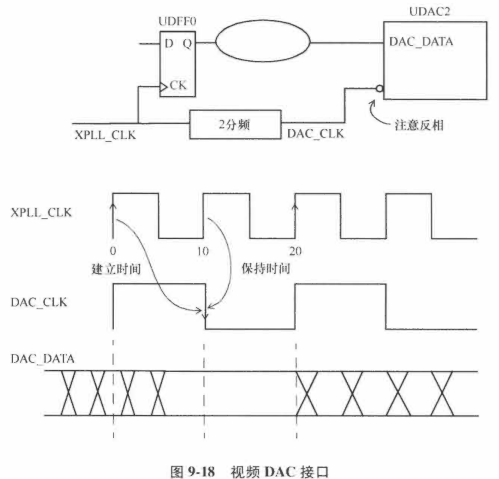

- 时钟DAC_CLK：XPLL_CLK的2分频时钟
- DAC建立和保持时间检查对应于DAC_CLK的下降沿
- 时钟XPLL_CLK的上升沿发射数据，时钟DAC_CLK的下降沿捕获数据

建立时间报告：

```pgp
Startpoint: UDFF0 (rising edge-triggered flip-flop clocked by XPLL_CLK)
Endpoint: UDAC2 (falling edge-triggered flip-flop clocked by DAC_CLK)
Path Group: DAC_CLK
Path Type: max

Point                                 Incr   Path
----------------------------------------------------------------
clock XPLL_CLK (rise edge)            0.00   0.00
clock source latency                  0.00   0.00
XPLL_CLK (in)                         0.00   0.00 r
UDFF0/CK (DF)                         0.00   0.00 r
UDFF0/Q (DF)                          0.12   0.12 f
UBUF0/Z (BUFF)                        0.06   0.18 f
UDFF2/D (DFN)                         0.00   0.18 f
data arrival time                            0.18

clock DAC_CLK (fall edge)             10.00  10.00
clock XPLL_CLK (source latency)       0.00   10.00
XPLL_CLK (in)                         0.00   10.00 r
UDFF1/Q (DF) (gclock source)          0.13   10.13 f
UDAC2/CKN (DAC)                       0.00   10.13 f
library setup time                   -0.04   10.08
data required time                           10.08
----------------------------------------------------------------
data required time                           10.08
data arrival time                           -0.18
----------------------------------------------------------------
slack (MET)                                  9.90
```

>注意：接口是从快速时钟到慢速时钟，需要的话可以指定2周期路径。

保持时间检查：在建立时间捕获沿之前1个周期完成，约束最紧的保持时间检查是当捕获沿和发射沿是同沿。

```pgp
Startpoint: UDFF0 (rising edge-triggered flip-flop clocked by XPLL_CLK)
Endpoint: UDAC2 (falling edge-triggered flip-flop clocked by DAC_CLK)
Path Group: DAC_CLK
Path Type: min

Point                                 Incr   Path
----------------------------------------------------------------
clock XPLL_CLK (rise edge)           10.00  10.00
clock source latency                  0.00  10.00
XPLL_CLK (in)                         0.00  10.00 r
UDFF0/CK (DF)                         0.00  10.00 r
UDFF0/Q (DF)                          0.12  10.12 f
UBUF0/Z (BUFF)                        0.05  10.17 f
UDFF2/D (DFN)                         0.00  10.17 f
data arrival time                           10.17

clock DAC_CLK (fall edge)             10.00  10.00
clock XPLL_CLK (source latency)       0.00   10.00
XPLL_CLK (in)                         0.00   10.00 r
UDFF1/Q (DF) (gclock source)          0.13   10.13 f
UDAC2/CKN (DAC)                       0.00   10.13 f
library setup time                    0.03   10.16
data required time                           10.16
----------------------------------------------------------------
data required time                           10.16
data arrival time                           -10.17
----------------------------------------------------------------
slack (MET)                                  0.01
```

