[TOC]

# 本书架构

什么是时序分析？为什么要进行时序分析？

标准单元库和互连寄生参数；

计算单元延迟和线延迟；

搭建STA环境，进行时序检查：建立时间和保持时间；

如何处理接口时序，如何处理串扰，以及验证鲁棒性；

介绍SDC（Synopsys Design Constraints，新思设计约束）、SDF（Standard Delay Format，标准延迟格式）、SPEF（Standard Parasitic Exchange Format，标准寄生交换格式）三种常用文件格式；


# 第1章 引言

介绍什么是STA，以及如何利用STA进行时序验证。时序验证是也需要考虑功耗和可靠性。

## 1.1 纳米级设计

对于深亚微米或者纳米级的工艺，互连线之间的耦合电容会引起噪声和串扰，而这两者都会限制芯片的运行速度。

在老旧工艺中，噪声和耦合效应都可以忽略不计，但纳米级设计中不行。

**物理实现**（又叫后端设计）和设计验证都应该考虑**串扰和噪声**的影响

## 1.2 什么是STA

STA：数字电路中验证时序的一种方法。

时序仿真：不仅可以验证时序，海能验证功能

STA中的**静态**：电路分析不依赖输入端口的激励`stimulus`

时序仿真：在输入端口施加激励，电路的行为被观察和验证。


- STA的目的

  验证1个电路是否可以在给定的1组时钟、给定的电路外部环境下，正常工作在额定速度上。

- 建立时间检查：保证数据可以在给定的时钟周期内到达触发器；

- 保持时间检查：保证数据至少稳定一段时间，没有预料之外的数据到达触发器，保证了触发器读取了正确的数据。

- SDC：一种时序约束的标准语言

## 1.3 为什么要进行STA

STA可以对设计中的所有时序进行完备的验证。

时序仿真：只能验证被激励执行到的部分时序，只能验证到使用测试向量的部。并且如果想验证千万门级甚至亿万门级设计的所有时序，速度会很慢，并且做不到彻底验证。

- 串扰和噪声

  噪声产生原因：信号线之间的串扰，主要输入端口或电源引入的噪声。

  噪声的影响：限制设计的频率、可能造成功能错误。

基于逻辑仿真的验证无法处理**串扰、噪声和片上变化**（on-chip Variation，OCV）的影响。

## 1.4 设计流程

### 1.4.1 CMOS数字设计

在CMOS数字设计流程中，STA可以在物理实现的各个阶段中进行。

- RTL级：主要任务是验证功能，而不是时序。

- 综合：RTL级代码映射为门级网表。STA可以在逻辑优化前运行，提前确定最差或关键的时序路径。

- 逻辑优化：得到优化过的门级网表。逻辑优化之后的STA，检查是否有遗留的时序违例路径。

- 物理实现

  物理实现开始前，时钟树被认为是理想的，即时钟树上的延迟为零。

  在物理实现过程中，STA可以在每个阶段执行来确定最差的时序路径。

  在物理实现过程中，所有的逻辑单元被金属互连线连接起来。金属绕线的寄生RC（电阻和电容）会影响经过这些绕线的信号路径延迟。

  纳米设计中，互连线的寄生参数是造成延迟和功耗损失的主要原因。

  信号线之间的耦合效应会带来噪声，验证时必须考虑噪声对性能的影响。

  - 布局前

    逻辑设计阶段没有布局的物理信息，可以假设互连线是理想状态，此阶段关注哪些逻辑造成了最差的时序路径。

    线负载模型：用于估计互连线的长度，基于逻辑单元的扇出估算出RC值。

  - 全局布线阶段

    用简化的绕线来估计绕线长度，而估计的绕线则用来估计电阻和电容，这些电阻和电容又被用来计算线延迟。此阶段，耦合效应无法分析。

    精细绕线完成后，可以提取实际的RC值来分析耦合效应的影响。但是，物理实现工具在计算RC值时，仍然会使用近似值来缩短运行时间。

总结（门级网表运行STA需要考虑的条件）：

1. 互连线如何建模：理想互连线、线负载模型，具有近似RC值的全局布线，或具有精准RC值的真实布线
2. 时钟如何建模：理想时钟（零延迟）或者传播时钟（真实延迟）
3. 是否考虑信号之间的耦合效应，即是否分析串扰噪声


## 1.5 不同阶段的STA

- 逻辑级的STA需要用到以下模型

  理想互连线或者基于线负载模型的互连线；

  带有预估时钟抖动和时钟延迟的理想时钟

- 物理实现阶段

  互连线：可以是使用预估RC值的全局布线，可以是提取近似RC值的真实布线，也可以是使用签核精度的真实布线。

  时钟树：真实时钟树。

  包括或者不包括串扰的影响

## 1.6 STA的局限性

在最先进的工艺中仍然无法使用STA完全替代时序仿真。

局限性：

1. 复位序列

   检查是否所有的触发器在收到异步或同步复位信号后都复位到所需的逻辑值，STA无法做到

2. X状态处理

   STA只能处理逻辑0和逻辑1，或者电平上升和下降。设计中未知状态X会造成不确定的值在设计中传播，STA无法进行这种检查。

3. PLL设置

   PLL的配置可能没有被正确读取和设置

4. 跨异步时钟域

   STA不能检查是否使用了正确的时钟同步器

5. IO接口时序

   仅依靠STA的约束来指定IO接口的需求不太可能

6. 模拟和数字块之间的接口

   STA无法处理模拟块，需要相应的验证方法确保两种块之间的连接是正确的。

7. 伪路径

   STA确保逻辑路径的时序满足所有的要求，并标记出不满足要求的逻辑路径。

   伪路径：系统使用不到的路径。

   如果时序约束时使用了正确的伪路径和多周期约束，STA的结果会好很多。

8. FIFO指针不同步

   当2个应该是同步的有限状态机不同步时，STA无法发现。

9. 时钟同步逻辑

   STA不能发现时钟生成逻辑和时钟定义不符。STA会假定时钟生成器会提供时钟定义中指定的时钟波形。

10. 跨时钟周期的功能性行为

    STA不能建模或仿真哪些跨时钟周期的功能性行为变化。

## 1.7 功耗考虑

总功耗

待机功耗：手持设备或者电池供电设备的强制约束

功耗与时序有关，也与工艺和单元库的选择相关。

## 1.8 可靠性考虑

金属互连线的寄生RC限制了设计的性能；

金属线的宽度：

​	高速时钟信号的走线必须足够宽，来满足可靠性要求，比如电迁移。

# 第2章 STA概念

介绍CMOS逻辑的基础知识以及STA相关的术语

## 2.1 CMOS逻辑设计

### 2.1.1 基本MOS结构

MOS：金属氧化物半导体，`Metal Oxide Semiconductor`


**源极和漏极之间的距离**：MOS晶体管的长度。用来制造MOS晶体管的最小长度通常就是CMOS技术工艺的最小特征尺寸。例如，025um工艺允许MOS晶体管有025um或更大的沟道长度

### 2.1.2 CMOS逻辑门

CMOS逻辑门：用NMOS和PMOS搭建

CMOS反相器：


CMOS与非门：2个并联PMOS+2个串联NMOS


### 2.1.3 标准单元

芯片的复杂功能通常是由基本的**构建模块**实现的。

基本模块：与、或、与非、或非、与或非、或与非，以及触发器等，这些模块都是预先设计好的，被称为**标准单元**。

## 2.2 CMOS单元建模

一个标准单元的输出引脚驱动多个扇出单元，**该输出引脚的总电容等于** + **组成该线`Net`的所有线段的电容** + **驱动单元的输出电容**

> 注意：CMOS单元中，单元的输入只表现为电容性负载

例子：1个单元G1驱动3个其他单元，Gs1-4是组成这条线的所有线段的电容值


总电容：单元G1翻转时需要充放电的电容。

每个输入引脚都指定了输入引脚电容，每个输出引脚也可以指定电容，但是大多数CMOS逻辑单元没有包括输出引脚电容。


- 当输出逻辑为逻辑1，输出级的上拉结构导通，它提供了一条从输出到Vdd的路径

- 当输出逻辑为逻辑0，输出级的下拉结构导通，它提供了一条从输出到Vss的路径

- CMOS单元的翻转速度：由输出线`Output Net`电容的充放电速度决定

- 上下拉结构中的通道对输出的充放电路径构成电阻

  - 输出上拉结构越大，上拉电阻越小，单元的输出高电平驱动越大。
  - 输出上拉结构越小，上拉电阻越大，单元的输出高电平驱动越小。
  - 下拉结构同理

  输出驱动决定了可以驱动的最大电容负载，最大电容负载决定最大扇出的数量，即决定可以驱动的单元个数。

CMOS单元的等效抽象模型`Equivalent Abstract Model`：抽象描述CMOS单元的时序行为

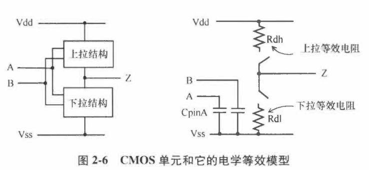


## 2.3 电平翻转波形

RC充放电波形：

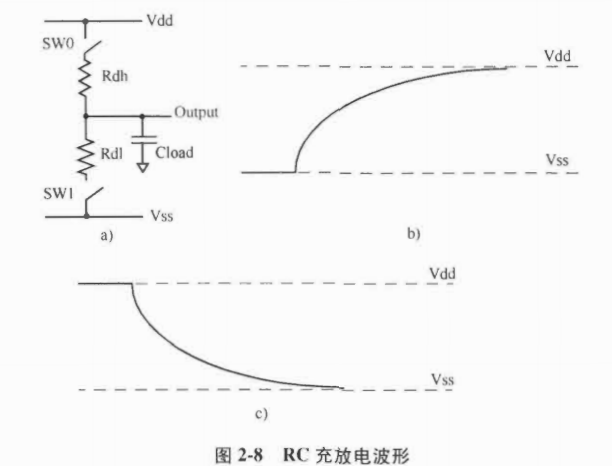

充电电压公式：$V=Vdd*[1-e^{-t/(Rdh*Cload)}]$ 

放电电压公式：$V=Vdd*e^{-t/(Rdl*Cload)}$ 

在一个CMOS单元中，PMOS上拉晶体管和NMOS下拉晶体管会在极短的时间内同时导通，所以充放电波形并不会如图2-8那样标准。

CMOS反相器从逻辑1到逻辑0的电流流动：

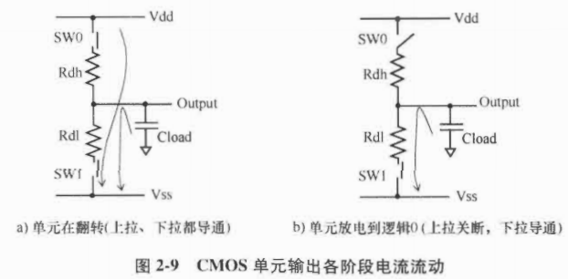

CMOS单元输出的典型波形：

​	描述了从1个逻辑状态到另一个逻辑状态所需时间

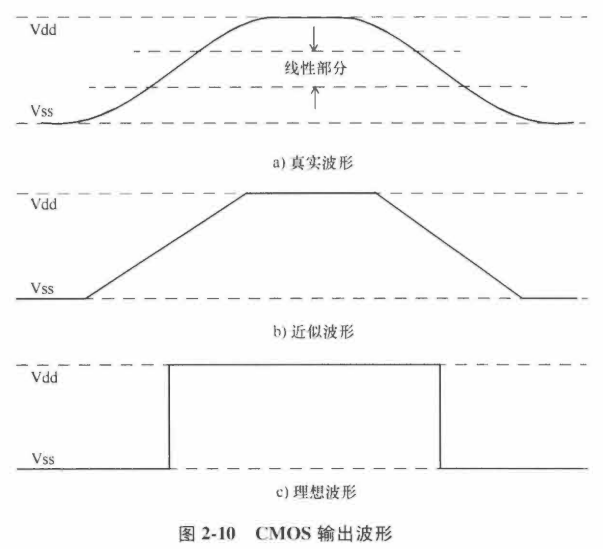


## 2.4 传播延迟

单元的传播延迟：用翻转波形上的一些测量点定义的，常见的4个变量点：

1. 输入下降沿阈值点

   `input_threshold_pct_fall : 50.0;`

2. 输入上升沿阈值点

   `input_threshold_pct_rise : 50.0;`

3. 输出下降沿阈值点

   `output_threshold_pct_fall : 50.0;`

4. 输出上升沿阈值点

   `output_threshold_pct_rise : 50.0;`

阈值参数：由`Vdd`或者电源的百分比定义

对于大多数标准单元库，使用**50%的阈值**表示延迟。

以反相器单元和引脚波形为例，**传播延迟**用以下值表示

1. 输出下降沿延迟`Tf`
2. 输出上升沿延迟`Tr`

通常以上2个值是不同的

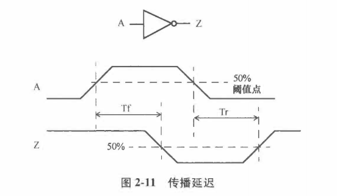

## 2.5 波形的转换率

**转换率**`Slew rate`：改变的速率，由转换时间`Transition Time`衡量

**转换时间**：信号在2个指定电平之间转换所需要的时间，通常需要指定阈值水平来定义

例如，转换率阈值（指定为`Vdd`百分比）设置为：

```
# 下降沿阈值
slew_lower_threshold_pct_fall : 30.0;
slew_upper_threshold_pct_fall : 70.0;
# 上升沿阈值
slew_lower_threshold_pct_rise : 30.0;
slew_upper_threshold_pct_rise : 70.0;
```

- 下降转换率：下降沿到达70% Vdd和30%Vdd的时间差值
- 上升转换率：上升沿到达30% Vdd和70%Vdd的时间差值

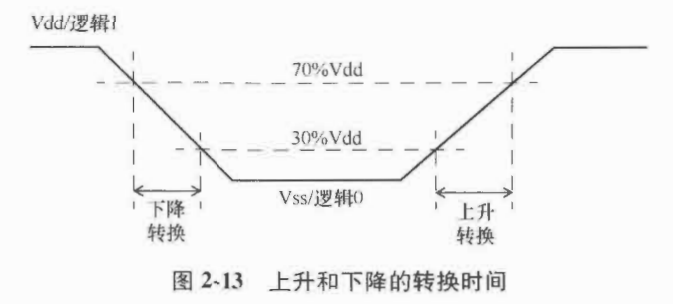

另一个例子：不同的阈值定义

```
# 下降沿阈值
slew_lower_threshold_pct_fall : 20.0;
slew_upper_threshold_pct_fall : 80.0;
# 上升沿阈值
slew_lower_threshold_pct_rise : 10.0;
slew_upper_threshold_pct_rise : 90.0;
```


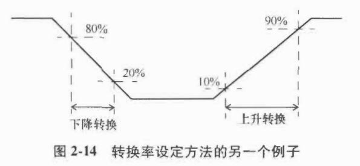

## 2.6 信号之间的偏移

偏移`skew`：2个或多个信号的时序之差

例如，1个时钟树`Clock Tree`有500个终点，有50ps的偏移，意味着最长的时钟路径和最短的时钟路径的延迟差为50ps。

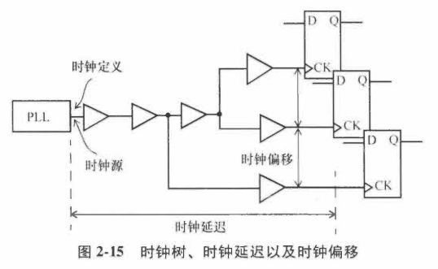

**时钟树的起点**：定义时钟的节点

**时钟树的终点**：同步元件的时钟引脚

**时钟延迟**`Clock Latency`：信号从时钟源到终点的时间

**时钟偏移**：时钟树到达每个终点的时间差


- 理想的时钟树

  假设时钟源有无限的驱动能力，且没有延迟

  逻辑设计早期，STA通常假设在理想时钟树下进行，专注分析数据路径`Data path`

  默认时钟偏移为0ps

**时钟树的延迟约束**：`set_clock_latency`

```verilog
set_clock_latency 2.2 [get_clocks BZCLK]
# 上升沿和下降沿的延迟都是2.2ns.
# 如果上升沿和下降沿的延迟不一致，用-rise和-fall来分别指定。
```

**时钟树的时钟偏移约束**：`set_clock_uncertainty`

```
set_clock_uncertainty 0.250 -setup [get_clocks BZCLK]
set_clock_uncertainty 0.100 -hold [get_clocks BZCLK]
```

`set_clock_uncertainty`指定1个时间窗口，时钟的沿可能在这个窗口内的任意时间出现。

- 不确定性的因素：

  时钟周期的抖动`Clock Period Jitter`

  时钟的偏移

  时序验证需要的额外余量`Margin`

- 为建立时间和保持时间设定不同的时钟不确定性

  保持时间检查的不确定性不需要包含时钟抖动，所以通常保持时间的检查的不确定性较小。

## 2.7 时序弧和单调性

每个单元有多个时序弧`Timing Arc`

每个时序弧都有时序极性`Timing Sense`

- 正单调

  输入的上升转换引起输出的上升（或不变），输入的下降转换引起输出的下降（或不变）

  如：与门、或门

- 负单调

  输入的上升转换引起输出的下降转换（或不变），输入的下降转换引起输出的上升（或不变）

  如：与非门、或非门

- 非单调的时序弧

  输出的转换不能由输入转换的方向单独决定，需要取决于其他输入的状态。

  如：异或门

使用时序弧的非单调性，比如使用**异或门翻转时钟的极性**`polarity`。

输入POLCTRL为逻辑0，单元UXOR0输出的时钟DDRCLK和输入时钟MEMCLK有一样的极性；

输入POLCTRL为逻辑1，单元UXOR0输出的时钟DDRCLK和输入时钟MEMCLK的极性相反；

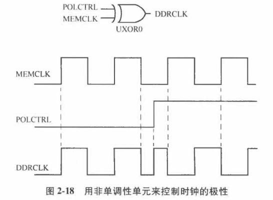


## 2.8 最小和最大时序路径

路径延迟`Path Delay`：包括逻辑单元以及线的总延迟

通常，逻辑可以通过不同的路径到达终点，而实际路径取决于这条逻辑路径上其他输入的状态。

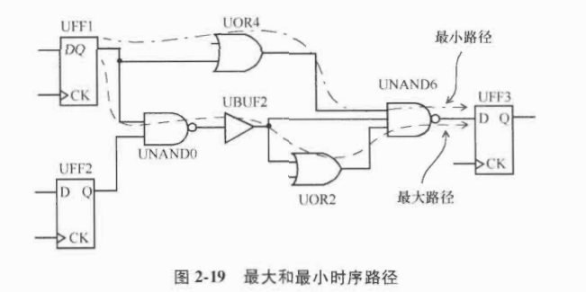

- 最大路径，也叫做晚路径`late path`
- 最小路径，也叫做早路径`early path`


## 2.9 时钟域

通常，设计中有多个时钟域，如200个触发器被时钟USBCLK驱动，1000个触发器被MEMCLK驱动。

2个时钟域是否有关联，取决于是否有数据路径从1个时钟域开始，到另一个时钟域结束。

如果有数据路径跨时钟域，必须确定这条路径是真是假。

- 伪路径

  设计时将时钟同步器逻辑明确放在2个时钟域之间，此时，就不是真实的时序路径

  使用`set_false_path`指定时钟域之间的伪路径

  `set_false_path -from [get_clocks USBCLK] -to [get_clocks MEMCLK]`

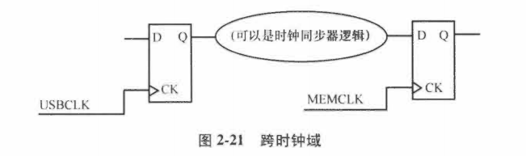

多路复用器选时钟源，2个时钟互斥

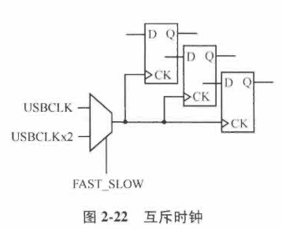

## 2.10 工作条件

STA通常是在特定的工作条件下进行的

工作条件`Operating Condition`：由工艺`Process`、电压`Voltage`、温度`Temperature`（PVT）共同定义

单元延迟和互连延迟是在特定的工作条件下计算的。


半导体代工厂会提供3种制造工艺模型：慢速、典型、快速。

慢速和快速工艺模型代表了代工厂制造工艺的极端工艺角。

单位延迟随工艺角、电压、温度的变化：

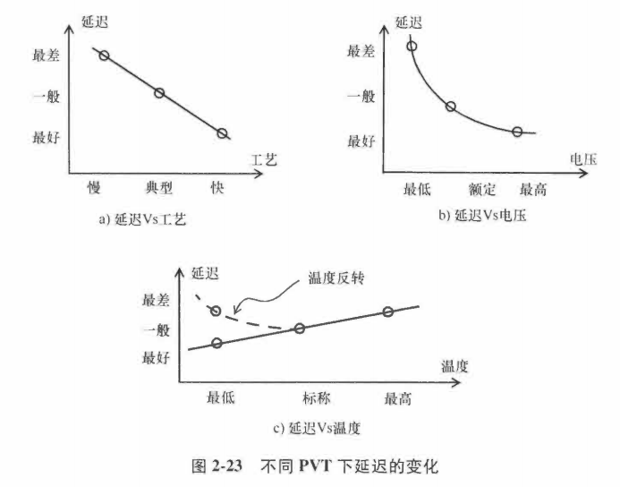

- 进行STA分析时，3种标准的工作条件

  1. WCS，`Worst-Case Slow`：工艺慢、温度最高、电压最低
  2. TYP，`Typical`：典型工艺，标称温度，额定电压
  3. BCF，`Best-Case fast`：快工艺，最低温度，最高电压

- 进行功耗分析时，工作条件

  1. ML（`maximal Leakage`，最大漏电流）：工艺是快，温度最高，电压也最高

     该工作条件下，有最大漏电功耗`Leakage Power`。对大多数设计来说，也有最大的动态功耗`Active Power`

  2. TL（`Typical Leakage`，典型漏电流）：典型工艺，温度最高，电压是额定的。

     该条件下大部分设计具有典型漏电流，因为正常工作时的发热，芯片温度也会变高

# 第3章 标准单元库

介绍时序相关信息如何存储在常见的库单元 `Libarary Cell` 中。库单元中包含很多属性，但是现在我们仅关注和时序、串扰以及功耗分析相关的属性

单元库：可以是1个标准单元、1个IO缓存器，或者更复杂的IP核。

1个库单元可以用多种标准格式描述，这里采用`Liberty`格式描述单元库。

## 3.1 引脚电容

单元的每个输入和输出都可以在引脚上指定引脚电容。

大多数情况下，只会指定输入的电容，而不会指定输出的，在多数的单元库中，输出引脚的电容是0.

```verilog
pin (INP1){
    capacitance: 0.5;
    rise_capacitance: 0.5;
    rise_capacitance_range: (0.48,0.52);
    fall_capacitance: 0.45;
    fall_capacitance_range: (0.435,0.46);
    ...
}
```

- 最基本的格式中，引脚电容被指定为单一值。
- 电容的单位通常在库文件的开头被指定为皮法`Picofarad`
- 单元描述时也可以为引脚的**上升和下降转换时间**指定值或范围。

## 3.2 时序建模

延迟：从输入跨过阈值点到输出跨过阈值点的时间。

反相器单元的时序弧延迟：

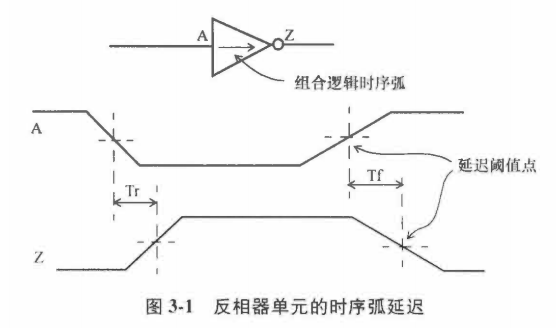

通过反相器的时序弧的延迟是基于以下2个因素：

- 输出负载，即输出引脚的电容负载

  负载电容越大，延迟越大

- 信号在输入的转换时间

  转换时间越大，延迟越大

> 少数情况，输入阈值和单元内部转换点显著不同，此时单元的延迟可能和输入的转换时间呈现非单调性——更大的输入转换时间可能产生更小的延迟，尤其是输出负载电容较小时。

单元输出转换率主要取决于：输出电容，电容越大，输出转换时间越大。

输入的较大转换率（较长的转换时间）可能在输出得到改善。

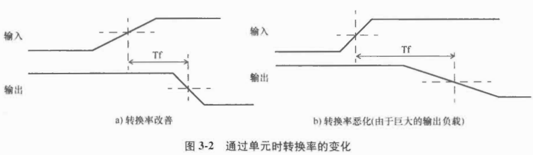

### 3.2.1 线性时序模型

- 线性延迟模型（`Linear Delay Model, LDM`）

  单元的延迟和输出转换时间由2个参数（输入转换时间、输出负载电容）的线性方程表示，一般形式：

  $D=D0+D1*S+D2*C$

  其中，D0、D1、D2都是常数，S是输入转换时间，C是输出负载电容。

  对于亚微米工艺，LDM对于一定范围内的输入转换时间和输出电容并不精确，所以现在大部门单元库采用的是更复杂的模型，比如非线性延迟模型（`Non-linear Delay Model, NLDM`）。

### 3.2.2 非线性延迟模型

表模型`Table Model`：被称为NLDM，用于计算延迟，输出转换率或者其他时序检查。

延迟的NLDM通过二维表格表示，2个独立变量：输入转换时间和输出负载电容。

例子，反相器单元的表格：

```
pin (OUT) {
    max_transition : 1.0;
    timing() {
        related_pin : "INP1";
        timing_sense : negative_unate;
        cell_rise(delay_template_3x3) {
            index_1 ("0.1, 0.3, 0.7");   /* Input transition */
            index_2 ("0.16, 0.35, 1.43"); /* Output capacitance */
            values ( /*  0.16    0.35    1.43 */ \
                /* 0.1 */ "0.0513, 0.1537, 0.5280", \
                /* 0.3 */ "0.1018, 0.2327, 0.6476", \
                /* 0.7 */ "0.1334, 0.2973, 0.7252");
        }
        cell_fall(delay_template_3x3) {
            index_1 ("0.1, 0.3, 0.7");   /* Input transition */
            index_2 ("0.16, 0.35, 1.43"); /* Output capacitance */
            values ( /*  0.16    0.35    1.43 */ \
                /* 0.1 */ "0.0617, 0.1537, 0.5280", \
                /* 0.3 */ "0.0918, 0.2027, 0.5676", \
                /* 0.7 */ "0.1034, 0.2273, 0.6452");
        }
    }
}
```

上述例子描述了输出接口OUT的延迟信息。包括了**从引脚INP1到引脚OUT时序弧的上升和下降延迟模型，以及引脚OUT所能允许的`max_transition`**。

对上升延迟和下降延迟（对于输出引脚）有单独的模型，分别标记为`cell_rise` 和` cell_fall` 。

索引`Index`的类型以及查表时索引的顺序在查表模板`delay_template_3x3`中有描述。

```
lu_table_template(delay_template_3x3) {
    variable_1 : input_net_transition;
    variable_2 : total_output_net_capacitance;
    index_1 ("1000, 1001, 1002");
    index_2 ("1000, 1001, 1002");
}
/* 输入转换时间和输出负载电容可以是任一顺序，
   比如，variable_1 可以是输出电容。
   但是这个顺序通常在1个库文件中是一致的。 */
```

表模板中：

- 第一个变量：输入转换时间；

- -第二个变量：输出电容；

- 索引`index_1`：外圈循环变量，相当于行索引

- 索引`index_2`：内圈循环变量，相当于列索引

  对应一个3x3的表，表的索引值可被真实值覆盖。

  ```
  lu_table_template(delay_template_3x3) {
      variable_1 : input_net_transition;
      variable_2 : total_output_net_capacitance;
      index_1 ("0.1, 0.3, 0.7");   
      index_2 ("0.16, 0.35, 1.43");
  }
  ```

基于上面的延迟表，当输入下降转换时间为0.3ns，输出负载为0.16pF时，相应的反相器的上升延迟为0.1018ns。

> 反相器的**输出上升延迟**应该用**输入的下降转换时间**去查表。


NLDM不仅可以用于描述延迟，也可以用于**描述单元输出的转换时间**。(rise_transition、fall_transition)

```
pin (OUT) {
    max_transition : 1.0;
    timing() {
        related_pin : "INP1";
        timing_sense : negative_unate;
        rise_transition(delay_template_3x3) {
            index_1 ("0.1, 0.3, 0.7");   /* Input transition */
            index_2 ("0.16, 0.35, 1.43"); /* Output capacitance */
            values ( /*  0.16    0.35    1.43 */ \
                /* 0.1 */ "0.0417, 0.1337, 0.4680", \
                /* 0.3 */ "0.0718, 0.1827, 0.5676", \
                /* 0.7 */ "0.1034, 0.2173, 0.6452");
        }
        fall_transition(delay_template_3x3) {
            index_1 ("0.1, 0.3, 0.7");   /* Input transition */
            index_2 ("0.16, 0.35, 1.43"); /* Output capacitance */
            values ( /*  0.16    0.35    1.43 */ \
                /* 0.1 */ "0.0817, 0.1937, 0.7280", \
                /* 0.3 */ "0.1018, 0.2327, 0.7676", \
                /* 0.7 */ "0.1334, 0.2973, 0.8452");
        }
        ...
    }
    ...
}
```

- 转换时间：基于转换率阈值计算，阈值通常是供电电压的10%-90%

1个具有NLDM的反相器单元有以下表格：

- 上升时间
- 下降时间
- 上升转换时间
- 下降转换时间


#### NLDM查表示例

情况1：输入转换时间和输出电容可直接通过查表获取

情况2：表中没有要找的值

- 二维插值法

  当索引超出表中的索引特征范围时，插值法仍然有效

### 3.2.3 阈值范围和转换率减免

转换率的值：基于库文件中设定的测量阈值。

大部分旧工艺的库（0.25um或更旧）用10%和90%作为转换率或者转换时间的测量阈值。

转换率阈值：与波形的线性部分对应。随着工艺的进步，真实波形的线性部分通常是30%-70%。

但是，之前的转换时间都是用10%和90%测量的，在移植库时，需要用**转换率减免系数**`Slew Derate Factor`进行转换。

- 转换率阈值为30%~70%，且转换率减免系数为0.5，等效于用10% ~ 90%测量的结果。

## 3.3 时序模型——组合逻辑单元

双输入与门单元的时序弧：

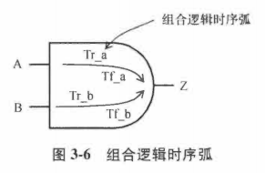

### 3.3.1 延迟和转换率模型

正单调性`Positive Unate`

负单调性`Negative Unate`

与非门单元的时序弧：负单调性，即输出引脚的转换方向和输入引脚的转换方向是负相关的

与门和或门的时序弧：正单调性

### 3.3.2 常用组合逻辑块

3输入、2输出的组合逻辑块：

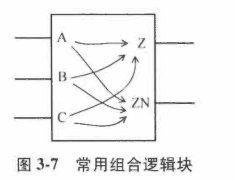

逻辑块的每个输入到每个输出都有时序弧。


穿过组合逻辑单元的时序弧可以是正单调的，也可以是负单调的，比如：双输入异或门单元的时序弧。


## 3.4 时序模型——时序单元

对于同步输入，比如引脚D，有以下时序弧：

1. 建立时间检查时序弧
2. 保持时间检查时序弧

对于异步输入，比如引脚CDN，有以下时序弧：

1. 恢复时间检查时序弧
2. 移除时间检查时序弧

对于触发器的同步输出，比如引脚Q或QN，有以下时序弧：

- CK到输出的传播延迟时序弧

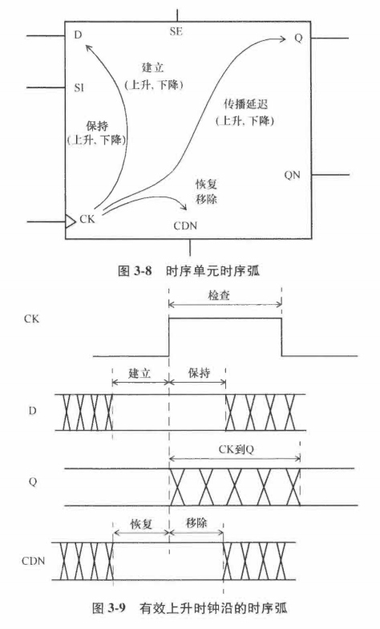

### 3.4.1 同步检查：建立时间和保持时间

- 建立时间

  最近的数据信号跨过阈值和有效时钟沿跨过阈值两者之间的时间间隔。

- 保持时间

  有效时钟沿跨过阈值和最早的数据信号跨过阈值两者之间的时间间隔

#### 建立时间检查和保持时间检查的例子

一个时序单元的同步引脚的建立时间约束和保持时间约束通常用二维表描述：

```
pin (D) {
    direction : input;
    ...
    timing () {
        related_pin : "CK";
        timing_type : "setup_rising";
        rise_constraint ("setuphold_template_3x3") {
            index_1 ("0.4, 0.57, 0.84"); /* Data transition */
            index_2 ("0.4, 0.57, 0.84"); /* Clock transition */
            values ( /*  0.4    0.57    0.84 */ \
                /* 0.4  */ "0.063, 0.093, 0.112", \
                /* 0.57 */ "0.526, 0.644, 0.824", \
                /* 0.84 */ "0.720, 0.839, 0.930");
        }
        fall_constraint ("setuphold_template_3x3") {
            index_1 ("0.4, 0.57, 0.84"); /* Data transition */
            index_2 ("0.4, 0.57, 0.84"); /* Clock transition */
            values ( /*  0.4    0.57    0.84 */ \
                /* 0.4  */ "0.762, 0.895, 0.969", \
                /* 0.57 */ "0.804, 0.952, 0.166", \
                /* 0.84 */ "0.159, 0.170, 0.245");
        }
    }

    timing () {
        related_pin : "CK";
        timing_type : "hold_rising";
        rise_constraint ("setuphold_template_3x3") {
            index_1 ("0.4, 0.57, 0.84"); /* Data transition */
            index_2 ("0.4, 0.57, 0.84"); /* Clock transition */
            values ( /*  0.4    0.57    0.84 */ \
                /* 0.4  */ "-0.220, -0.339, -0.584", \
                /* 0.57 */ "-0.247, -0.381, -0.729", \
                /* 0.84 */ "-0.398, -0.516, -0.864");
        }
        fall_constraint ("setuphold_template_3x3") {
            index1("0.4, 0.57, 0.84"); /* Data transition */ 
            index2("0.4, 0.57, 0.84");/*Clock transition */ 
            values( /* 0.4 0.57 0.84 */ \ 
            /* 0.4 */ "-0.028, -0.397, -0.489", \ 
            /* 0.57 */ "-0.408, -0.527, -0.649", \ 
            /* 0.84 */ "-0.705, -0.839, -0.580");
        }
    }
}

```

上述例子显示：相对于时钟CK的上升沿，1个时序单元输入引脚D上的建立时间和保持时间约束。

上述二维模型的索引：D 和 CK 上的转换时间`transition time`

查找上述二维表是根据库文件中的模板库`setuphold_template_3x3`。

```
lu_table_template(setuphold_template_3x3) {
    variable_1 : constrained_pin_transition;
    variable_2 : related_pin_transition;
    index_1 ("1000", "1001", "1002");
    index_2 ("1000", "1001", "1002");
}
/* ☐ 被约束的引脚和相关的引脚可以是任意顺序，也就是说，variable_1
   可以是相关引脚转换时间。但是，这一顺序在库文件中的所有模板中，
   通常是固定唯一的。*/
```

- 例子：D引脚转换时间0.4ns，CK引脚的转换时间0.84ns

  根据`rise_constraint`表，D引脚的上升沿建立时间约束值就是0.112ns；

  根据`fall_constraint`表，D引脚的下降沿建立时间约束值就是0.969ns；

  > 当二维表中没有对应的索引值，需要采用3.2节中非线性模型查表中用的插值法。

#### 建立时间检查和保持时间检查里面的负值

- 保持时间有些是负值，这是允许接受的。

  这种情况通常发生在当数据路径从触发器的引脚到内部的锁存点比对应的时钟路径长。

  保持时间负值意味着：触发器的数据引脚先于时钟引脚变化，且满足保持时间检查。

- 建立时间也可以是负值

- 建立时间和保持时间不能同时是负值

  为了让建立和保持时间检查一致，**建立时间和保持时间之和**必须为正。

  例子：负保持时间

  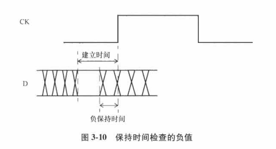

  建立时间加保持时间的时间宽度：信号必须保持稳定的区间。

### 3.4.2 异步检查

- 恢复时间和移除时间检查

  异步引脚：如异步清除`Clear`，异步置位`Set`

  当异步引脚有效，输出由异步引脚控制，而不是由数据输入端的时钟锁存控制。

  恢复时间：异步引脚被设置为无效后，在下一个有效时钟沿之前需要保持稳定的最短时间。

  移除时间：异步引脚被设置为无效前，在1个有效时钟沿之后需要保持有效的时间。

- 脉冲宽度检查

  如果时钟引脚上的脉冲宽度小于指定的最小值，时钟可能没有正确的锁存数据。

  可以给相关的同步和异步引脚指定脉冲宽度检查。

  脉冲宽度可以指定高脉冲和低脉冲。

- 例子

  ```
  pin(CDN) {
      direction : input;
      capacitance: 0.002236;
  	...
      timing() {
          related_pin : "CDN";
          timing_type : min_pulse_width;
          fall_constraint(width_template_3x1) { /*low pulse check*/
              index_1 ("0.032, 0.504, 0.788"); /* Input transition */
              values (/* 0.032 0.504 0.788 */\
              	      "0.034, 0.060, 0.377");
          }
      }
  
      timing() {
          related_pin : "CK";
          timing_type : recovery_rising;
          rise_constraint(recovery_template_3x3) { /* CDN rising */
              index_1 ("0.032, 0.504, 0.788"); /* Data transition */
              index_2 ("0.032, 0.504, 0.788"); /* Clock transition */
              values (/* 0.032 0.504 0.788 */\
              /* 0.032 */ "-0.198, -0.122, 0.187", \
              /* 0.504 */ "-0.268, -0.157, 0.124", \
              /* 0.788 */ "-0.490, -0.219, -0.069");
          }
      }
  
      timing() {
          related_pin : "CP";
          timing_type : removal_rising;
          rise_constraint(removal_template_3x3) { /* CDN rising */
              index_1 ("0.032, 0.504, 0.788"); /* Data transition */
              index_2 ("0.032, 0.504, 0.788"); /* Clock transition */
              values (/* 0.032 0.504 0.788 */\
              /* 0.032 */ "0.106, 0.167, 0.548",\
              /* 0.504 */ "0.221, 0.381, 0.662", \
              /* 0.788 */ "0.381, 0.456, 0.778");
          }
      }
  }
  ```

### 3.4.3 传播延迟

时序单元的传播延迟：从时钟的有效沿到输出的上升或下降沿。

- 例子：下降沿触发的触发器

  非单调时序弧：时种的有效沿可以导致输出Q的上升或下降。

  延迟表`Delay Table`：

  ​	二维表的索引：输入转换时间、输出引脚的电容

  ```
  timing() {
      related_pin : "CKN";
      timing_type : falling_edge;
      timing_sense : non_unate;
      cell_rise (delay_template_3x3) {
          index_1 ("0.1, 0.3, 0.7"); /* Clock transition */
          index_2 ("0.16, 0.35, 1.43"); /* Output capacitance */
          values (/* 0.16 0.35 1.43 */\
          /* 0.1 */ "0.0513, 0.1537, 0.5280", \
          /* 0.3 */ "0.1018, 0.2327, 0.6476",\
          /* 0.7 */ "0.1334, 0.2973, 0.7252");
      }
      rise_transition (delay_template_3x3) {
          index_1 ("0.1, 0.3, 0.7");
          index_2 ("0.16, 0.35, 1.43");
          values (\
          "0.0417, 0.1337, 0.4680", \
          "0.0718, 0.1827, 0.5676", \
          "0.1034, 0.2173, 0.6452");
      }
      cell_fall (delay_template_3x3) {
          index_1 ("0.1, 0.3, 0.7");
          index_2 ("0.16, 0.35, 1.43");
          values (\
          "0.0617, 0.1537, 0.5280", \
          "0.0918, 0.2027, 0.5676",\
          "0.1034, 0.2273, 0.6452");
      }
      fall_transition (delay_template_3x3) {
          index_1 ("0.1, 0.3, 0.7");
          index_2 ("0.16, 0.35, 1.43");
          values (\
          "0.0817, 0.1937, 0.7280",\
          "0.1018, 0.2327, 0.7676",\
          "0.1334, 0.2973, 0.8452");
      }
  }
  ```

## 3.5 状态相关的时序模型

异或门、异或非门和时序单元

考虑两输入的异或门单元：

- 当输入A2为逻辑0，从输入A1到输出Z的时序路径是正单调的；
- 当输入A2为逻辑1，从输入A1到输出Z的时序路径是负单调的；

用状态相关模型`Stat-Dependent Model`来指定当输入A2为逻辑0时，从A1到Z的时序模型：

​	使用when来指定状态相关条件。

```
pin (Z) {
    direction : output;
    max_capacitance : 0.0842;
    function : "(A1^A2)";
    timing() {
        related_pin : "A1";
        when : "!A2";
        sdf_cond : "A2 == 1'b0";
        timing_sense : positive_unate;
        cell_rise (delay_template_3x3) {
            index_1 ("0.0272, 0.0576, 0.1184"); /* Input slew */
            index_2 ("0.0102, 0.0208, 0.0419"); /* Output load */
            values (\
            "0.0581, 0.0898, 0.2791", \
            "0.0913, 0.1545, 0.2806",\
            "0.0461, 0.0626, 0.2838");
		}
		...
    }
    ...
}
```

状态相关模型可以用于指定是时序库中任何属性。

状态相关的规范可以是：功耗、漏电功耗、转换时间、上升和下降延迟、时序约束等。

状态相关漏电功耗的规范：

```
leakage_power(){
	when : "A1 !A2";
	value : 259.8;
}
leakage_power(){
	when : "A1 A2";
	value : 282.7;
}
```

## 3.6 黑箱的接口时序模型

黑箱接口模型可能有组合逻辑弧，可能有时序逻辑弧。

通常，这些时序弧也是状态相关的。

例子：

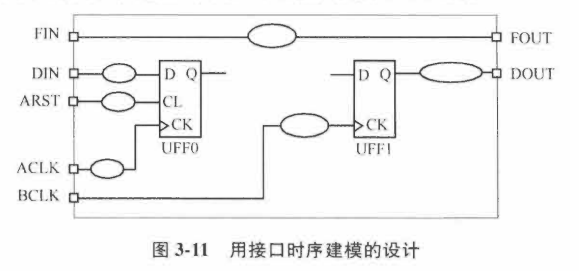

上述例子的时序弧可以被归类为以下几种

1. 输入到输出的组合逻辑弧，如FIN到FOUT。
2. 输入时序弧，如DIN相对于时钟ACLK的建立时间检查。
3. 异步输入弧，如输入ARST到触发器UFF0的异步清除引脚。
4. 输出时序弧，如时钟BCLK到触发器UFF1的输出端，再到输出端口DOUT。

总结：黑箱模型可能有以下时序弧：

- 对于组合逻辑路径的输入到输出时序弧
- 从同步输入到相应的时钟引脚的建立和保持时间时序弧
- 从异步输入到相应的时钟引脚的恢复和移除时间时序弧
- 从时钟引脚到输出引脚的传播时间延迟


## 3.7 先进时序建模

NLDM这种时序模型假设输出负载是纯电容性质的，无互连线电阻。

由于互连电阻的存在，延迟计算算法改进了NLDM，在单元的输出端创造了一个等效的有效电容。


等效电流源对驱动的输出级进行建模，常见方法：CCS（`Composite Curremt Source`，复合电流源）模型、ECSM（`Effective Current Source Model`，有效电流源模型）

## 3.8 功耗建模

动态功耗：芯片工作时功耗。

待机功耗：待机模式下产生的功耗，主要是漏电造成，又叫漏电功耗。

### 3.8.1 动态功耗

动态功耗：与单元输入输出引脚的活动相关，由输出负载的充电和内部开关组成。

- 输出开关功耗

  与单元类型无关，只和输出电容负载、开关频率，以及单元的供电电压有关。

- 内部开关功耗

  和单元类型有关，功耗属性包括在单元库下。


组合逻辑单元的开关功耗：以输入输出引脚对为基础指定。


即使输出或者内部状态没有转换，开关功耗也会被消耗，如触发器时钟引脚翻转。

### 3.8.2 漏电功耗

当单元接通电源但并没有工作时产生的任何功耗都是由非零的漏电流。

早期的CMOS工艺技术中，漏电功耗可以忽略不计。

随着工艺尺寸缩小，漏电功耗不再可以忽略。

漏电功耗主要由两种现象构成：

- MOS器件的亚阈值电流。

- MOS器件的栅极氧化物隧穿效应

- 解决

  高阈值电压单元，可以减少亚阈值电流，但是会影响速度。

  高/低阈值电压单元对栅极氧化物隧穿效应的影响并不明显。

  所以，设计时需要在漏电流和速度之间做平衡。

- MOS器件的亚阈值电流和温度有很强的非线性关系

  在多数工艺下，温度从25℃升高到125℃，亚阈值电流可以增长10-20倍。

- 栅极氧化物隧穿电流相对来说，不随温度或器件的阈值电压变化而变化

  100nm工艺下，可以忽略；

  在室温的65nm或更先进工艺下，是漏电流的重要原因；

  在高温时，亚阈值漏电流占据主要低位。

## 3.9 单元库中的其他属性

库文件的单元描述除了时序信息，还指定了面积、功能以及时序弧的SDF条件。

## 3.10 特征化和工作条件

单元库会指定产生该库的**特征化条件和工作条件**。

比如，库文件的头部可能包含以下信息：

```
nom_process : 1;
nom_temperature : 0;
nom_voltage : 1.1;
voltage_map (COREVDD1, 1.1);
voltage_map (COREGND1, 0.0);
operating_conditions ("BCCOM") {
    process : 1;
    temperature : 0;
    voltage : 1.1;
    tree_type : "balanced_tree";
}
```

标称环境条件（通过nom_process/temperature/voltage来指定）指定了库在特征化时的工艺、电压和温度。

工作条件：指定该库中的单元在何种条件下使用。

当工作条件和特征条件不一致时，需要通过**减免系数（K系数）**计算得到延迟时间。


- 库单位

  ```
  library("my_cell_library") {
    voltage_unit : "1V";
    time_unit : "1ns";
    capacitive_load_unit (1.000000, pf);
    current_unit : 1mA;
    pulling_resistance_unit : "lkohm";
    ...
  }
  ```

  以后讨论均假设库的时间单位为ns，电压单位为V，每次转换的内部功耗单位为pJ，漏电功耗为nW，电容单位为pF，电阻单位为kΩ，面积单位为$um^2$。


# 第4章 互连寄生参数

介绍互连寄生参数的各种建模技术和表示方法。

一条线`Net`通常只有一个驱动，但是可以驱动多个扇出单元或块`Block`。

在物理实现`Physical Implementation`之后，Net可能经过芯片上的多层金属。

不同金属层可能有不同的电阻和电容值。

## 4.1 互连线电阻、电感和电容

- 互连电阻：单元输出引脚和扇出单元输入引脚之间的电阻，来自处于各层金属和过孔中的互连走线。

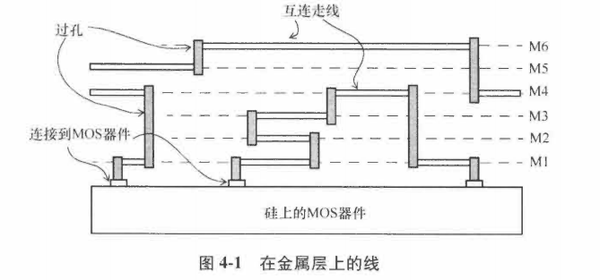

- 互连电容：来自金属走线，由接地电容和相邻信号线间的电容构成。

- 电感：电流环路引起。

  通常，电感的影响在芯片内可以忽略不计，仅在封装和板级分析时考虑。


互连走线任一部分的电阻和电容被理想表示为1个分布式RC树：

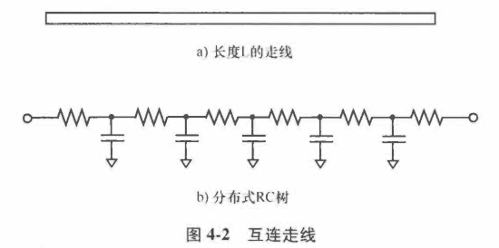

- RC树的总电阻：$R_t=R_p*L$

- RC树的总电容：$C_t=C_p*L$ 

  其中，Rp和Cp是该段走线长度的互联电阻和电容，L是走线长度。


RC互连可以用各种简单模型来表示：

1. **T模型**

2. **Pi模型**

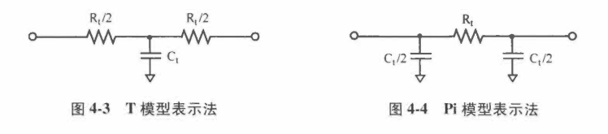

更精确的表示分布式RC树：把$R_t$和$C_t$分割成多部分（N部分）：

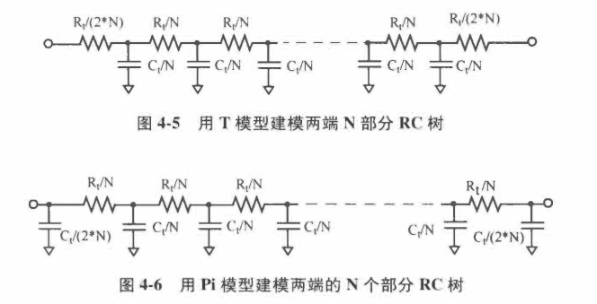


## 4.2 线负载模型

在布图规划或布局前，线负载模型用于估计电容、电阻和互连线的面积开销。

**线负载模型**`Wireload Model`：基于扇出的数量估计线的长度。

块内的平均线长和块的大小密切相关，**块尺寸**增加，**平均线长**相应增加。

线负载模型例子：

```
wire_load ("wlm_conservative") {
    resistance : 5.0;
    capacitance : 1.1;
    area : 0.05;
    slope : 0.5;
    fanout_length (1, 2.6);
    fanout_length (2, 2.9);
    fanout_length (3, 3.2);
    fanout_length (4, 3.6);
    fanout_length (5, 4.1);
}
```

`Resistance`：指每单位长度互连线的电阻；

`Capacitance`：指每单位长度互连线的电容；

`area`：每单位长度互连线的面积开销；

`slope`：数据点超出扇出长度表时所使用的外推斜率。

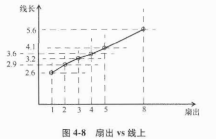

对于没有在表中列出的扇出值，通过线性外推法指定斜率计算得到互连线长度。

比如：**8扇出**

- 互连线长度：$Length=4.1+(8-5)*0.5=5.6units$
- 电容：$Capacitance=Length*cap\_coeff(1.1)=6.16units$
- 电阻：$Resistance=Length*res\_coeff(5.0)=28.0units$
- 面积开销：$Length*area\_coeff(0.05)=0.28 area units$

### 4.2.1 互连树

互连线RC结构相对于驱动单元如何分布？

- 最佳情况树：假设负载引脚在物理位置上和驱动是紧邻的。

  到终点（负载）引脚没有线电阻。

- 平衡树：每个终点引脚都分别处在互连线的一部分上。

  每条到终点的线路都有等分的线电阻和线电容。

- 最差情况树：所有的重点引脚都聚集在线的最远端。

  每个终点引脚都看到了总的线电阻和总的线电容。

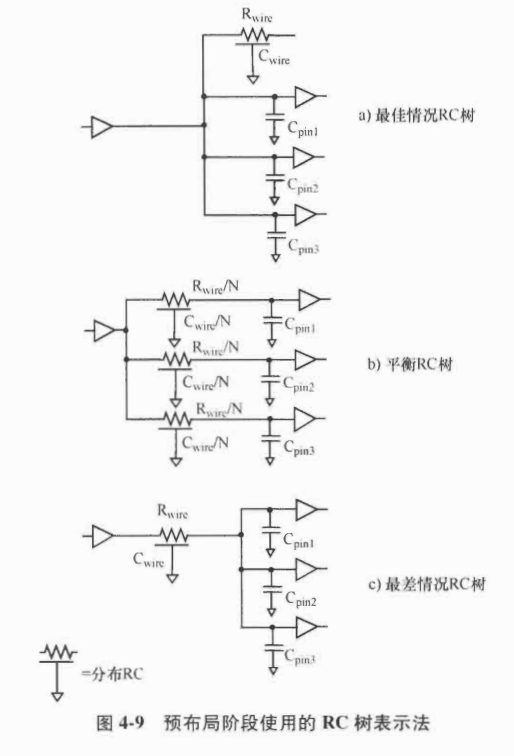


### 4.2.2 指定线负载模型

线负载模型指定命令：

```
set_wire_load_model "wlm_cons" -library "lib_stdcell"
# 此命令表示使用单元库lib_stdcell中的线负载模型wlm_cons
```

当线穿过层次边界时，可以基于不同的线负载模型。有如下三种：

1. op;
2. enclosed
3. segmented

使用如下命令指定：`set_wire_load_mode enclosed`


## 4.3 提取的寄生参数的表示方法

从布局中提取寄生参数，可以用以下3种格式描述：

1. 详细标准寄生参数格式`Detailed Standard Parasitic Format, DSPF`
2. 精简标准寄生参数格式`Reduced Standard Parasitic Format, RSPF`
3. 标准寄生参数交换格式`Standard Parasitic Exchange Format, SPEF`


## 4.4 耦合电容的表示方法

线电容：表示为接地电容。

因为纳米工艺中绝大部分电容是侧壁电容，正确表示这些电容的方式是**信号和信号之间的耦合电容**。

- DSPF中

  表示耦合电容是在初始的DSPF标准上增加，所以它不是唯一的。

- RSPF

  不适合表示耦合电容

- SPEF

  可以统一且清晰地表示耦合电容。当要考虑串扰时序时，就可以选择SPEF方式表示寄生参数。

## 4.5 层次化设计方法

时序验证时，从布局中提取寄生参数的块可以和布局没有完成的块一起使用。

此时，布局完成的块会从布局中提取寄生参数，与布局的块会用线负载模型预估寄生参数。


**布局中的块复用**：

布局中1个块被多次复用，其中1个实例化实体的寄生参数提取可以用在所有实例化实体上。

此时，要求这块的布局在各种实例化的方面都完全一致，比如，从块内的走线看，布局环境完全相同。

这意味着，块级别的走线不会和任何块外的走线发生电容耦合。

要达到这一要求，常见的方法是：顶层不允许在该块上走线，该线在块的边界附近有适当的间距和屏蔽。

## 4.6 减少关键线的寄生参数

常用技术：

- 减少互联电阻

  对于关键线，保持低转换率需要减少互连电阻。减少互联电阻的方法：

  1. 宽走线：让走线比最小宽度更宽能减少互联电阻，且不会带来寄生电容的显著增加。
  2. 在高层金属走线：高层金属通常有更低的电阻率，可以用来走关键线。

- 增加走线间距

  增加走线间距可以减少走线的耦合电容。

  大的耦合电容会增加串扰，而避免串扰时长距离相邻走线要面临的重要问题。

- 关联走线的寄生参数

  很多情况下，1组走线需要时序匹配，比如：高速DDR接口的1B通道内的数据信号。

  

# 第5章 延迟计算

介绍在布局前后的时序验证中，单元延迟和路径延迟是如何计算的。

## 5.1 概述

### 5.1.1 延迟计算的基础

一个典型的设计包括了各种组合逻辑以及时序单元。

每个单元的库描述为每个输入引脚指定了引脚电容值。

设计中每条线的电容负载=该条线所有扇出引脚的电容负载之和+互连线电容

本章不考虑互连线贡献的电容。

例子：逻辑片段：

不考虑互连线寄生参数。

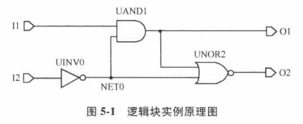

内部线NET0的线电容：由UAND1和UNOR2的输入引脚电容构成；

输出端O1：具有UNOR2单元的引脚电容，加上输出上的任何电容性负载

输入I1和I2：具有UAND1和UINV0各自的引脚电容。

图5-1中的逻辑设计可以等效于图5-2中的描述。

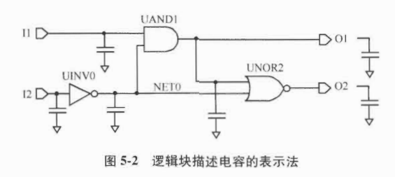

这种情况可以用NLDM得到各种时序弧的延迟时间。

### 5.1.2 带有互连线的延迟计算

**1. 预布局时序**

根据第4章方式，预布局阶段，互连寄生参数用线负载模型预估。

大多数情况，线负载模型的电阻假设为0，线负载表现为纯电容性负载。

此时可以用之前描述的NLDM方式得到时序弧的延迟。

假设线负载模型考虑互连线电阻的影响：将用NLDM模型和总的线电容一起计算经过单元的延迟。

因为互连线的电阻性，从驱动单元的输出到扇出单元的输入就有额外的延迟。这种互连线延迟的计算方式会在5.3节中介绍。

**2. 布局后时序**

金属走线的寄生参数：映射为驱动和终点单元间的RC网络。

以图5-1为例：

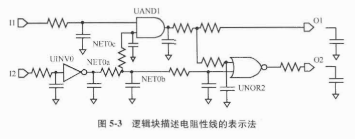

NLDM表的索引是输入转换时间和输出电容。

由于输出引脚存在电阻性负载，意味着这里无法直接使用NLDM表。

## 5.2 使用有效电容的单元延迟

考虑互连线电阻时，NLDM无法直接使用，此时，采用一种“有效“电容法处理电阻的影响。

- 有效电容法

  使用1个单独的电容作为等效的负载，该负载可以让具有该负载的设计和初始设计**在单元输出上具有相似的时序**。

  等效的单独电容称为**有效电容**。

- 带有效电阻的RC互连线

  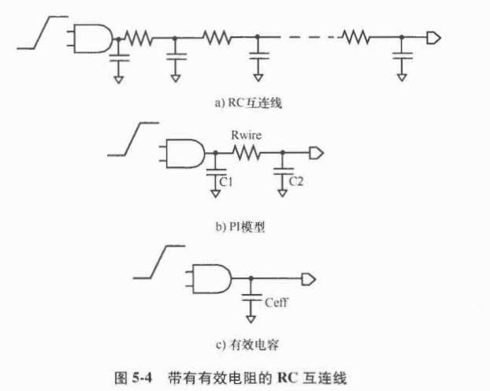

  图b是等效的RC PI-网络表示；图c是等效的有效电容`Ceff`

  通常，单元具有RC负载的输出波形和具有单独电容负载的输出波形是很不同的，如图5-5所示。

  需要选取合适的有效电容`Ceff`，使单元的输出延迟（在转换时间中间点测得）和真实RC互连线的延迟一致。

  使用Pi等效模型表示时，有效电容可以表示为：

  $Ceff=C1+k*C2, 0<=k<=1$

  式中，C1是近端电容，C2是远端电容。

  互联电阻可以忽略时，有效电容和总电容近似相等。

  互联电阻相当大时，有效电容近似于近端电容C1。

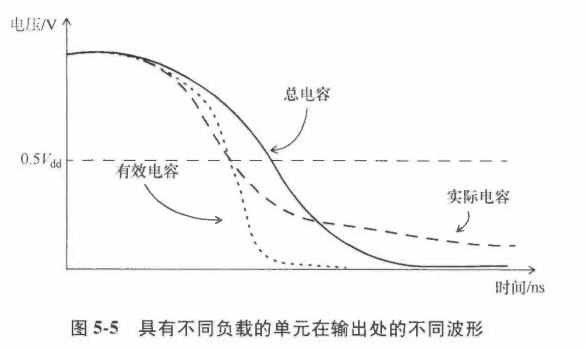

- 有限电容是以下各项的函数：

  1）驱动单元；

  2）负载的特征（从驱动单元看到的负载输入阻抗）

- 终点引脚转换时间晚于驱动单元的输出。

- 近端电容充电快于远端电容，此现象被称为互连线的电阻屏蔽效应。


- 有效电容法也需要为驱动单元计算出1个等效戴维南电压源

  该电压源由具有串联电阻Rd的电压源构成。

## 5.3 互连线延迟

有效电容法提供了通过驱动单元的延迟，以及单元输出端的等效戴维南电压源。

对于预布局分析，RC互连结构由RC树类型决定，RC互连结构又决定了线延迟。

预布局阶段的RC树类型在4.2节中已经介绍。

通常：

- 最坏情况慢速库会选择最坏情况树。

- 最佳情况快速库会选择最佳情况树结构。

  该类型树不包括任何从源引脚到终点引脚的电阻，因此，互连线延迟为0。

- 典型情况树和最差情况树的互连延迟处理方式和布局后的RC互连处理方式一样。

**1. Elmore延迟模型**

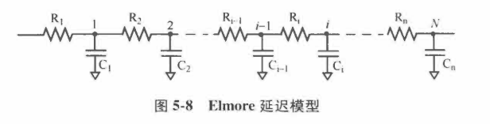

- RC树满足以下三个条件：

  1）有唯一输入（源）节点

  2）没有电阻回路；

  3）所有的电容都位于节点和电源地之间

- 从源头到各个中间节点的延迟可以表示如下：

  $T_{d1}=C_1*R_1$;

  $T_{d2}=C_1*R_1+C_2*(R_1+R_2)$;

  ...

  $T_{dn}=\sum(i=1,N)C_i(\sum(j=1,N)R_j)$；# Elmore延迟公式

  Elmore延迟在数学上相当于脉冲响应的一阶矩

- 利用Elmore延迟模型计算1条使用线负载模型和平衡RC树（以及最差情况RC树）的线延迟

  - 使用平衡树模型

    线的电阻和电容在线的分支上平均分开。

    对于1条分支，具有引脚负载Cpin，计算得到的延迟为：

    $net\ delay=(R_{wire}/N)*(C_{wire}/(2*N)+C_{pin})$

  - 使用最差情况RC树模型

    每个终点都要考虑整条线的电阻和电容。所有扇出的总引脚电容：$C_{pins}$

    $net\ delay=R_{wire}*(C_{wire}/2+C_{pins})$

  - 例子：

    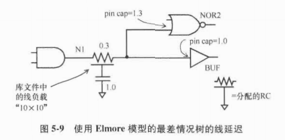

    最差情况树模型计算线N1延迟：

    $Net\ delay=R_{wire}*(C_{wire}/2+C_{pins})=0.3*(0.5+2.3)=0.84$

    使用平衡树模型，得到线N1的2个分支的延迟：

    Net delay to NOR2 input pin = (0.3/2)*(0.5/2+1.3)=0.2325

    Net delay to BUF input pin = (0.3/2)*(0.5/2+1.0)=0.1875

**2. 高阶互连线延迟估计**

Elmore延迟是脉冲响应的一阶矩。

AWE(Asymptotic Waveform Evaluation，渐进波形估计法)，Arnoldi算法或者其他算法匹配响应的更高阶矩。

通过考虑更高阶矩估计法，可以计算得到更高精度的互连线延迟。

## 5.4 转换率融合

转换率融合点`Slew Merge Point`：多个转换率到达同一点。

考虑2输入单元：

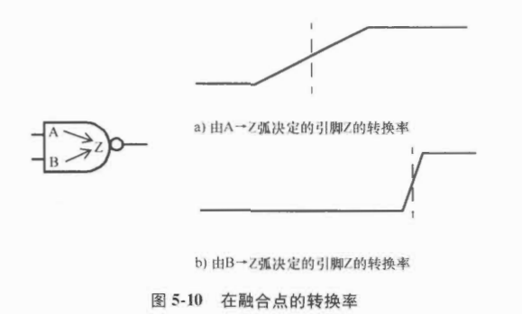

由引脚A上的信号改变引起的引脚Z上的转换率，到达的较早但是上升的缓慢；

由引脚B上信号改变引起的引脚Z上的转换率，到达的较晚但是上升的快。

在转换率融合点，选哪个转换率进行传播，取决于进行的是哪种时序分析（最大或最小）。

- 最大时序路径分析时有两种可能

  1）最差转换率传播：选择融合点处最差转换率来传播

  即图5-10a中的转换率。

  2）最差到达时间传播：选择融合点处最差的到达时间传播

  即图5-10b中的转换率

- 最小时序路径分析时也有两种可能性

  1）最佳转换率传播：选择融合点处最佳转换率来传播，即图5-10b中的转换率

  2）最佳到达时间传播：选择融合点处最佳到达时间来传播，即图5-10a中的转换率

## 5.5 不同的转换率阈值

通常，在表征单元时，库文件会指定转换率（转换时间）的阈值。

问题：当1个单元具有一组转换率阈值，驱动另一些具有不同转换率阈值设定的单元，会发生什么？

例子：

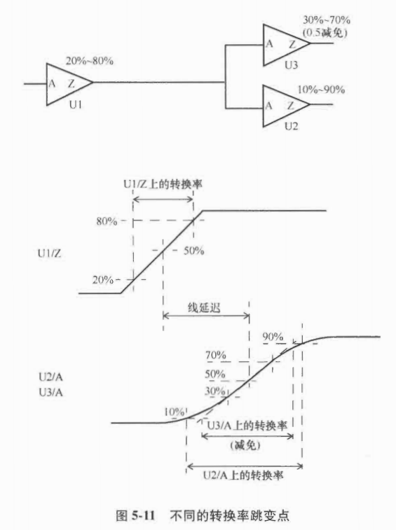

图中，单元U1转换率阈值20%-80%，驱动两个扇出单元，其中1个单元转换率阈值10-90%，另一个单元转换率阈值为30-70%且转换率减免系数为0.5。

在预布局阶段，不考虑互联电阻情况下，10\~90%转换率和20~80%转换率关系：

$slew2080/(0.8-0.2)=slew1090/(0.9-0.1)$

当slew1090=500ps，可以计算得到slew2080=375ps。

## 5.6 不同的电压域

芯片的不同部分可能使用不同的供电电压，此时，在不同电压域的接口上要使用**电平转换单元**。

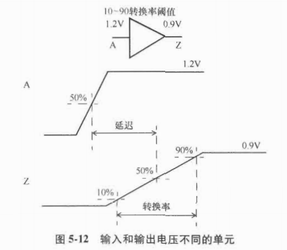

## 5.7 路径延迟计算

### 5.7.1 组合逻辑路径延迟

考虑3个反相器串联：

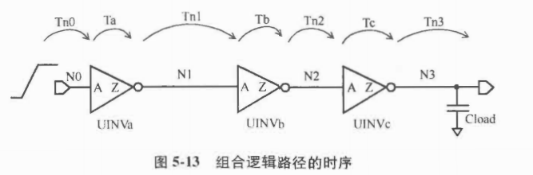

假设在线N0有个上升沿：

- 输入UINVa/A的转换时间：由互连线延迟模型得到。
- 输出UINVa/Z的有效电容：基于UINVa输出的RC负载得到。
- 单元UINVa的输出延迟时间：由输入的转换时间和输出的有效电容得到。
- UINVb/A的转换时间：由引脚UINVa/Z的等效戴维南源模型+互连线模型得到。

- ...
- 最后一级负载是由任何明确指定的负载值决定的，如果没有指定，则只有线N3负载。

计算延迟时间：

$T_{fall}=Tn0_{rise}+Ta_{fall}+Tn1_{fall}+Tb_{rise}+Tn2_{rise}+Tc_{fall}+Tn3_{fall}$

$T_{rise}=Tn0_{fall}+Ta_{rise}+Tn1_{rise}+Tb_{fall}+Tn2_{fall}+Tc_{rise}+Tn3_{rise}$

通常，通过互连线的上升和下降延迟是不一样的，这是因为驱动单元输出的戴维南源模型不一样。

### 5.7.2 到触发器的路径

**1. 输入到触发器路径**

考虑从输入SDT到触发器UFF1的时序路径：

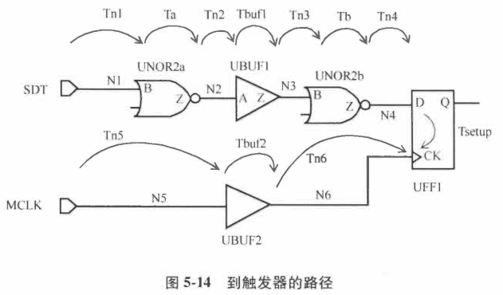

- 当输入SDT是上升沿，数据路径延迟：

  $Tn1_{rise}+Ta_{fall}+Tn2_{fall}+Tbuf1_{fall}+Tn3_{fall}+Tb_{rise}+Tn4_{rise}$

- 当输入SDT是下降沿，数据路径延迟：

  $Tn1_{fall}+Ta_{rise}+Tn2_{rise}+Tbuf1_{rise}+Tn3_{rise}+Tb_{fall}+Tn4_{fall}$

- 输入MCLK的上升沿捕获时钟路径延迟为：

  $Tn5_{rise}+Tbuf2_{rise}+Tn6_{rise}$

**2. 触发器到触发器路径**

考虑2个触发器之间的数据路径和对应时钟路径：

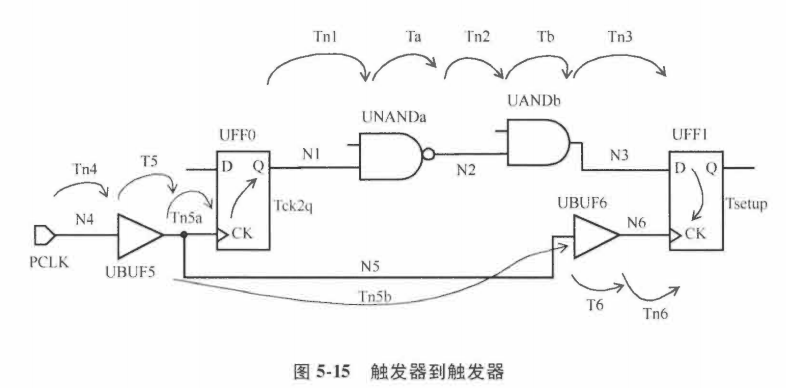

- UFF0/Q上升沿的数据路径延迟：

  $Tck2q_{rise}+Tn1_{rise}+Ta_{fall}+Tn2_{fall}+Tb_{fall}+Tn3_{fall}$

- 输入PCLK上升沿的发射时钟路径延迟：

  $Tn4_{rise}+T5_{rise}+Tn5a_{rise}$

- 输入PCLK上升沿的捕获时钟路径延迟：

  $Tn4_{rise}+T5_{rise}+Tn5b_{rise}+T6_{rise}+Tn6_{rise}$

### 5.7.3 多路径

在任意2个点之间可能有多条路径。

最长路径：延迟最大的路径，又叫最差路径`Worst Path`，晚路径`Late Path`，或者最大路径`Max Path`。

最短路径：延迟最小的路径，又叫最佳路径`Best Path`，早路径`Early Path`，或者最小路径`Min Path`。

例子：

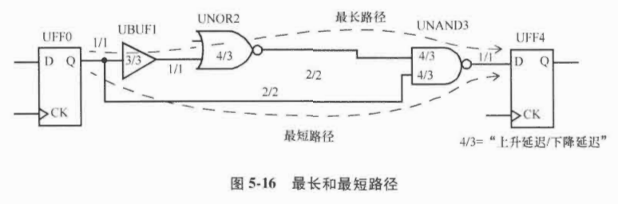

- 最长的路径是通过单元UBUF1、UNOR2、UNAND3的路径；

- 最短路径是通过单元UNAND3的路径。

## 5.8 裕量计算

裕量`Slack`：信号需要到达时间`Required Time`和实际到达时间之间的差值。

例子：

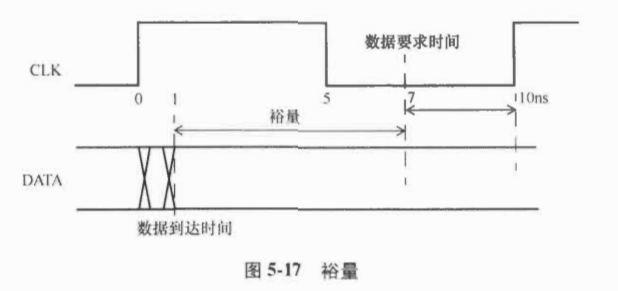

为了满足建立时间，必须在时间7ns时保持稳定，但信号在1ns时就开始稳定，则裕量为6ns。

假设数据需要到达时间是从捕获触发器的建立时间得到：

$Slack=Required\_time-Arrival\_time$

$Required\_time=Tperiod-Tsetup(capture\_flip\_flop)=10-3=7ns$

$Arrival\_time=1ns$

$Slack=7-1=6ns$

# 第6章 串扰和噪声

串扰毛刺分析和串扰延迟分析，确保时序方面的鲁棒性。

==前面部分在csdn草稿箱中，csdn暂时打不开。==

## 6.1 概述

在深亚微米以及纳米工艺中，噪声会影响器件的功能和时序。
在深亚微米工艺中，会出现噪声和信号完整性问题，原因归结为以下几点：
1）金属层增多：例如0.25um或者0.3um工艺有4层或5层金属，而在65nm或者45nm工艺中，金属层数增长到10层甚至更多。
2）金属长宽比中，垂直方向占主导：以为线段既细又高，导致很大一部分电容来源于侧壁耦合电容（相邻线之间形成的电容）。
3）更小尺寸带来了更高的走线密度：更近的物理距离内放入了更多的金属走线。
4）大量互相影响的器件和互连线。
5）更高的频率导致更快的波形：导致更多的尖峰电流。
6）更低的供电电压：低供电电压给噪声留下的余量更小。

**串扰噪声**：多个信号活动间非故意的耦合。
例子：

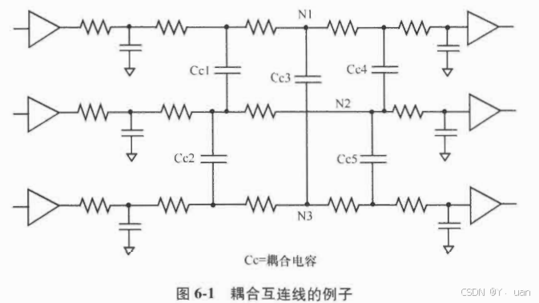

图中，线N1和N2之间有耦合电容$C_{c1}+C_{c4}$，线N2和线N3之间有耦合电容$C_{c2}+C_{c5}$。
**串扰造成的噪声**影响有两种：
- 毛刺
- 时序变化（增加延迟）

## 6.2 串扰毛刺分析

### 6.2.1 基础

一条稳定的信号线，可能会由于侵害者电平翻转通过耦合电容带来的电荷转移，产生毛刺。如下图：由于上升侵害线的串扰诱发的正向毛刺。

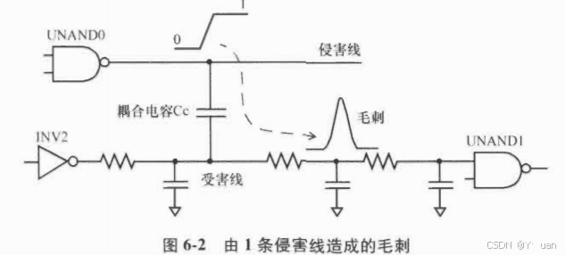

产生的**毛刺的大小量级取决于多种因素**，其中的一些因素为：
1）侵害线和受害线之间的耦合电容：耦合电容越大，毛刺的量级越大。
2）侵害线的转换率：转换率越快，毛刺的量级越大。通常，更快的转换率时因为驱动侵害线的单元有更高的输出驱动能力。
3）受害线的接地电容：受害先有更小的接地电容，毛刺有更大的量级。
4）受害线的驱动能力：驱动受害线单元的输出驱动能力越小，毛刺有更大的量级。

虽然受害线回重回稳定值，但毛刺依然会影响电路的功能，原因如下：
1）毛刺的量级可能大到足够倍扇出单元当作不同的逻辑值。
2）即使受害线没有驱动时序单元，一个足够大的毛刺可能通过该受害线的扇出传播出去，到达时序单元的输入，对整个设计造成影响。

### 6.2.2 毛刺的类型

**1. 上升和下降毛刺**
- 稳定低电平受害线上的正向毛刺
- 稳定高电平受害线上的负向毛刺

**2. 过冲和下冲毛刺**
- 稳定的高电压受害线被上升侵害者推高到超过本身稳定的高电平——过冲。
- 稳定低电压的受害线被下降侵害者推到低于本身稳定低电平的电平——下冲。

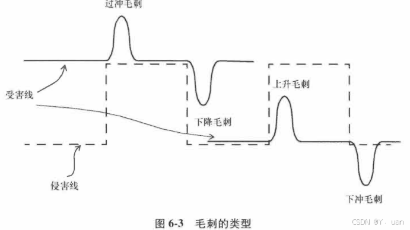

### 6.2.3 毛刺的阈值和传播

毛刺是否可以通过扇出单元传播，取决于扇出单元和毛刺的属性。
直流噪声分析只检查噪声的量级；交流噪声分析检查毛刺宽度和扇出单元的输出负载等。
**1. 直流阈值**
- 直流噪声余量：单元输入上直流噪声大小的极限。
如：反相器输入保持在单元VIL最大值之下，输出就是高电平；
反相器单元的直流传输特性：

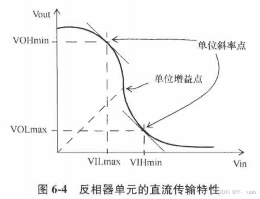

其中，`VILmax`和`VIHmin`被称为直流裕量极限。

**2. 交流阈值**
噪声分析的直流余量极限是很保守的，是在最坏情况下分析设计。
直流余量极限保证了即使毛刺的宽度非常宽，也不会影响设计的功能。
大多数情况，不会通过保守的直流噪声分析极限，进行噪声分析时，无法避免需要考虑**毛刺宽度和单元的输出负载**。

交流噪声抑制（给定的输出电容）：
- 毛刺宽度对毛刺阈值的影响。
- 对于给定的单元，增加输出负载会增加惯性延迟和可以穿过单元的毛刺宽度，从而增加噪声余量。

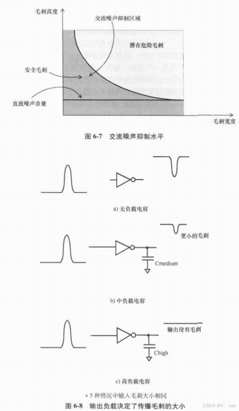

### 6.2.4 多侵害者的噪声累积

多数情况下，多侵害者耦合效应分析会把各侵害者的毛刺效应相加（最差毛刺）。
另一种方式是采用RMS(`Root Mean Squared`，均方根)方法计算受害者上的毛刺量级。

### 6.2.5 侵害者的时序相关性

STA分析时，从侵害先的时序窗口获取侵害线的时序相关性，得到各种侵害线电平翻转的时间窗口。
毛刺分析确定各侵害线可以造成的毛刺量级。
例子：

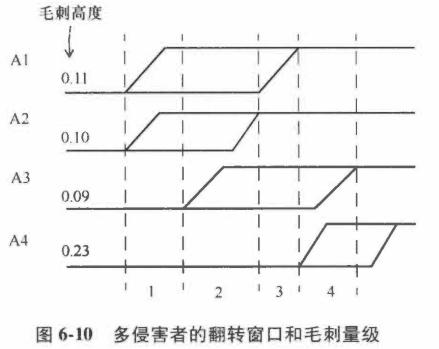

上述例子将翻转窗口区域分为4个区域，计算可以得到区域4有最差的可能出现的毛刺量级0.32。
如果没有使用时间窗口，就会得到累积的毛刺量级0.53。

### 6.2.6 侵害者的功能相关性

信号的功能相关性：
- 扫描控制信号
  扫描控制信号只在扫描模式下翻转，在设计的功能模式下或者任务模式下保持稳定，所以扫描控制信号在功能模式下不可能造成毛刺。

- 互补信号

  测试时钟和功能时钟是互斥的，二者控制的逻辑互不相干。

## 6.3 串扰延迟分析

### 6.3.1 基础

纳米设计中，线的电容提取受多个相邻导体的影响，其中一些是接地电容，一些是信号线的部分走线电容。

在基础延迟计算（不考虑串扰）时，所有的电容都被认为时总的线电容的一部分。

当相邻线电平稳定时，信号间的电容被认为是接地电容。

当相邻信号线电平翻转时，充电电流通过耦合电容影响线的时序。

例子：

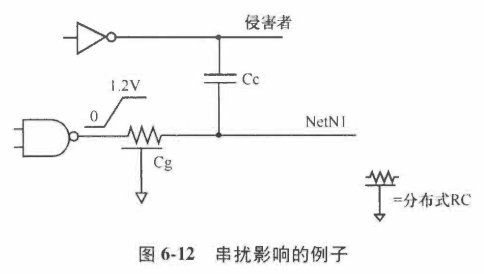

上图，假设线N1在输出端有上升电平转换：

- 侵害线稳定时

  线N1的驱动单元为电容Cg和Cc充电，电压Vdd提供电荷，提供的总电荷为(Cg+Cc)\*Vdd。

  不考虑侵害线带来的串扰。

  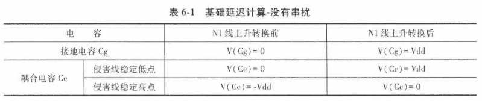

- 侵害者向同一方向翻转时

  - 侵害者同时转换且转换率相同，驱动单元提供的总电荷只有Cg*Vdd。
  - 侵害者转换率比N1快，实际提供的电荷会比Cg*Vdd小，此时线N1的翻转延迟更小，延迟减小的部分被标记为**负串扰延迟**。

- 侵害者向相反方向翻转时

  - 耦合电容从电压-Vdd充电到Vdd，在电平转换前后，耦合电容的电荷变化为2*Cc\*Vdd。
  - 额外需要的电荷是由线N1的驱动单元和侵害线共同提供。
  - 延迟增大的部分被标记为**正串扰延迟**。

### 6.3.2 正向串扰和负向串扰

正向串扰：侵害线和受害线翻转方向相反，驱动单元所需提供的电荷增加，增大受害线的延迟。

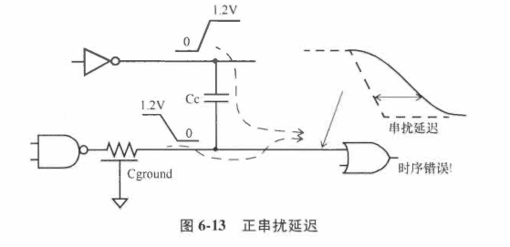

负向串扰：侵害线和受害线的翻转方向相同，驱动单元所需提供的电荷减少，会降低驱动单元的延迟和受害线的互连延迟。


### 6.3.3 多侵害者的累积

多侵害者的串扰延迟分析需要累计每个侵害者串扰带来的影响，和对串扰毛刺的分析相似。

简单的累积计算受害者的影响可能过于保守，可以使用RMS法进行分析，较少一些悲观影响。

### 6.3.4 侵害者和受害者的时序相关性

和6.2节描述的串扰毛刺分析的时序向光性相似。

只有在侵害者和受害者同时翻转时，串扰才可能影响受害者的时序。

**时间窗口**：在1个时钟周期内1条线可以在其中翻转的最早和最晚时间。

如果受害者和侵害者的翻转时间窗口有重叠，就需要计算串扰对延迟的影响。

例子：侵害线A1,A2,A3，受害线V


最差串扰延迟为区域1，影响为0.26。

串扰延迟有4种：正上升延迟，负上升延迟，正下降延迟和负下降延迟。

不同的侵害线造成的串扰延迟类型可能不用。

### 6.3.5 侵害者和受害者的功能相关性

- 扫描控制信号

  扫描控制信号只在扫描模式下翻转，在功能模式下不可能是侵害者。

- 侵害者互补

  信号和它的互补信号在串扰噪声计算式不可能向同一方向翻转

## 6.4 考虑串扰延迟的时序分析

为每个单元和互连线计算下面4种串扰延迟影响：

1）正上升延迟：上升沿推迟到达；

2）负上升沿延迟：上升沿提前到达；

3）正下降延迟：下降沿推迟到达；

4）负下降延迟：下降沿提前到达。

### 6.4.1 建立时间分析

考虑串扰的STA分析时，验证数据路径和时钟路径的最差情况串扰延迟来保证设计的时序。

例子：


- **建立时间检查的最坏情况**：

  发射时钟路径和数据路径都有正向串扰——导致数据延迟到达捕获触发器。

  捕获时钟路径具有负向串扰——导致时钟提早到达捕获触发器。

### 6.4.2 保持时间分析

- 保持时间检查的最坏情况

  发射时钟路径和数据路径有负向串扰：数据提早到达捕获触发器。

  捕获时钟路径有正向串扰：时钟推迟到达捕获触发器。

时钟信号很关键，任何时钟树上的串扰都直接转化为时钟抖动，进而影响设计的性能。

较少时钟信号上的串扰的办法——对时钟树进行屏蔽。

## 6.5 计算复杂度

**1. 层次化设计与分析**

对于大型设计，可以采用层次化设计，对每一个层次化块的寄生参数进行分开提取。

这种方法意味着：层次化块内部信号和块外的信号不能有耦合电容。

**2. 耦合电容的过滤**

非常小的耦合电容可以在参数提取过程中过滤掉。

过来吧时基于以下标准：

- 小电容值：如低于1fF可以直接忽略。
- 耦合比：侵害线的耦合比太小，如小于0.001时，可以在串扰延迟或者毛刺分析中排除。
- 合并小侵害者：对各具有很小影响的小侵害者可以映射为一个大的虚拟侵害者，这种方式可能过于悲观，但是可以简化分析。

## 6.6 避免噪声的技术

在物理实现阶段常用的避免噪声的技术：

1. 屏蔽

   要求屏蔽线位域关键信号的两边。

2. 线段间距：减少了相邻线间的耦合

3. 快速转换率

   快速转换率意味着该线不易受串扰影响。

4. 保持良好稳定的供电

   对于串扰不重要，但是有利于减少信号的抖动。电源供电的噪声可能给时钟信号带来显著的噪声。

5. 保护环

   衬底上的保护环可以帮助关键模拟电路屏蔽掉数字信号

6. 深N阱

7. 隔离一个块：给块边界加上进纸走线环；甚至给块的每个IO加上隔离缓冲器。

# 第7章

介绍时序分析的环境是如何配置的，以及如何指定时钟、IO特性、伪路径以及多周期路径


# 第8章

介绍时序检查，包括建立时间、保持时间、异步时钟恢复时间检查以及移除时间检查。


# 第9章

介绍特殊接口的时序验证，比如源同步和存储器接口


# 第10章

介绍时序借用、层次化设计、功耗管理，以及统计时序分析	