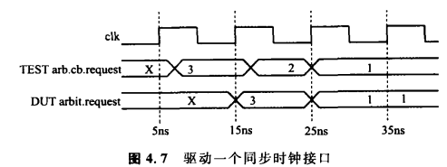

# 1. 接口

- 关键词：`interface`

仲裁器的简单接口

```verilog
interface arb_if(input bit clk);
    logic[1:0] grant,request;
    logic rst;
endinterface
```


特点：

- 接口信号必须使用**非阻塞赋值**驱动
- 接口中不能例化模块，但是可以例化其他接口；


## 信号分组modport

指定信号的输入输出方向

```verilog
// 带modport的接口
interface arb_if(input bit clk);
    logic[1:0] grant,request;
    logic rst;
    
    modport TEST(output request,rst,
                 input grant,clk);
    modport DUT(input request,rst,clk,
                output grant);
    modport MONITOR(input request,grant,rst,clk);
endinterface

// 使用modport的仲裁器模型
module arb(arb_if.DUT arbif);
    ...
endmodule
// 使用modport的测试平台
module test(arb_if.TEST arbif);
    ...
endmodule
```


# 2. 时钟块

带时钟块的接口

```verilog
interface arb_if(input bit clk);
    logic[1:0] grant,request;
    logic rst;
    
    clocking cb@(posedge clk); //声明cb
        output request;
        input grant;
    endclocking
    
    modport TEST(clocking cb,
        output rst);
    modport DUT(input request,rst,
                output grant);
endinterface
```


## 测试和设计之间的竞争

SV引入一种时间片划分方式：

- Active区域：运行设计事件，包括RTL、门级代码和时钟发生器等
- Observed区域：执行断言
- Reactive区域：执行测试平台
- Postponed区域：为测试平台采样输入信号


## 通过时钟块驱动接口信号

测试平台：驱动同步接口

```verilog
program test(arb_if.TEST arbif);
    initial begin
        #7 arbif.cb.request<=3;  // @7ns
        #10 arbif.cb.request<=2; // @17ns
        # 8 arbif.cb.request<=1; // @25ns
        #15 $finish;
    end
endprogram

module arb(arb_if.DUT arbif);
    initial $monitor("@%0t: req=%h",$time,arbif.request);
endmodule
```

结果：



- 异步驱动时钟块信号，导致数值丢失

- 使用时钟延时前缀以保证在时钟沿驱动信号

  ```verilog
  ##2 arbif.cb.request<=0; //等待2个时钟周期然后赋值
  // 必须和赋值语句同时使用
  ```


## 接口中的双向信号

双向信号不能定义为logic，只能使用wire

```verilog
interface master_if (input bit clk);
    wire [7:0] data; // 双向信号
    clocking cb @(posedge clk);
        inout data;
    endclocking

    modport TEST (clocking cb);
endinterface

program test(master_if mif);
    initial begin
        // 1. 释放总线，设置为高阻态，准备从总线读取或让出控制权
        mif.cb.data <= 'z; // 三态总线
        @mif.cb;
        
        // 2. 从总线读取当前数据并以十六进制显示
        $displayh(mif.cb.data); // 从总线读取
        @mif.cb;
        
        // 3. 驱动总线，写入数据 8'h5a
        mif.cb.data <= 8'h5a; // 驱动总线
        @mif.cb;
        
        // 4. 再次释放总线
        mif.cb.data <= 'z; // 释放总线
    end
endprogram
```


# 3. SV断言

- 立即断言

  ```verilog
  bus.cb.request<=1;
  repeat(2) @bus.cb;
  a1:assert(bus.cb.grant==2'b01);
  // 若2个时钟周期后，没有产生应答，仿真器会输出错误信息
  ```


- 改变断言的报错信息

  ```verilog
  a1:assert(bus.cb.grant==2'b01)
  	else $error("Grant not asserted");
  ```


- SV中的四个输出消息函数

  $info, \$warning, \$error, \$fatal


- 并发断言

  - 关键词：`assert property`

  - 整个仿真过程中检查信号的值；
  - 需要在断言内指定采样时钟

  ```verilog
  // 检查X/Z的并发断言
  interface arb_if(input bit clk);
      logic [1:0] grant, request;
      logic rst;
  
      property request_2state;
          @(posedge clk) disable iff (rst);
          $isunknown(request) == 0;    // 确保没有 z 或者 x 值存在
      endproperty
  
      assert_request_2state: assert property (request_2state);
  endinterface
  ```


