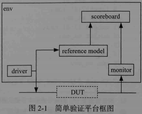
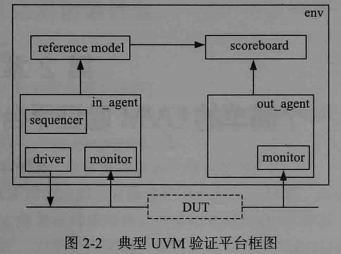
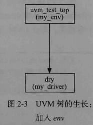
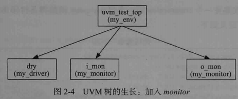
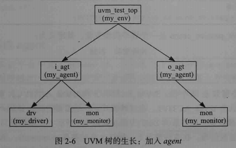
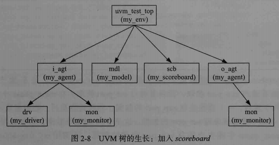
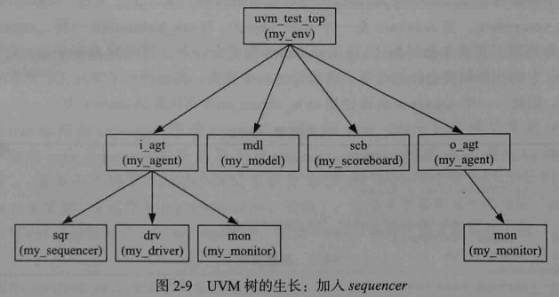
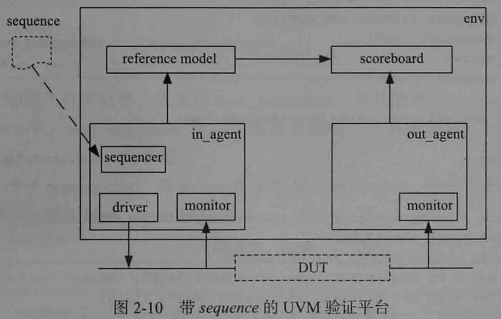
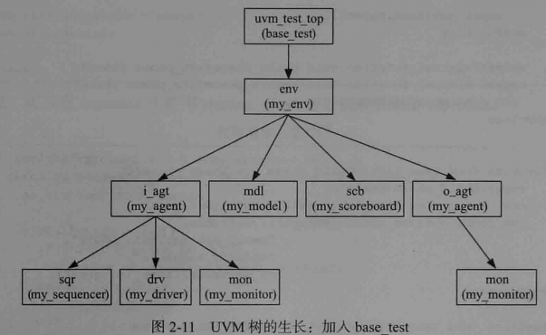
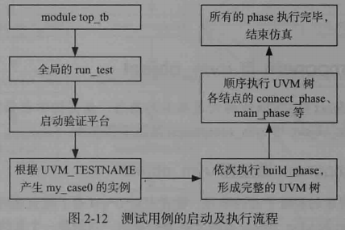

# 1. 验证平台组成

验证平台基本功能：

- 产生DUT的激励输入——`driver`
- 根据DUT的输出判断DUT的行为是否符合预期——记分板`scoreboard1`或`checker`

- 收集DUT的输出并传递给记分板——`monitor`
- 根据输入给出预期结果——`reference model`

简单验证平台框图：




UVM验证平台框图：




# 2. 只有driver的验证平台

DUT定义：

```verilog
module dut(clk,
           rst_n, 
           rxd,
           rx_dv,
           txd,
           tx_en);
input clk;
input rst_n;
input[7:0] rxd;
input rx_dv;
output [7:0] txd;
output tx_en;

reg[7:0] txd;
reg tx_en;

always @(posedge clk) begin
   if(!rst_n) begin
      txd <= 8'b0;
      tx_en <= 1'b0;
   end
   else begin
      txd <= rxd;
      tx_en <= rx_dv;
   end
end
endmodule
```

注意：

- UVM库几乎所有组件都是通过**类`class`**实现的
- UVM的第一条原则：验证平台中所有的组件应该派生自UVM中的类


派生自uvm_driver的driver：

```verilog
`ifndef MY_DRIVER__SV
`define MY_DRIVER__SV
class my_driver extends uvm_driver;

   function new(string name = "my_driver", uvm_component parent = null);
      super.new(name, parent);
   endfunction
   extern virtual task main_phase(uvm_phase phase);
endclass

task my_driver::main_phase(uvm_phase phase);
   top_tb.rxd <= 8'b0; 
   top_tb.rx_dv <= 1'b0;
   while(!top_tb.rst_n)
      @(posedge top_tb.clk);
   for(int i = 0; i < 256; i++)begin
      @(posedge top_tb.clk);
      top_tb.rxd <= $urandom_range(0, 255);
      top_tb.rx_dv <= 1'b1;
      `uvm_info("my_driver", "data is drived", UVM_LOW)
   end
   @(posedge top_tb.clk);
   top_tb.rx_dv <= 1'b0;
endtask
`endif
```


`main_phase`：`uvm_driver`预先定义好的任务。UVM由phase管理平台运行

- 参数类型：uvm_phase

- 参数:phase


**`uvm_info`宏**：有3个参数

- 参数1：字符串，打印信息归类

- 参数2：字符串，具体需要打印的信息

- 参数3：冗余级别

  `UVM_LOW`：非常关键的信息

  `UVM_HIGH`：可有可无的信息

  `UVM_MEDIUM`：介于两者之间

- 打印示例

  ```verilog
  UVM_INFO my_driver.sv(20) @ 48500000: drv [my_diver] data is drived
  ```

  


**factory机制**：所有派生自`uvm_component`及其派生类的类都应该使用`uvm_component_utils`宏注册


**objection机制**：控制验证平台的关闭

- `raise_objection`：必须在`main_phase`中第一个消耗仿真时间的语句之前
- `drop_objection`：finish函数的替代者


**`virtual interface`：**类中不能声明一个`interface`，


**`config_db`机制**：

- UVM通过run_test语句实例化了一个脱离top_tb层次结构的实例，建立了一个新的层次结构；

- 在**top_tb**中使用新的层次结构方式：`set`操作

  ```verilog
  initial begin
     uvm_config_db#(virtual my_if)::set(null, "uvm_test_top", "vif", input_if);
  end
  ```

  

- `get`操作：`my_driver`中执行

  ```verilog
  virtual function void build_phase(uvm_phase phase);
      super.build_phase(phase); //必须显示调用执行
        `uvm_info("my_driver", "build_phase is called", UVM_LOW);
        if(!uvm_config_db#(virtual my_if)::get(this, "", "vif", vif))
           `uvm_fatal("my_driver", "virtual interface must be set for vif!!!")
     endfunction
  ```

  `build_phase`：和`main_phase`一样，属于UVM内建的一个phase

  - UVM启动之后，自动执行
  - 在new函数之后main_phase函数之前执行
  - 通过`config_db`的set和get操作传递数据以及实例化成员变量等
  - 是一个函数phase，不消耗仿真时间


- `uvm_config_db`的set和get函数：4个参数
  - 参数1：
    - set函数：null
  - 参数2：
    - set函数：路径索引
  
  - 参数3：必须完全一致
  - 参数4
    - set函数：表示将哪个`interface`通过`config_db`传递给`my_driver`
    - `get`函数：表示将得到的`ineterface`传递给哪个`my_driver`的成员变量


**`uvm_fatal`宏**：只有两个参数

- 参数1：字符串，打印信息归类
- 参数2：字符串，具体打印信息


# 3. 为验证平台加入各组件

## 3.1 加入transaction

一个简单的`transaction`定义：

```verilog
`ifndef MY_TRANSACTION__SV
`define MY_TRANSACTION__SV

class my_transaction extends uvm_sequence_item;

   rand bit[47:0] dmac;
   rand bit[47:0] smac;
   rand bit[15:0] ether_type;
   rand byte      pload[];
   rand bit[31:0] crc;

   constraint pload_cons{
      pload.size >= 46;
      pload.size <= 1500;
   }

   function bit[31:0] calc_crc();
      return 32'h0;
   endfunction

   function void post_randomize();
      crc = calc_crc;
   endfunction

   `uvm_object_utils(my_transaction)

   function new(string name = "my_transaction");
      super.new();
   endfunction
endclass
`endif
```


**基类`uvm_sequence_item`**：派生自`uvm_object`

- UVM中所有的`transaction`都要从`uvm_sequence_item`派生
- 使用`uvm_object_utils`宏实现
- 有生命周期


## 3.2 加入env

容器类：`uvm_env`

```verilog
`ifndef MY_ENV__SV
`define MY_ENV__SV

class my_env extends uvm_env;

   my_driver drv;

   function new(string name = "my_env", uvm_component parent);
      super.new(name, parent);
   endfunction

   virtual function void build_phase(uvm_phase phase);
      super.build_phase(phase);
      drv = my_driver::type_id::create("drv", this); 
   endfunction

   `uvm_component_utils(my_env)
endclass
`endif
```


注意：

- 所有env都是派生自`uvm_env`
- 在仿真中一直存在，使用`factory`机制注册


**验证平台的组件实例化**都应该使用：**`type_name::type_id::create`的方式**

- 参数1：名字

- 参数2：this指针

  在该例中，是`my_driver`的new函数的第二个参数


UVM树的结构：都是由`uvm_component`或者其派生类继承而来

- my_env是树根
- my_driver是树叶




由于层次结构变化，top_tb中发生的改变：

- 使用的config_db机制传递的virtual interface：

```verilog
initial begin
   uvm_config_db#(virtual my_if)::set(null, "uvm_test_top.drv", "vif", input_if);
end
```

- run_test的参数

```verilog
initial begin
   run_test("my_env");
end
```


## 3.3 加入`monitor`

- 功能：检测DUT行为

- 与driver对比

  driver组件：负责把transaction级别的数据转变为DUT端口级别；

  monitor组件：负责收集DUT端口有数据，并转换为transaction级别数据；


```verilog
`ifndef MY_MONITOR__SV
`define MY_MONITOR__SV
class my_monitor extends uvm_monitor;

   virtual my_if vif;

   `uvm_component_utils(my_monitor)
   function new(string name = "my_monitor", uvm_component parent = null);
      super.new(name, parent);
   endfunction

   virtual function void build_phase(uvm_phase phase);
      super.build_phase(phase);
      if(!uvm_config_db#(virtual my_if)::get(this, "", "vif", vif))
         `uvm_fatal("my_monitor", "virtual interface must be set for vif!!!")
   endfunction

   extern task main_phase(uvm_phase phase);
   extern task collect_one_pkt(my_transaction tr);
endclass

task my_monitor::main_phase(uvm_phase phase);
   my_transaction tr;
   while(1) begin
      tr = new("tr");
      collect_one_pkt(tr);
   end
endtask

task my_monitor::collect_one_pkt(my_transaction tr);
   bit[7:0] data_q[$]; 
   int psize;
   while(1) begin
      @(posedge vif.clk);
      if(vif.valid) break;
   end

   `uvm_info("my_monitor", "begin to collect one pkt", UVM_LOW);
   while(vif.valid) begin
      data_q.push_back(vif.data);
      @(posedge vif.clk);
   end
   //pop dmac
   for(int i = 0; i < 6; i++) begin
      tr.dmac = {tr.dmac[39:0], data_q.pop_front()};
   end
   //pop smac
   for(int i = 0; i < 6; i++) begin
      tr.smac = {tr.smac[39:0], data_q.pop_front()};
   end
   //pop ether_type
   for(int i = 0; i < 2; i++) begin
      tr.ether_type = {tr.ether_type[7:0], data_q.pop_front()};
   end

   psize = data_q.size() - 4;
   tr.pload = new[psize];
   //pop payload
   for(int i = 0; i < psize; i++) begin
      tr.pload[i] = data_q.pop_front();
   end
   //pop crc
   for(int i = 0; i < 4; i++) begin
      tr.crc = {tr.crc[23:0], data_q.pop_front()};
   end
   `uvm_info("my_monitor", "end collect one pkt, print it:", UVM_LOW);
    tr.my_print();
endtask
`endif
```

注意：

- 所有monitor类应该派生自`uvm_monitor`
- 与`driver`类似，`monitor`也需要一个虚拟接口`virtual my_if`
- `uvm_monitor`在仿真中一直存在，需要使用`uvm_component_utils`宏进行注册
- `while(1)`循环实现端口实时检测


收集完一个transaction之后，通过`my_transaction`类中定义的my_print函数打印

```verilog
function void my_print();
    $display("dmac = %0h", dmac);
    $display("smac = %0h", smac);
    $display("ether_type = %0h", ether_type);
    for(int i = 0; i < pload.size; i++) begin
        $display("pload[%0d] = %0h", i, pload[i]);
    end
    $display("crc = %0h", crc);
endfunction
```


在env中对monitor中进行实例化：

```verilog
`ifndef MY_ENV__SV
`define MY_ENV__SV

class my_env extends uvm_env;

   my_driver drv;
   my_monitor i_mon;
   
   my_monitor o_mon;

   function new(string name = "my_env", uvm_component parent);
      super.new(name, parent);
   endfunction

   virtual function void build_phase(uvm_phase phase);
      super.build_phase(phase);
      drv = my_driver::type_id::create("drv", this); 
      i_mon = my_monitor::type_id::create("i_mon", this);
      o_mon = my_monitor::type_id::create("o_mon", this);
   endfunction

   `uvm_component_utils(my_env)
endclass
`endif
```


UVM树的结构变为：




在top_tb中使用config_db将input_if和output_if进行传递：

```verilog
initial begin
   uvm_config_db#(virtual my_if)::set(null, "uvm_test_top.drv", "vif", input_if);
   uvm_config_db#(virtual my_if)::set(null, "uvm_test_top.i_mon", "vif", input_if);
   uvm_config_db#(virtual my_if)::set(null, "uvm_test_top.o_mon", "vif", output_if);
end
```


## 3.4 封装为agent

- 将driver和monitor封装为agent

```verilog
`ifndef MY_AGENT__SV
`define MY_AGENT__SV

class my_agent extends uvm_agent ;
   my_driver     drv;
   my_monitor    mon;
   
   function new(string name, uvm_component parent);
      super.new(name, parent);
   endfunction 
   
   extern virtual function void build_phase(uvm_phase phase);
   extern virtual function void connect_phase(uvm_phase phase);

   `uvm_component_utils(my_agent)
endclass 


function void my_agent::build_phase(uvm_phase phase);
   super.build_phase(phase);
   if (is_active == UVM_ACTIVE) begin
       drv = my_driver::type_id::create("drv", this);
   end
   mon = my_monitor::type_id::create("mon", this);
endfunction 

function void my_agent::connect_phase(uvm_phase phase);
   super.connect_phase(phase);
endfunction

`endif
```


注意：

- 所有agent派生自`uvm_agent`类

- 需要通过`uvm_component_utils`宏进行注册

- `is_active`是`uvm_agent`的成员变量

  - 在UVM源码中，is_active定义如下：

    ```verilog
    uvm_active_passive_enum is_active=UVM_ACTIVE;
    ```

  - `uvm_active_passive_enum`是一个枚举类型，其定义如下：

    ```verilog
    tyedef enum bit{UVM_PASSIVE=0, UVM_ACTIVE=1} uvm_active_passive_enum;
    ```

- `is_active`默认值为UVM_ACTIVE


在本例中，DUT的输出端口不需要driver，只需要monitor，所以不需要实例化driver：

```verilog
`ifndef MY_ENV__SV
`define MY_ENV__SV

class my_env extends uvm_env;

   my_agent  i_agt;
   my_agent  o_agt;
   
   function new(string name = "my_env", uvm_component parent);
      super.new(name, parent);
   endfunction

   virtual function void build_phase(uvm_phase phase);
      super.build_phase(phase);
      i_agt = my_agent::type_id::create("i_agt", this);
      o_agt = my_agent::type_id::create("o_agt", this);
      i_agt.is_active = UVM_ACTIVE;
      o_agt.is_active = UVM_PASSIVE;
   endfunction

   `uvm_component_utils(my_env)
endclass
`endif
```


UVM树变为：




由于层次结构发生改变，在top_tb中使用config_db设置virtual my_if时也需要改变路径：

```verilog
initial begin
   uvm_config_db#(virtual my_if)::set(null, "uvm_test_top.i_agt.drv", "vif", input_if);
   uvm_config_db#(virtual my_if)::set(null, "uvm_test_top.i_agt.mon", "vif", input_if);
   uvm_config_db#(virtual my_if)::set(null, "uvm_test_top.o_agt.mon", "vif", output_if);
end
```


## 3.5 加入`reference model`

`reference model`的输出被`scoreboard`接收，用于和DUT的输出比较。

```verilog
`ifndef MY_MODEL__SV
`define MY_MODEL__SV

class my_model extends uvm_component;
   
   uvm_blocking_get_port #(my_transaction)  port;
   uvm_analysis_port #(my_transaction)  ap;

   extern function new(string name, uvm_component parent);
   extern function void build_phase(uvm_phase phase);
   extern virtual  task main_phase(uvm_phase phase);

   `uvm_component_utils(my_model)
endclass 

function my_model::new(string name, uvm_component parent);
   super.new(name, parent);
endfunction 

function void my_model::build_phase(uvm_phase phase);
   super.build_phase(phase);
   port = new("port", this);
   ap = new("ap", this);
endfunction

task my_model::main_phase(uvm_phase phase);
   my_transaction tr;
   my_transaction new_tr;
   super.main_phase(phase);
   while(1) begin
      port.get(tr);
      new_tr = new("new_tr");
      new_tr.my_copy(tr);
      `uvm_info("my_model", "get one transaction, copy and print it:", UVM_LOW)
      new_tr.my_print();
      ap.write(new_tr);
   end
endtask
`endif
```


- `my_model`的main_phase作用：复制一份从i_agt得到的tr，并传递给`scoreboard`

- `my_transaction`中`my_copy`的定义

  ```verilog
  function void my_copy(my_transaction tr);
      if(tr == null)
          `uvm_fatal("my_transaction", "tr is null!!!!")
          dmac = tr.dmac;
      smac = tr.smac;
      ether_type = tr.ether_type;
      pload = new[tr.pload.size()];
      for(int i = 0; i < pload.size(); i++) begin
          pload[i] = tr.pload[i];
      end
      crc = tr.crc;
  endfunction
  ```

  

问题：`my_transaction`如何传递？

- UVM中，通常使用**TLM**（Transaction Level Modeling）实现component之间的transaction级别的通信。


`transaction`级别的通信需要考虑：

- 数据如何发送；
- 数据如何接收；

### transaction级别通信

`transaction`级别的通信数据**发送**方式：

- 使用`uvm_analysis_port`：一个参数化的类

  `my_monitor`中定义变量ap：

  ```verilog
  uvm_analysis_port #(my_transaction)  ap;
  ```

  在`my_monitor`中实例化ap；

  ```verilog
  virtual function void build_phase(uvm_phase phase);
      super.build_phase(phase);
      if(!uvm_config_db#(virtual my_if)::get(this, "", "vif", vif))
          `uvm_fatal("my_monitor", "virtual interface must be set for vif!!!")
      ap = new("ap", this);
  endfunction
  ```

  `my_monitor`中收集完一个`transaction`之后，写入ap：

  ```verilog
  task my_monitor::main_phase(uvm_phase phase);
     my_transaction tr;
     while(1) begin
        tr = new("tr");
        collect_one_pkt(tr);
        ap.write(tr);
     end
  endtask
  ```

  - `write`是`uvm_analysis_port`的一个内建函数


`transaction`级别的通信数据**接收**方式：

- 使用`uvm_blocking_get_port`：参数化的类

  `my_model`中定义端口，并在`build_phase`中对其进行实例化;

  在`main_phase`中，通过`port.get`任务来得到从`i_agt`的monitor中发出的transaction

  ```verilog
  uvm_blocking_get_port #(my_transaction)  port;
  uvm_analysis_port #(my_transaction)  ap;
  ...
  function void my_model::build_phase(uvm_phase phase);
     super.build_phase(phase);
     port = new("port", this);
     ap = new("ap", this);
  endfunction
  
  task my_model::main_phase(uvm_phase phase);
     my_transaction tr;
     my_transaction new_tr;
     super.main_phase(phase);
     while(1) begin
        port.get(tr);
        new_tr = new("new_tr");
        new_tr.my_copy(tr);
        `uvm_info("my_model", "get one transaction, copy and print it:", UVM_LOW)
        new_tr.my_print();
        ap.write(new_tr);
     end
  endtask
  ```

  

- 在`my_env`中使用fifo将两个端口进行联系

  `my_env`中定义`fifo`，并在`build_phase`中进行实例化；

  ```verilog
  uvm_tlm_analysis_fifo #(my_transaction) agt_mdl_fifo;
  ...
  virtual function void build_phase(uvm_phase phase);
      super.build_phase(phase);
      i_agt = my_agent::type_id::create("i_agt", this);
      o_agt = my_agent::type_id::create("o_agt", this);
      i_agt.is_active = UVM_ACTIVE;
      o_agt.is_active = UVM_PASSIVE;
      mdl = my_model::type_id::create("mdl", this);
      agt_mdl_fifo = new("agt_mdl_fifo", this);
  endfunction
  ```

  `fifo`的类型是`uvm_tlm_analysis_fifo`，本质上是一个参数化的类

  之后，在`connect_phase`中将`fifo`分别与`my_monitor`中的`analysis_port`和`my_model`中的`blocking_get_port`相连。

  ```verilog
  function void my_env::connect_phase(uvm_phase phase);
     super.connect_phase(phase);
     i_agt.ap.connect(agt_mdl_fifo.analysis_export);
     mdl.port.connect(agt_mdl_fifo.blocking_get_export);
  endfunction
  ```

  

- `connect_phase`：UVM内建的`phase`

  在`build_phase`执行完之后马上执行；

  执行顺序和`build_phase`（从树根到树叶）不同，它是从树叶到树根执行；

  即限执行driver和monitor的connect_phase，再执行agent的connect_phase，最后执行env的connect_phase；


- `my_agent`中ap变量的处理

  不需要实例化，只需要使用`connect_phase`将`monitor`中的值赋给ap；

  本质上，my_agent的ap是一个指向monitor中ap的指针‘

  ```verilog
  function void my_agent::connect_phase(uvm_phase phase);
     super.connect_phase(phase);
     ap = mon.ap;
  endfunction
  ```


## 3.6 加入scoreboard

`my_scoreboard`代码：

```verilog
`ifndef MY_SCOREBOARD__SV
`define MY_SCOREBOARD__SV
class my_scoreboard extends uvm_scoreboard;
   my_transaction  expect_queue[$];
   uvm_blocking_get_port #(my_transaction)  exp_port;
   uvm_blocking_get_port #(my_transaction)  act_port;
   `uvm_component_utils(my_scoreboard)

   extern function new(string name, uvm_component parent = null);
   extern virtual function void build_phase(uvm_phase phase);
   extern virtual task main_phase(uvm_phase phase);
endclass 

function my_scoreboard::new(string name, uvm_component parent = null);
   super.new(name, parent);
endfunction 

function void my_scoreboard::build_phase(uvm_phase phase);
   super.build_phase(phase);
   exp_port = new("exp_port", this);
   act_port = new("act_port", this);
endfunction 

task my_scoreboard::main_phase(uvm_phase phase);
   my_transaction  get_expect,  get_actual, tmp_tran;
   bit result;
 
   super.main_phase(phase);
   fork 
      while (1) begin
         exp_port.get(get_expect);
         expect_queue.push_back(get_expect);
      end
      while (1) begin
         act_port.get(get_actual);
         if(expect_queue.size() > 0) begin
            tmp_tran = expect_queue.pop_front();
            result = get_actual.my_compare(tmp_tran);
            if(result) begin 
               `uvm_info("my_scoreboard", "Compare SUCCESSFULLY", UVM_LOW);
            end
            else begin
               `uvm_error("my_scoreboard", "Compare FAILED");
               $display("the expect pkt is");
               tmp_tran.my_print();
               $display("the actual pkt is");
               get_actual.my_print();
            end
         end
         else begin
            `uvm_error("my_scoreboard", "Received from DUT, while Expect Queue is empty");
            $display("the unexpected pkt is");
            get_actual.my_print();
         end 
      end
   join
endtask
`endif
```


要比较的数据：

- 一是来源于参考模型；
- 一是来源于o_agt的monitor；

`main_phase`中建立两个进程，一个处理exp_port的数据，一个处理act_port的数据；

要求：exp_port比act_port先收到数据；

- 参考模型是基于高级语言的处理，一般不需要延时，而DUT处理数据需要延时，因此可以保证上述要求


在`my_transaction`类中定义了`compare`函数：

```verilog
function bit my_compare(my_transaction tr);
    bit result;

    if(tr == null)
        `uvm_fatal("my_transaction", "tr is null!!!!")
        result = ((dmac == tr.dmac) &&
                  (smac == tr.smac) &&
                  (ether_type == tr.ether_type) &&
                  (crc == tr.crc));
    if(pload.size() != tr.pload.size())
        result = 0;
    else 
        for(int i = 0; i < pload.size(); i++) begin
            if(pload[i] != tr.pload[i])
                result = 0;
        end
    return result; 
endfunction
```


整棵UVM树变为：




## 3.7 加入field_automation机制

引入`my_monitor`时，在`my_transaction`中加入了`my_print`函数；

引入`reference_model`时，加入了`my_copy`深拷贝函数；

引入`scoreboard`时，加入了`my_compare`函数；

在UVM中，通过定义某些规则可以自动实现上述函数


UVM的`field_automation`机制：

- 使用`uvm_field`系列宏实现

 ```verilog
 `ifndef MY_TRANSACTION__SV
 `define MY_TRANSACTION__SV
 
 class my_transaction extends uvm_sequence_item;
 
    rand bit[47:0] dmac;
    rand bit[47:0] smac;
    rand bit[15:0] ether_type;
    rand byte      pload[];
    rand bit[31:0] crc;
 
    constraint pload_cons{
       pload.size >= 46;
       pload.size <= 1500;
    }
 
    function bit[31:0] calc_crc();
       return 32'h0;
    endfunction
 
    function void post_randomize();
       crc = calc_crc;
    endfunction
 
    `uvm_object_utils_begin(my_transaction)
       `uvm_field_int(dmac, UVM_ALL_ON)
       `uvm_field_int(smac, UVM_ALL_ON)
       `uvm_field_int(ether_type, UVM_ALL_ON)
       `uvm_field_array_int(pload, UVM_ALL_ON)
       `uvm_field_int(crc, UVM_ALL_ON)
    `uvm_object_utils_end
 
    function new(string name = "my_transaction");
       super.new();
    endfunction
 
 endclass
 `endif
 ```

- 使用`uvm_object_utils_begin`和`uvm_object_utils_end`来实现`my_transaction`的factory注册；
- 在两个宏中间，使用uvm_field宏注册所有字段；
- 注册完成之后，可以直接调用copy、compare、print等函数，无需自己定义

```verilog
// my_model.sv
task my_model::main_phase(uvm_phase phase);
   my_transaction tr;
   my_transaction new_tr;
   super.main_phase(phase);
   while(1) begin
      port.get(tr);
      new_tr = new("new_tr");
      new_tr.copy(tr);
      `uvm_info("my_model", "get one transaction, copy and print it:", UVM_LOW)
      new_tr.print();
      ap.write(new_tr);
   end
endtask

// my_scoreboard.sv
...
while (1) begin
    act_port.get(get_actual);
    if(expect_queue.size() > 0) begin
        tmp_tran = expect_queue.pop_front();
        result = get_actual.compare(tmp_tran);
        if(result) begin 
            `uvm_info("my_scoreboard", "Compare SUCCESSFULLY", UVM_LOW);
        end
        ...
    end
    ...
end
```


- 使用`field_automation`机制后，也简化了driver和monitor。

```verilog
// my_driver.sv中的drive_one_pkt任务 
// 可以和2.3.1节进行对比
task my_driver::drive_one_pkt(my_transaction tr);
   byte unsigned     data_q[];
   int  data_size;
   
    // pack_bytes将tr中所有的字段变为bits流并放入data_q中
   data_size = tr.pack_bytes(data_q) / 8; 
   `uvm_info("my_driver", "begin to drive one pkt", UVM_LOW);
   repeat(3) @(posedge vif.clk);
   for ( int i = 0; i < data_size; i++ ) begin
      @(posedge vif.clk);
      vif.valid <= 1'b1;
      vif.data <= data_q[i]; 
   end

   @(posedge vif.clk);
   vif.valid <= 1'b0;
   `uvm_info("my_driver", "end drive one pkt", UVM_LOW);
endtask

// my_monitor.sv中collec_on_pkt任务
task my_monitor::collect_one_pkt(my_transaction tr);
   byte unsigned data_q[$];
   byte unsigned data_array[];
   logic [7:0] data;
   logic valid = 0;
   int data_size;
   
   while(1) begin
      @(posedge vif.clk);
      if(vif.valid) break;
   end
   
   `uvm_info("my_monitor", "begin to collect one pkt", UVM_LOW);
   while(vif.valid) begin
      data_q.push_back(vif.data);
      @(posedge vif.clk);
   end
   data_size  = data_q.size();   
   data_array = new[data_size];
   for ( int i = 0; i < data_size; i++ ) begin
      data_array[i] = data_q[i]; 
   end
   tr.pload = new[data_size - 18]; //da sa, e_type, crc
    // 把data_array中的内容拆解到tr的各成员变量中
   data_size = tr.unpack_bytes(data_array) / 8; 
   `uvm_info("my_monitor", "end collect one pkt", UVM_LOW);
endtask
```


# 4. UVM中的Sequence

## 4.1 在验证平台加入`sequencer`

- sequence机制：用于产生激励


规范化的UVM验证平台中，driver只负责驱动transaction，而不负责产生transaction。


sequence机制两大组成部分：

- sequence;
- sequencer;


sequencer定义：

```verilog
`ifndef MY_SEQUENCER__SV
`define MY_SEQUENCER__SV

class my_sequencer extends uvm_sequencer #(my_transaction);
   
   function new(string name, uvm_component parent);
      super.new(name, parent);
   endfunction 
   
   `uvm_component_utils(my_sequencer)
endclass

`endif
```


- uvm_sequencer和uvm_driver都是参数化的类

  参数都是transaction类型，前者负责产生，后者负责接收。


现在仍然使用driver产生激励：

完成sequencer的定义之后，将其加入agent：

```verilog
`ifndef MY_AGENT__SV
`define MY_AGENT__SV

class my_agent extends uvm_agent ;
   my_sequencer  sqr;
   my_driver     drv;
   my_monitor    mon;
   
   uvm_analysis_port #(my_transaction)  ap;
   
   function new(string name, uvm_component parent);
      super.new(name, parent);
   endfunction 
   
   extern virtual function void build_phase(uvm_phase phase);
   extern virtual function void connect_phase(uvm_phase phase);

   `uvm_component_utils(my_agent)
endclass 


function void my_agent::build_phase(uvm_phase phase);
   super.build_phase(phase);
   if (is_active == UVM_ACTIVE) begin
      sqr = my_sequencer::type_id::create("sqr", this);
      drv = my_driver::type_id::create("drv", this);
   end
   mon = my_monitor::type_id::create("mon", this);
endfunction 

function void my_agent::connect_phase(uvm_phase phase);
   super.connect_phase(phase);
   ap = mon.ap;
endfunction

`endif
```


加入sequencer之后，UVM树结构如下：




## 4.2 sequence机制

带sequence的UVM验证平台：



由图可见，sequence处于一个特殊的位置，不属于验证平台的任何部分。


sequence负责产生transaction，并在sequencer的帮助下送给driver；

- sequence——弹夹
- transaction——子弹
- sequencer——枪

本质上：

- sequencer：uvm_component
- sequence：uvm_object，和transaction一样，具有生命周期


my_sequence定义：

```verilog
`ifndef MY_SEQUENCE__SV
`define MY_SEQUENCE__SV

class my_sequence extends uvm_sequence #(my_transaction);
   my_transaction m_trans;

   function new(string name= "my_sequence");
      super.new(name);
   endfunction

   virtual task body();
      repeat (10) begin
         `uvm_do(m_trans)
      end
      #1000;
   endtask

   `uvm_object_utils(my_sequence)
endclass
`endif
```

- 每一个sequence都派生自uvm_sequence，并指定要产生的transaction类型
- 每一个sequence都有一个body任务，sequence启动之后，会自动执行body中的代码


- 宏`uvm_do`

  1、创建一个transaction实例

  2、将其随机化；

  3、最终送给sequencer


替代uvm_do宏的方式：

- 使用start_item和finish_item方式产生transaction


sequencer要做的两件事：

- 检测中仲裁队列中是否有某个sequence发送的transaction请求；
- 检测driver是否申请transaction


driver如何向sequencer发出transaction申请？

- uvm_driver中有成员变量seq_item_port
- uvm_sequencer中有成员变量seq_item_export
- 在my_agent中，使用connect函数将二者联系起来

```verilog
function void my_agent::connect_phase(uvm_phase phase);
   super.connect_phase(phase);
   if (is_active == UVM_ACTIVE) begin
      drv.seq_item_port.connect(sqr.seq_item_export);
   end
   ap = mon.ap;
endfunction
```

driver中通过get_next_item任务向sequencer申请新的transaction

```verilog
task my_driver::main_phase(uvm_phase phase);
   vif.data <= 8'b0;
   vif.valid <= 1'b0;
   while(!vif.rst_n)
      @(posedge vif.clk);
   while(1) begin
      seq_item_port.get_next_item(req);
      drive_one_pkt(req);
      seq_item_port.item_done();
   end
endtask
```

- driver只负责驱动，因此做成无限循环的形式

- 通过get_next_item任务获取一个新的req，并且驱动它；
- 驱动完成之后，调用item_done通知sequencer已得到transaction

注意：

- get_next_item时阻塞的，它会一直等到有新的transaction后才会返回；
- 可以使用非阻塞的try_next_item进行代替，在尝试询问sequencer是否有新的transaction，有则得到，否则直接返回


sequence中:

- 向sequencer发送transaction使用uvm_do宏，并等待driver返回item_done信号，uvm_do宏才算执行完毕，返回后开始执行下一个uvm_do，并产生新的transaction


sequence如何向sequencer中发送transaction？

- 需要在某个component的main_phase中启动sequence

  

以在my_env中启动为例：

```verilog
task my_env::main_phase(uvm_phase phase);
   my_sequence seq;
   phase.raise_objection(this);
   seq = my_sequence::type_id::create("seq");
   seq.start(i_agt.sqr); 
   phase.drop_objection(this);
endtask
```

- start任务的参数：sequencer指针


在sequencer中启动sequence：

```verilog
task my_sequencer::main_phase(uvm_phase phase);
   my_sequence seq;
   phase.raise_objection(this);
   seq = my_sequence::type_id::create("seq");
    seq.start(this); 
   phase.drop_objection(this);
endtask
```

- start的参数：this


## 2.4.3 default_sequence的使用

在实际应用中，sequence可以通过default_sequence的方式启动，取代2.4.2节手动启动sequence的方式。

在某个component的build_phase中设置：如my_env

```verilog
virtual function void build_phase(uvm_phase phase);
    super.build_phase(phase);
    ...
    uvm_config_db#(uvm_object_wrapper)::set(this,
                                            "i_agt.sqr.main_phase",
                                            "default_sequence",
                                            my_sequence::type_id::get());

endfunction
```

也可以在top_tb中设置default_sequence：

```verilog
module top_tb;
    ...
    initial begin
        uvm_config_db#(uvm_object_wrapper)::set(null,
                                            "uvm_test_top.i_agt.sqr.main_phase",
                                            "default_sequence",
                                            my_sequence::type_id::get());
    end
endmodule
```


2.4.2节手动启动sequence，需要使用raise_objection和drop_objection提起和撤销objection；

使用default_sequence时，可以在seuqence中使用strating_phase进行提起和撤销objection；

- starting_phase：uvm_sequence这个基类中的变量

```verilog
`ifndef MY_SEQUENCE__SV
`define MY_SEQUENCE__SV

class my_sequence extends uvm_sequence #(my_transaction);
   my_transaction m_trans;

   function new(string name= "my_sequence");
      super.new(name);
   endfunction

   virtual task body();
      if(starting_phase != null) 
         starting_phase.raise_objection(this);
      repeat (10) begin
         `uvm_do(m_trans)
      end
      #1000;
      if(starting_phase != null) 
         starting_phase.drop_objection(this);
   endtask

   `uvm_object_utils(my_sequence)
endclass
`endif
```


# 5. 建造测试用例

## 5.1 加入base_test

实际的UVM验证平台中，my_env并不是树根：

- 树根：基于uvm_test派生的类

- base_test：派生自uvm_test


base_test的定义：

```verilog
`ifndef BASE_TEST__SV
`define BASE_TEST__SV

class base_test extends uvm_test;

   my_env         env;
   
   function new(string name = "base_test", uvm_component parent = null);
      super.new(name,parent);
   endfunction
   
   extern virtual function void build_phase(uvm_phase phase);
   extern virtual function void report_phase(uvm_phase phase);
   `uvm_component_utils(base_test)
endclass


function void base_test::build_phase(uvm_phase phase);
   	super.build_phase(phase);
    env  =  my_env::type_id::create("env", this); //实例化my_env
    // 设置sequencer的default_sequence
   	uvm_config_db#(uvm_object_wrapper)::set(this,
                                           "env.i_agt.sqr.main_phase",
                                           "default_sequence",
                                            my_sequence::type_id::get());
endfunction

function void base_test::report_phase(uvm_phase phase);
   uvm_report_server server;
   int err_num;
   super.report_phase(phase);

   server = get_report_server();
   err_num = server.get_severity_count(UVM_ERROR);

   if (err_num != 0) begin
      $display("TEST CASE FAILED");
   end
   else begin
      $display("TEST CASE PASSED");
   end
endfunction

`endif
```

除了上述操作之外，通常还需要在base_test中做如下事情：

- 第一，设置整个验证平台的超时退出时间；
- 第二，通过config_db设置平台中某些参数的值；


UVM树结构变为：



top_tb：在config_db中设置virtual_interface的路径参数做如下改变：

```verilog
initial begin
    run_test("base_test");
end

initial begin
   uvm_config_db#(virtual my_if)::set(null, "uvm_test_top.env.i_agt.drv", "vif", input_if);
   uvm_config_db#(virtual my_if)::set(null, "uvm_test_top.env.i_agt.mon", "vif", input_if);
   uvm_config_db#(virtual my_if)::set(null, "uvm_test_top.env.o_agt.mon", "vif", output_if);
end
```


## 5.2 UVM中测试用例的启动

激励：测试向量或pattern

注意：

- 测试用例添加过程中，不能影响已经建好的测试用例


my_case0测试用例：

```verilog
`ifndef MY_CASE0__SV
`define MY_CASE0__SV
class case0_sequence extends uvm_sequence #(my_transaction);
   my_transaction m_trans;

   function  new(string name= "case0_sequence");
      super.new(name);
   endfunction 
   
   virtual task body();
      if(starting_phase != null) 
         starting_phase.raise_objection(this);
      repeat (10) begin
         `uvm_do(m_trans)
      end
      #100;
      if(starting_phase != null) 
         starting_phase.drop_objection(this);
   endtask

   `uvm_object_utils(case0_sequence)
endclass


class my_case0 extends base_test;

   function new(string name = "my_case0", uvm_component parent = null);
      super.new(name,parent);
   endfunction 
   extern virtual function void build_phase(uvm_phase phase); 
   `uvm_component_utils(my_case0)
endclass


function void my_case0::build_phase(uvm_phase phase);
   super.build_phase(phase);

   uvm_config_db#(uvm_object_wrapper)::set(this, 
                                           "env.i_agt.sqr.main_phase", 
                                           "default_sequence", 
                                           case0_sequence::type_id::get());
endfunction

`endif
```

my_case1测试用例定义：

```verilog
`ifndef MY_CASE1__SV
`define MY_CASE1__SV
class case1_sequence extends uvm_sequence #(my_transaction);
   my_transaction m_trans;

   function  new(string name= "case1_sequence");
      super.new(name);
   endfunction 

   virtual task body();
      if(starting_phase != null) 
         starting_phase.raise_objection(this);
      repeat (10) begin
          `uvm_do_with(m_trans, { m_trans.pload.size() == 60;}) //uvm_do系列宏中一个
      end
      #100;
      if(starting_phase != null) 
         starting_phase.drop_objection(this);
   endtask

   `uvm_object_utils(case1_sequence)
endclass

class my_case1 extends base_test;
  
   function new(string name = "my_case1", uvm_component parent = null);
      super.new(name,parent);
   endfunction 
   
   extern virtual function void build_phase(uvm_phase phase); 
   `uvm_component_utils(my_case1)
endclass


function void my_case1::build_phase(uvm_phase phase);
   super.build_phase(phase);

   uvm_config_db#(uvm_object_wrapper)::set(this, 
                                           "env.i_agt.sqr.main_phase", 
                                           "default_sequence", 
                                           case1_sequence::type_id::get());
endfunction

`endif
```


- 启动my_case0，在top_tb中更改run_test参数：

  ```verilog
  initial begin
      run_test("my_case0");
  end
  ```

- 启动my_case1，也同理


上述方式均需要修改代码，重新编译后才能运行，相当不便。

UVM提供对不加参数的run_test的支持：

```verilog
initial begin
    run_test();
end
```

- UVM会利用UVM_TEST_NAME从命令行中寻找测试用例的名字，创建实例并运行

  - 启动my_case0

    ```verilog
    <sim command> ... +UVM_TEST_NAME=my_case0
    ```

  - 启动my_case1

    ```verilog
    <sim command> ... +UVM_TEST_NAME=my_case1
    ```


整个启动及执行的流程：


