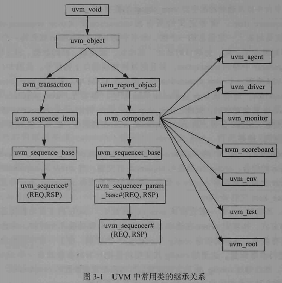
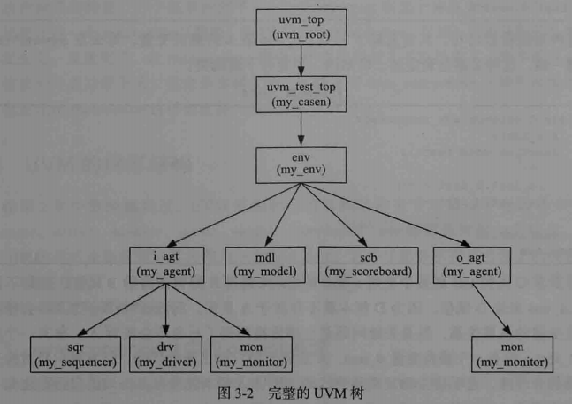

# 1. uvm_component与uvm_object

- uvm_component派生自uvm_object

- uvm_object：UVM中最基本的类


uvm_component有两大特性是uvm_object不具有：

- 通过new指定parent参数，形成树形组织结构；
- 有phase的自动执行特点


UVM中常用类的继承关系：



- uvm_object派生出两个分支；
- 基于uvm_component派生的类可以成为UVM树的结点；
- 左边分支的类或直接派生自uvm_object的类，不能以结点形式出现在UVM树中；


UVM中常见的派生自uvm_object的类：

- uvm_sequence_item

- uvm_sequence：

  所有sequence要从uvm_sequence派生。sequence就是sequence_item的组合

- config：

  一般直接从uvm_object派生；

  功能：规范验证平台的行为方式

- uvm_reg_item：

  派生自uvm_sequence_item，用于寄存器模型

- uvm_phase

  派生自uvm_object；

  作用：控制uvm_component的行为方式


常用的派生自uvm_component的类：

- uvm_driver

  功能：向sequencer索要seuqence_item(transaction)，并将其中的信息驱动到DUT的端口；

  本质：实现transaction级别到端口级别信息的转换

  与uvm_component相比，多了如下成员变量：

  ```verilog
  uvm_seq_item_pull_port #(REQ, RSP) seq_item_port;
  uvm_seq_item_pull_port #(REQ, RSP) seq_item_port_if;
  uvm_analysis_port #(RSP) rsp_port;
  REQ req;
  RSP rsp;
  ```

  在任务/函数上，uvm_driver没有做过多的扩展

- uvm_monitor

  检测DUT端口数据，并送给scoreboard；

  几乎无扩展

- uvm_sequencer：

  组织管理sequence；

  相对父类，有很多扩展

- uvm_scoreboard

  比较参考模型结果和监测端口结果；

  几乎无扩展

- reference_model

  模仿DUT的行为，可直接使用SV高级语言的特性

- uvm_agent

  封装driver和monitor;

  引入了is_active枚举变量

- uvm_env

  封装各类组件；

  几乎无扩展

- uvm_test

  不同测试用例差异很大；

  几乎无扩展


与uvm_object相关的宏：

- uvm_object_utils

  将派生自uvm_object的类注册到factory中

- uvm_object_param_utils

  将派生自uvm_object的参数化的类注册到factory中

- uvm_object_utils_begin

  使用field_automation机制时使用

- uvm_object_param_utils_begin

  适用于参数化的且其中某些成员变量要使用field_automation机制实现的类

- uvm_object_utils_end

  作为factory注册的结束标志


与uvm_component相关的宏：

- uvm_component_utils

  将派生自uvm_component的类注册到factory中

- uvm_component_param_utils

  将派生自uvm_component的参数化的类注册到factory中

- uvm_component_utils_begin

- uvm_component_param_utils_begin

- uvm_component_utils_end


uvm_component的限制：

- 作为UVM树的结点存在，失去了uvm_object的某些特征；

  如：无法使用clone函数，但是可以使用copy函数。clone=new+copy

- 同一父结点下的不同component，在实例化时，不能使用相同的名字


# 2. UVM的树形结构

uvm_component中的parent参数：

- 一般情况下，parent都是this

```verilog
function new(string name, uvm_component parent);
```


UVM树的根:

- uvm_top：全局变量，属于uvm_root的一个实例




uvm_root的存在：

- 保证整个验证平台只有一棵树；
- 所有结点都是uvm_top的子结点

得到uvm_top指针的方式：

```verilog
uvm_root top;
top=uvm_root::get();
```


层次结构相关函数：

- get_parent

  函数原型：

  ```verilog
  extern virtual function uvm_component get_parent();
  ```

  

- get_child

  ```verilog
  extern virtual function uvm_component get_child(string name);
  ```

  

- get_children

  ```verilog
  extern virtual function uvm_component get_children(ref uvm_component children[$]);
  ```

  

- get_first_child和get_next_child

  函数原型：name作为ref类型传递

  ```verilog
  extern function int get_first_child(ref string name);
  extern function int get_next_child(ref string name);
  ```

  

- get_num_children

  ```verilog
  extern function int get_num_children();
  ```


# 3. filed automation机制

filed automation机制相关的宏：

最简单的uvm_filed系列宏有如下几种：

```verilog
`define uvm_filed_int(ARG,FLAG)
`define uvm_filed_real(ARG,FLAG)
`define uvm_filed_enum(T, ARG, FLAG)
`define uvm_filed_object(ARG,FLAG)
`define uvm_filed_event(ARG,FLAG)
`define uvm_filed_string(ARG,FLAG)
```


上述宏分别用于注册的字段是：整数、实数、枚举类型、直接或间接派生自uvm_object的类型、事件及字符串类型


与动态数组有关的uvm_filed系列宏：

```verilog
`define uvm_filed_array_enum(ARG,FLAG)
`define uvm_filed_array_int(ARG,FLAG)
`define uvm_filed_array_object(ARG,FLAG)
`define uvm_filed_array_string(ARG,FLAG)
```


与静态数组有关的uvm_filed系列宏：

```verilog
`define uvm_filed_sarray_enum(ARG,FLAG)
`define uvm_filed_sarray_int(ARG,FLAG)
`define uvm_filed_sarray_object(ARG,FLAG)
`define uvm_filed_sarray_string(ARG,FLAG)
```


与队列有关的uvm_filed系列宏：

```verilog
`define uvm_filed_queue_enum(ARG,FLAG)
`define uvm_filed_queue_int(ARG,FLAG)
`define uvm_filed_queue_object(ARG,FLAG)
`define uvm_filed_queue_string(ARG,FLAG)
```


与联合数组有关的uvm_filed系列宏：

```verilog
`define uvm_field_aa_int_string(ARG,FLAG)
`define uvm_field_aa_string_string(ARG,FLAG)
`define uvm_field_aa_object_string(ARG,FLAG)
`define uvm_field_aa_int_int(ARG,FLAG)
`define uvm_field_aa_int_int_unsigned(ARG,FLAG)
`define uvm_field_aa_int_integer(ARG,FLAG)
`define uvm_field_aa_int_integer_unsigned(ARG,FLAG)
`define uvm_field_aa_int_byte(ARG,FLAG)
`define uvm_field_aa_int_byte_unsigned(ARG,FLAG)
`define uvm_field_aa_int_shortint(ARG,FLAG)
`define uvm_field_aa_int_shortint_unsigned(ARG,FLAG)
`define uvm_field_aa_int_longint(ARG,FLAG)
`define uvm_field_aa_int_longint_unsigned(ARG,FLAG)
`define uvm_field_aa_string_int(ARG,FLAG)
`define uvm_field_aa_object_int(ARG,FLAG)
```

联合数组两大识别标志：

- 索引的类型
- 存储数据的类型


## 标志位的使用

field automation机制中标志位的使用：

考虑一种功能：给DUT施加一种CRC错误的异常激励：

添加crc_err的标志位：

```verilog
class my_transaction extends uvm_sequence_item;

   rand bit[47:0] dmac;
   rand bit[47:0] smac;
   rand bit[15:0] ether_type;
   rand byte      pload[];
   rand bit[31:0] crc;
   rand bit       crc_err;
    ...
   function void post_randomize();
      if(crc_err)
         ;//do nothing
      else
         crc = calc_crc;
   endfunction
    ...
endclass
```

在post_randomize函数中计算CRC先检查crc_err字段，若为1，直接使用随机值；否则使用真实的CRC。


在sequence中使用如下方式产生CRC错误激励：

```verilog
`uvm_do_with(tr, {tr.crc_err==1;})
```


实际需求：crc_err字段不需要注册打包，但是调用print函数时，需要显示。

解决方法：加入**UVM_NOPACK**标志位,，禁止打包功能

- 执行pack和unpack操作时，UVM就不会考虑crc_err字段了

```verilog
`uvm_object_utils_begin(my_transaction)
    `uvm_field_int(dmac, UVM_ALL_ON)
    `uvm_field_int(smac, UVM_ALL_ON)
    `uvm_field_int(ether_type, UVM_ALL_ON)
    `uvm_field_array_int(pload, UVM_ALL_ON)
    `uvm_field_int(crc, UVM_ALL_ON)
    `uvm_field_int(crc_err, UVM_ALL_ON | UVM_NOPACK)
`uvm_object_utils_end
```


UVM标志位：17位

```verilog
来源：UVM 源代码
//A=ABSTRACT Y=PHYSICAL
//F=REFERENCE, S=SHALLOW, D=DEEP
//K=PACK, R=RECORD, P=PRINT, M=COMPARE, C=COPY
//---------------------------------- AYFSD K R P M C
parameter UVM_ALL_ON         = 'b000000101010101;

parameter UVM_COPY           = (1<<0); //copy
parameter UVM_NOCOPY         = (1<<1);
parameter UVM_COMPARE        = (1<<2); //compare
parameter UVM_NOCOMPARE       = (1<<3);
parameter UVM_PRINT          = (1<<4); //print
parameter UVM_NOPRINT        = (1<<5);
parameter UVM_RECORD         = (1<<6); //record
parameter UVM_NORECORD       = (1<<7);
parameter UVM_PACK           = (1<<8); //pack
parameter UVM_NOPACK         = (1<<9);
```


## 宏与if结合

VLAN帧：普通以太网扩展

```verilog
// 文件: src/ch3/section3.3/3.3.4/my_transaction.sv
class my_transaction extends uvm_sequence_item;

   rand bit[47:0] dmac;
   rand bit[47:0] smac;
   rand bit[15:0] vlan_info1;
   rand bit[2:0]  vlan_info2;
   rand bit       vlan_info3;
   rand bit[11:0] vlan_info4;
   rand bit[15:0] ether_type;
   rand byte      pload[];
   rand bit[31:0] crc;

   rand bit       is_vlan;
   ...

   `uvm_object_utils_begin(my_transaction)
      `uvm_field_int(dmac, UVM_ALL_ON)
      `uvm_field_int(smac, UVM_ALL_ON)
      
      // 使用 if 语句实现动态打包：只有当 is_vlan 为真时，才注册这些字段
      if(is_vlan) begin
         `uvm_field_int(vlan_info1, UVM_ALL_ON)
         `uvm_field_int(vlan_info2, UVM_ALL_ON)
         `uvm_field_int(vlan_info3, UVM_ALL_ON)
         `uvm_field_int(vlan_info4, UVM_ALL_ON)
      end
      
      `uvm_field_int(ether_type, UVM_ALL_ON)
      `uvm_field_array_int(pload, UVM_ALL_ON)
      
      // 使用位或操作符叠加标志位：开启除 PACK 以外的所有功能
      	`uvm_field_int(crc, UVM_ALL_ON | UVM_NOPACK)
    	`uvm_field_int(is_vlan, UVM_ALL_ON | UVM_NOPACK)
   `uvm_object_utils_end
   ...
endclass
```


随机化VLAN帧时，使用如下方式：

```verilog
my_transaction tr;
tr = new();
// 通过 inline 约束强制 randomize() 产生一个带 VLAN 的数据包
assert(tr.randomize() with {is_vlan == 1;});
```


# 4. UVM中打印信息的控制

## 冗余度阈值

UVM默认的冗余度阈值：UVM_MEDIUM

- 低于或等于该阈值的信息都会被打印出来


冗余度阈值获取函数：`get_report_verbosity_level`

- 该函数返回的是一个整数

```verilog
typedef enum 
{
   UVM_NONE  = 0,
   UVM_LOW   = 100,
   UVM_MEDIUM= 200,
   UVM_HIGH  = 300,
   UVM_FULL  = 400,
   UVM_DEBUG = 500
} uvm_verbosity;
```


设置某个特定component的默认冗余度阈值函数：

- set_report_verbosity_level
- 由于涉及层次引用，需要在connect_phase及以后的phase才能调用该函数
- 不涉及任何层次引用时，可在connect_phase之前调用


设置某个component及其下所有component的冗余度阈值：

- set_report_verbosity_level_hier


## 重载打印信息的严重性

UVM默认有四种信息严重性：

- UVM_INFO
- UVM_WARNING
- UVM_ERROR
- UVM_FATAL

把driver中所有的UVM_WARNING显示为UVM_ERROR:

```verilog
virtual function void connect_phase(uvm_phase phase);
   // 将该组件所有 UVM_WARNING 严重级别的报告提升为 UVM_ERROR
   env.i_agt.drv.set_report_severity_override(UVM_WARNING, UVM_ERROR);
   
   // 被注释掉的代码展示了如何针对特定 ID ("my_driver") 执行更细粒度的严重级别覆盖
   // env.i_agt.drv.set_report_severity_id_override(UVM_WARNING, "my_driver", UVM_ERROR);
endfunction
```


也可以在命令行进行重载：

```verilog
// 通用语法
<sim command> +uvm_set_severity=<comp>,<id>,<current severity>,<new severity>

// 针对my_driver中示例
<sim command> +uvm_set_severity="uvm_test_top.env.i_agt.drv,my_driver,UVM_WARNING,UVM_ERROR"

//使用 _ALL_ 匹配所有 ID
<sim command> +uvm_set_severity="uvm_test_top.env.i_agt.drv,_ALL_,UVM_WARNING,UVM_ERROR"
```


## UVM_ERROR达到一定数量结束仿真

- uvm_fatal：出现致命错误，仿真立马停止


UVM_ERROR出现一定数量错误，结束仿真的函数：

- set_report_max_quit_count

- 调用方式：

  ```verilog
  function void base_test::build_phase(uvm_phase phase);
      super.build_phase(phase);
      env = my_env::type_id::create("env", this);
      set_report_max_quit_count(5);
  endfunction
  ```


查询当前的退出阈值：

- get_report_max_quit_count()
- 返回值为int类型。
- 若返回0，则无论出现多少个uvm_error都不会退出仿真


命令行中设置退出阈值的方式：

```verilog
<sim command> +UVM_MAX_QUIT_COUNT=6,NO
// 第一个参数6：退出阈值
// 第二个参数NO：此值不允许被后面设置的语句重载
```


## 设置计数的目标

set_report_max_quit_count仅统计uvm_error的数量，不包含uvm_warning


将uvm_error和uvm_warning一起加入计数目标：

- set_report_severity_action();

  参数1：指明要配置的对象

  参数2：行为动作

```verilog
virtual function void connect_phase(uvm_phase phase);
    set_report_max_quit_count(5);
    env.i_agt.drv.set_report_severity_action(UVM_WARNING, UVM_DISPLAY|UVM_COUNT);
...
endfunction
```


set_report_severity_action对应的递归调用方式：

- 将对应结点及其下所有结点的warning和error都加入到计数目标

```verilog
env.i_agt.drv.set_report_severity_action_hier(UVM_WARNING, UVM_DISPLAY|UVM_COUNT);
```


针对某个特定的ID进行计数：

```verilog
env.i_agt.drv.set_report_id_action("my_drv", UVM_DISPLAY|UVM_COUNT);
```

- 把ID为my_drv的所有信息加入计数，包括UVM_INFO,UVM_WARNING, UVM_ERROR, UVM_FATAL

对应的递归调用方式：

```verilog
env.i_agt.drv.set_report_id_action_hier("my_drv", UVM_DISPLAY|UVM_COUNT);
```


## 断点功能

- UVM_COUNT替换为UVM_STOP


## 将输出信息导出到文件

UVM提供将特定信息输出到特定日志文件的功能：

- set_report_severity_file函数

```verilog
env.i_agt.drv.set_report_severity_file(UVM_INFO, info_log);
env.i_agt.drv.set_report_severity_action(UVM_INFO, UVM_DISPLAY|UVM_LOG);
```

说明：将env.i_agt.drv的UVM_INFO输出到info.log

对应的递归调用：

```verilog
env.i_agt.drv.set_report_severity_file_hier(UVM_INFO, info_log);
env.i_agt.drv.set_report_severity_action_hier(UVM_INFO, UVM_DISPLAY|UVM_LOG);
```


UVM还能根据不同ID设置不同的日志文件：

- set_report_id_file
- set_report_id_file_hier


## **打印信息的行为**

UVM中定义的行为如下：

```verilog
typedef enum
{
    UVM_NO_ACTION   = 'b000000, //不做任何操作
    UVM_DISPLAY     = 'b000001, //输出到标准输出上
    UVM_LOG         = 'b000010, //输出到日志文件中
    UVM_COUNT       = 'b000100, //计数目标
    UVM_EXIT        = 'b001000, //直接退出仿真
    UVM_CALL_HOOK   = 'b010000, //调用一个回调函数
    UVM_STOP        = 'b100000 //停止仿真，进入命令行交互模式
} uvm_action_type;
```


默认情况下，UVM系统对不同严重性等级severity消息设置了如下的行为：

```verilog
set_severity_action(UVM_INFO,    UVM_DISPLAY);
set_severity_action(UVM_WARNING, UVM_DISPLAY);
set_severity_action(UVM_ERROR,   UVM_DISPLAY | UVM_COUNT);
set_severity_action(UVM_FATAL,   UVM_DISPLAY | UVM_EXIT);
```

说明：

- 所有严重性消息都会输出到标准输出上；
- UVM_ERROR作为仿真退出计数器的计数目标
- UVM_FATAL：自动退出仿真


# 5. config_db机制

一个component内通过get_full_name函数可以获取组件的路径：

```verilog
function void my_driver::build_phase();
    super.build_phase(phase);
    $display("%s", get_full_name());
endfunction
```

说明：

- 返回当前组件在 UVM 层次结构中的完整路径名
- 例如：`uvm_test_top.env.i_agt.drv`


## set函数和get函数

寄信set举例:

```verilog
uvm_config_db#(int)::set(this, "env.i_agt.drv", "pre_num", 100);
```

- **`uvm_config_db#(int)`**: 指定了配置数据库操作的数据类型为 `int`（整型）。
- **`::set(...)`**: 这是配置数据库的写入方法。
- 参数说明
  - **`this`**: 上下文参数，表示当前组件是配置的源头
  - **`"env.i_agt.drv"`**: 目标路径，指定配置信息要发送给 UVM 层次结构中的哪一个组件（在这里是 `env` 下的 `i_agt` 中的 `drv`）
  - **`"pre_num"`**: 配置项的名称（Field name），目标组件将通过这个字符串来获取该值
  - **`100`**: 要传递的实际数据值
- 注意：第一个参数和第二个参数联合组成目标路径


收信get举例：

```verilog
uvm_config_db#(int)::get(this, "", "pre_num", pre_num);
```

- 参数说明

  - **`this`**: 上下文，通常指当前调用该方法的组件。

  - **`""`**: 路径字符串。因为这里传入的是空字符串 `""`，表示相对于当前组件（`this`）的查找路径为空，即**直接在该组件的配置空间内查找**。

  - **`"pre_num"`**: 要查找的配置项名称。

  - **`pre_num`**: 用来接收获取到的数据的本地变量（在该组件类中预先定义好的成员变量）。


注意：

- set和get的**第三个参数必须一致**


## 省略get语句

某些情况下，可以只设置set，如：

- pre_num使用uvm_field_int注册，并在build_phase中调用super.build_phase()，即可省略get语句
- 省略条件
  - my_driver使用uvm_component_utils宏注册；
  - pre_num使用uvm_field_int宏注册
  - 调用set函数时，set的第三个参数必须要和get函数中变量（my_driver本地变量）的名字一致

